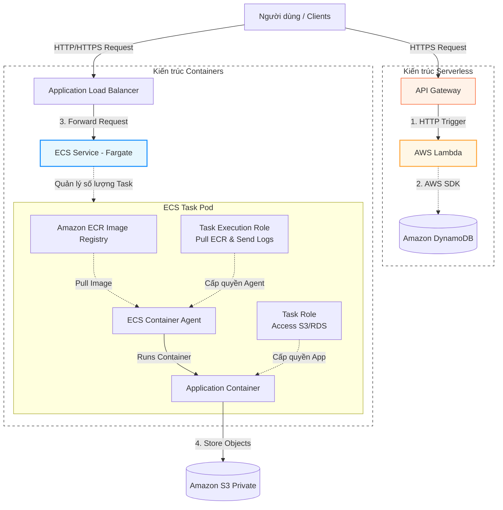

# ⚡ Phase 5: Containers & Serverless (Container & Điện toán Không máy chủ)

Giai đoạn xây dựng ứng dụng hiện đại (Modern Application), sử dụng các giải pháp điện toán tự động đóng gói dưới dạng container hoặc chạy mã nguồn trực tiếp không cần quản lý máy chủ: **ECS**, **EKS**, **ECR**, **Fargate**, **Lambda**, và **API Gateway**.

---

## 🏛️ Sơ đồ triển khai ứng dụng Hiện đại (Containers vs Serverless)

---

## 🔍 Phân tích chi tiết mối quan hệ giữa các dịch vụ

### 1. Phân phối container và Quản lý Image (ECR, ECS/EKS)
- **ECR (Elastic Container Registry):** Đóng vai trò là kho chứa Docker images bảo mật của riêng bạn.
- **Mối liên kết:** Khi bạn triển khai một ứng dụng trên **ECS (Elastic Container Service)** hoặc **EKS (Elastic Kubernetes Service)**:
  1. ECS Agent (chạy trên máy chủ hoặc do Fargate quản lý) sẽ gọi API tới ECR.
  2. Agent thực hiện tải (pull) container image dựa trên thẻ phiên bản (tag).
  3. Để thực hiện điều này, ECS Agent cần được ủy quyền qua **Task Execution Role** (chứa policy `AmazonECSTaskExecutionRolePolicy`).

### 2. AWS Fargate - Triển khai Container dạng Serverless
- Khi chọn Fargate làm Compute Layer cho ECS hay EKS:
  - Bạn không cần tạo, cấu hình hệ điều hành hay vá lỗi cho các máy chủ EC2.
  - **Mạng lưới:** Mỗi ECS Task chạy trên Fargate sẽ nhận được một card mạng ảo riêng (**ENI**) với một địa chỉ IP nội bộ duy nhất nằm trong VPC của bạn (sử dụng chế độ mạng `awsvpc`). Điều này giúp container có thể giao tiếp trực tiếp với các tài nguyên khác trong VPC mà không cần qua NAT trung gian hay cấu hình Port Mapping phức tạp.

### 3. Bảo mật ứng dụng Container (Task Role vs Task Execution Role)
Đây là nguyên tắc bảo mật then chốt (Least Privilege) của AWS:
- **Task Execution Role (Quyền chạy hạ tầng):** Cấp quyền cho ECS Agent tải container image từ ECR và ghi logs vào CloudWatch Logs. Quyền này thuộc về AWS hạ tầng.
- **Task Role (Quyền chạy ứng dụng):** Cấp quyền cho chính mã nguồn ứng dụng chạy bên trong container truy cập tài nguyên AWS (như đọc/ghi file từ S3, gọi DynamoDB).
- **Why:** Việc tách biệt này đảm bảo rằng nếu container ứng dụng của bạn bị hack, kẻ tấn công cũng không thể lạm dụng quyền để can thiệp vào hạ tầng ECS agent hoặc tải trộm các container image khác của doanh nghiệp.

### 4. Thiết lập Endpoint Serverless (API Gateway & Lambda)
- **API Gateway:** Nhận request HTTPS từ internet, thực hiện xác thực (Cognito/JWT) và kiểm tra giới hạn tần suất (Rate Limiting).
- **Lambda:** Nhận event dữ liệu từ API Gateway, xử lý logic nghiệp vụ và trả về kết quả.
- **Tối ưu hóa Cold Start:**
  - **Provisioned Concurrency:** Giữ một số lượng instance của Lambda luôn ở trạng thái "warm" (đã khởi tạo sẵn môi trường thực thi và kết nối database) để loại bỏ hoàn toàn độ trễ khởi động lạnh (Cold Start latency).
  - **Lambda@Edge:** Chạy code Lambda trực tiếp tại các Edge Location của CloudFront để xử lý/chuyển đổi dữ liệu ngay trước khi gửi request về Origin hoặc trả phản hồi cho client, tối ưu hóa tối đa thời gian phản hồi API.
