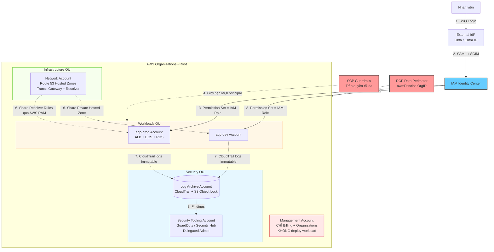
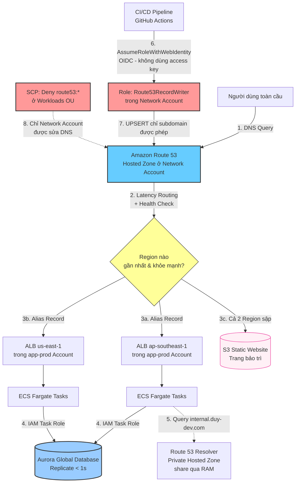

# 🏛️ Phase 6: Multi-Account Governance & Global Traffic (Quản trị Đa tài khoản & Điều phối Lưu lượng Toàn cầu)

Giai đoạn "trưởng thành" của hạ tầng. Sau khi đã dựng được compute, network, storage, database và container (Phase 1-5), câu hỏi tiếp theo không còn là *"xây thế nào"* mà là ***"mở rộng ra 10 team và 50 tài khoản thì kiểm soát ra sao"***.

Phase này phân tích mối quan hệ giữa 3 dịch vụ nằm ở **tầng điều khiển (control plane)** của AWS: **AWS Organizations**, **AWS IAM**, và **Amazon Route 53**.

> **Điểm chung ít người để ý:** Cả ba đều là **global service** — không thuộc region nào, endpoint chính ở `us-east-1`. Chúng khác biệt hoàn toàn với EC2/S3/RDS ở tầng tài nguyên. Hệ quả thực tế: một SCP chặn region viết sai sẽ khóa luôn cả ba, và bạn mất quyền sửa chính guardrail vừa tạo ra.

---

## 🏛️ Sơ đồ 1: Kiến trúc Multi-Account và luồng kiểm soát



---

## 🌍 Sơ đồ 2: Luồng người dùng toàn cầu đi vào hạ tầng Multi-Account



---

## 🔍 Phân tích chi tiết mối quan hệ giữa các dịch vụ

### 1. Tại sao Account là ranh giới cách ly, không phải VPC hay IAM

Ở Phase 2 ta dùng VPC + Security Group + IAM để cách ly workload **trong một account**. Điều đó là chưa đủ khi tổ chức lớn lên, vì bốn lý do:

- **Blast Radius:** Account là ranh giới cách ly **mạnh nhất** trong AWS. Một IAM policy viết sai ở account Dev về mặt kỹ thuật không thể chạm tới tài nguyên Production.
- **Service Quotas:** Số EC2, số VPC, số Lambda concurrent đều tính **theo account**. Một team dùng hết quota Lambda sẽ chặn cả công ty — điều mà IAM không giải quyết được.
- **Billing:** Account là đơn vị phân bổ chi phí tự nhiên nhất, không phụ thuộc vào việc tag có được gắn đầy đủ hay không.
- **Compliance:** PCI-DSS và HIPAA yêu cầu chứng minh cách ly. Tách account là cách dễ chứng minh nhất với auditor.

> **Nguyên tắc số một:** Management Account phải **trống rỗng** — chỉ dùng cho Organizations và billing. Lý do: **SCP không áp được lên Management Account**, nên mọi tài nguyên đặt ở đây đều nằm ngoài mọi guardrail. Nó cũng là mục tiêu tấn công giá trị nhất trong tổ chức.

### 2. Mối quan hệ SCP ↔ IAM: Trần quyền, không phải nguồn quyền

Đây là quan hệ quan trọng nhất trong Phase này và cũng là nguồn gốc của phần lớn lỗi `AccessDenied` khó hiểu:

- **SCP không cấp quyền.** Nó chỉ định nghĩa *quyền tối đa có thể có* của mọi principal trong account. IAM policy vẫn phải cấp quyền riêng.
- **Quyền hiệu dụng = SCP ∩ IAM Policy ∩ Permissions Boundary ∩ Session Policy.** Đây là phép **GIAO**, không phải phép hợp — chỉ cần một lớp nói "không" là request bị chặn.
- **Explicit Deny thắng tất cả**, không có ngoại lệ nào ghi đè được.

**Hệ quả thực tế:** Một user có `AdministratorAccess` vẫn bị Denied nếu SCP ở OU cha chặn action đó. Khi debug, thứ tự kiểm tra đúng là: **SCP → Explicit Deny → Permissions Boundary → Resource Policy → Condition → Identity Policy**. Đa số thời gian bị lãng phí vì kỹ sư soi IAM policy trong khi thủ phạm là một SCP họ thậm chí không có quyền xem.

> Nên cấp quyền read-only `organizations:DescribeEffectivePolicy` cho đội platform ở member account để họ tự debug được.

### 3. Ba lớp phòng thủ chống Privilege Escalation

Bài toán thực tế: cho phép developer tự tạo IAM Role cho Lambda của họ (giảm ticket cho đội platform), nhưng không để họ tạo ra role `AdministratorAccess` rồi assume nó.

| Lớp | Cơ chế | Ai không thể vượt qua |
|---|---|---|
| **1. SCP** | `Deny iam:CreateRole` nếu thiếu điều kiện `iam:PermissionsBoundary` | **Mọi người trong account, kể cả admin** |
| **2. Permissions Boundary** | Trần quyền gắn vào từng role dev tạo ra | Chính role đó |
| **3. IAM Policy** | Chỉ cấp quyền trên tài nguyên có prefix `dev-*` | Người dùng thông thường |

**Tại sao cần cả ba?** Chỉ có IAM policy thì dev sửa được policy của chính mình. Chỉ có Boundary thì dev gỡ boundary khỏi role rồi leo thang. **SCP là lớp duy nhất mà principal bên trong account không thể chạm tới** — nó nằm ở tầng Organization, ngoài tầm với của mọi IAM principal.

### 4. IAM Identity Center — Nơi Organizations và IAM hợp nhất

Identity Center (trước là AWS SSO) **chỉ hoạt động khi có Organizations**. Nó lấy danh sách account từ Organizations và dịch "user trong IdP" thành "IAM Role trong từng member account":

- **Permission Set** là template policy, được Identity Center tự động deploy thành IAM Role trong mọi account được gán.
- **Không còn IAM User dài hạn, không còn access key nằm trong laptop dev.** Kết hợp SCP `Deny iam:CreateUser` để cưỡng chế điều này trên toàn tổ chức.
- **Offboarding:** tắt tài khoản ở IdP → mất quyền trên toàn bộ 50 account ngay lập tức. Với IAM User, bạn phải xóa thủ công ở từng account và gần như chắc chắn sẽ sót.
- **SCP vẫn là trần quyền phía trên Permission Set** — nghĩa là có ba lớp cùng lúc: IdP group → Permission Set → SCP.

### 5. Route 53 tập trung tại Network Account (Organizations ↔ Route 53)

Ở Phase 3 ta dùng Route 53 + Alias Record trỏ tới CloudFront/ALB trong cùng một account. Trong mô hình multi-account, DNS phải được tập trung hóa:

- **Một Network Account sở hữu toàn bộ Hosted Zone.** Không để mỗi team tự tạo hosted zone cho cùng một domain — đó là công thức cho DNS conflict và phân giải sai.
- **Resolver Rules share qua AWS RAM** cho toàn Organization. Tạo Resolver Endpoint một lần ở Network Account thay vì mỗi account tự tạo. Với 20 account, khoản này tiết kiệm **~$1,700/tháng** (mỗi cặp ENI HA tốn ~$90/tháng).
- **Private Hosted Zone associate cross-account** với VPC ở account khác — quy trình 2 bước: `CreateVPCAssociationAuthorization` ở account chứa zone, rồi `AssociateVPCWithHostedZone` ở account chứa VPC.
- **SCP bảo vệ:** `Deny route53:*` áp ở **Workloads OU** (không phải Root, để Network Account trong Infrastructure OU vẫn hoạt động).

### 6. Phân quyền DNS chi tiết (IAM ↔ Route 53)

DNS là single point of failure có sức tàn phá cao nhất — xóa nhầm record A ở zone apex làm sập toàn bộ website, và phục hồi mất thời gian bằng TTL cộng với cache của resolver.

**Vấn đề:** Quyền `route53:ChangeResourceRecordSets` áp ở cấp **Hosted Zone**, không phải cấp **record**. Không thể dùng ARN để nói "user này chỉ được sửa `api.duy-dev.com`".

**Hai giải pháp, theo thứ tự ưu tiên:**

- **Condition key đặc thù của Route 53** — giới hạn theo loại record, hành động và tên record:
  - `route53:ChangeResourceRecordSetsRecordTypes` → chỉ cho phép A/AAAA/CNAME, **cấm đụng NS, SOA, MX, CAA** (sửa sai là mất domain hoặc mất email).
  - `route53:ChangeResourceRecordSetsActions` → chỉ `CREATE`/`UPSERT`, **không có `DELETE`**.
  - `route53:ChangeResourceRecordSetsNormalizedRecordNames` → chỉ trong subdomain được giao.
- **Subdomain Delegation** (mạnh hơn) — tách hosted zone con cho từng team, đặt ở account của họ, dùng NS record để ủy quyền từ zone cha. Ranh giới lúc này là **account boundary** thay vì IAM condition.

> **Nguyên tắc rút ra:** Khi IAM condition bắt đầu trở nên quá phức tạp, đó là tín hiệu nên **tách account hoặc tách hosted zone**. Kiến trúc giải quyết được bài toán mà policy không giải quyết nổi.

### 7. CI/CD cập nhật DNS cross-account bằng OIDC

Pattern chuẩn khi pipeline ở app account cần tạo record trong zone ở Network Account — **không dùng access key**:

1. GitHub Actions gọi `sts:AssumeRoleWithWebIdentity` với OIDC token.
2. Trust Policy của role kiểm tra `token.actions.githubusercontent.com:sub` khớp **đúng repo và đúng branch** (`repo:my-org/app-a:ref:refs/heads/main`).
3. STS trả credential tạm 1 giờ.
4. Permissions Policy của role giới hạn chỉ subdomain `app-a.*`.

> **Lỗi cấu hình phổ biến:** Chỉ khóa `sub` tới `repo:my-org/*` — khi đó **bất kỳ repo nào trong org** cũng deploy được, kể cả repo test do người ngoài đóng góp.

### 8. Data Perimeter — Vòng ngoài cùng bằng RCP

**SCP có một điểm mù:** nó chỉ kiểm soát principal *bên trong* account. Một kẻ tấn công dùng credential từ account bên ngoài truy cập S3 bucket của bạn — SCP hoàn toàn không nhìn thấy request đó.

**RCP (Resource Control Policy)** lấp điểm mù này. Một policy duy nhất áp ở Root:

```json
{
  "Effect": "Deny",
  "Principal": "*",
  "Action": ["s3:*", "sts:AssumeRole", "kms:*", "secretsmanager:*"],
  "Resource": "*",
  "Condition": {
    "StringNotEqualsIfExists": { "aws:PrincipalOrgID": "o-abc123xyz" },
    "BoolIfExists": { "aws:PrincipalIsAWSService": "false" }
  }
}
```

Chặn mọi truy cập từ ngoài Organization vào tài nguyên nhạy cảm — trên **tất cả** account, kể cả những bucket mà đội bảo mật chưa kịp review. Khác với SCP, **RCP áp được cả lên Management Account**.

### 9. Cách ba dịch vụ phối hợp khi có sự cố

Tình huống: credential của một developer bị lộ trên GitHub.

| Kẻ tấn công thử | Lớp chặn |
|---|---|
| Tạo EC2 ở region lạ | **SCP** chặn region |
| Tạo IAM User để duy trì quyền | **SCP** `Deny iam:CreateUser` |
| Copy dữ liệu sang S3 cá nhân | **SCP** Resource Perimeter (`aws:ResourceOrgID`) |
| Sửa DNS trỏ domain về server của mình | **SCP** `Deny route53:*` ở Workloads OU |
| Xóa dấu vết | **Không thể** — CloudTrail đã ghi vào Log Archive Account với S3 Object Lock |

**Xử lý:** Di chuyển account sang **Quarantine OU** có SCP `Deny *` → thu hồi mọi session đang hoạt động bằng policy điều kiện `aws:TokenIssueTime` → điều tra bằng CloudTrail immutable ở Log Archive.

> Không lớp nào đơn lẻ ngăn được tấn công. Nhưng **kết hợp lại**, kẻ tấn công có credential hợp lệ vẫn không làm được gì đáng kể. Đây là **defense in depth** đúng nghĩa: IAM cấp quyền, Organizations đặt giới hạn không thể vượt qua, Route 53 được bảo vệ vì nó là cửa chính của toàn hệ thống.

---

## ⚠️ Bẫy nghiêm trọng nhất của Phase này

**SCP chặn region mà không loại trừ global service** — đây là cách phổ biến nhất để tự khóa mình khỏi chính AWS account của mình:

```json
{
  "Effect": "Deny",
  "NotAction": [
    "iam:*", "organizations:*", "route53:*", "cloudfront:*",
    "sts:*", "support:*", "budgets:*", "waf:*"
  ],
  "Resource": "*",
  "Condition": {
    "StringNotEquals": { "aws:RequestedRegion": ["ap-southeast-1", "us-east-1"] }
  }
}
```

Thiếu `iam:*` trong `NotAction` → bạn mất quyền vào IAM và **không thể sửa lại chính SCP vừa tạo**. Lúc đó chỉ còn cách gọi AWS Support.

> **Quy trình test SCP an toàn:** Luôn áp lên **Sandbox OU trước**, chạy ít nhất một tuần → mở rộng lên Workloads OU → cuối cùng mới lên Root.

---

## 📚 Đọc sâu hơn

| Chủ đề | Tài liệu |
|---|---|
| Route 53: 7 routing policies, Health Check, Resolver, DNSSEC, ARC | [Amazon Route 53 Deep Dive](../../AWS_Knowledge/03_Networking/Amazon_Route53_DeepDive.md) |
| IAM: Policy Evaluation Logic, Boundary, ABAC, Confused Deputy, IRSA | [IAM Deep Dive v2](../../AWS_Knowledge/02_Security_Identity/IAM_DeepDive_v2.md) |
| Organizations: SCP patterns, RCP, Delegated Admin, Control Tower | [AWS Organizations Deep Dive](../../AWS_Knowledge/12_Cloud_Governance/AWS_Organizations_DeepDive.md) |
| Phân tích tích hợp ba dịch vụ chi tiết hơn | [Route 53 + IAM + Organizations](../../AWS_Knowledge/12_Cloud_Governance/Route53_IAM_Organizations_Integration.md) |
| Config, Security Hub, Tagging Strategy, FinOps | [Cloud Governance](../../AWS_Knowledge/12_Cloud_Governance/Cloud_Governance.md) |
