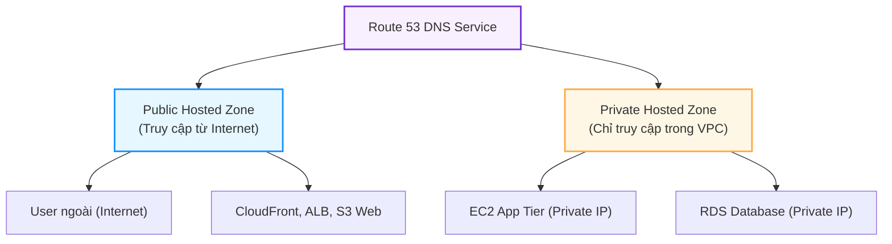
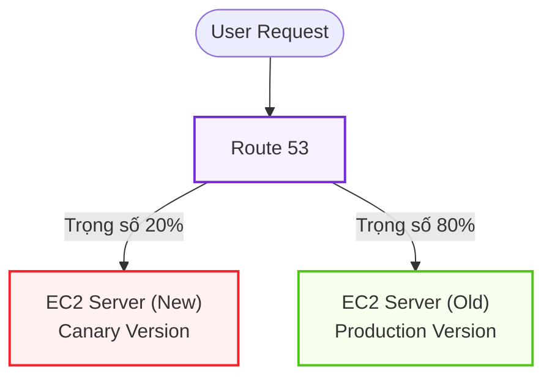
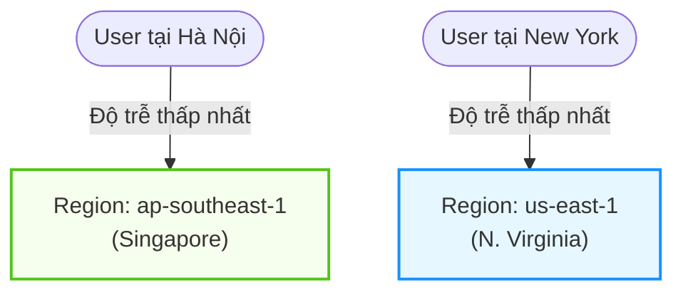
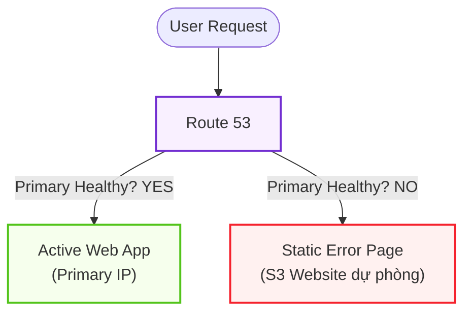

# 🌐 Route 53 — Deep Dive & Routing Policies

> **Amazon Route 53** là dịch vụ hệ thống tên miền (DNS) có độ sẵn sàng cao (SLA 100%) và khả năng mở rộng cực lớn của AWS. 
> Ngoài chức năng cốt lõi là phân giải tên miền (Domain Name) thành địa chỉ IP, Route 53 đóng vai trò bộ điều phối traffic thông minh toàn cầu dựa trên nhiều chính sách định tuyến (Routing Policies) khác nhau.

---

## 1. Thành phần cốt lõi: Hosted Zones

Hosted Zone là một container chứa các bản ghi (records) định nghĩa cách điều phối traffic cho một domain (ví dụ: `antigravity.com`) và các subdomain của nó.

### 1.1. Public Hosted Zone (Vùng phân giải công cộng)
- **Định nghĩa:** Chứa các bản ghi cấu hình định tuyến cho traffic từ Internet bên ngoài vào các tài nguyên của bạn.
- **Cách thức hoạt động:** Khi bạn mua một domain hoặc chuyển giao (delegate) DNS quản lý về AWS, Route 53 sẽ cấp 4 địa chỉ Name Servers (NS) công cộng. Mọi truy vấn từ bên ngoài sẽ trỏ tới các Name Servers này để lấy thông tin IP của dịch vụ.

### 1.2. Private Hosted Zone (Vùng phân giải nội bộ)
- **Định nghĩa:** Chứa các bản ghi cấu hình chỉ có thể phân giải được bên trong một hoặc nhiều Virtual Private Clouds (VPCs) mà bạn chỉ định.
- **Cách thức hoạt động:** Trình phân giải nội bộ của AWS (Route 53 Resolver / VPC DNS ở địa chỉ `10.x.x.2`) sẽ chặn các request DNS này.
- **Trường hợp sử dụng:**
  - Định nghĩa domain nội bộ gọn gàng cho microservices (ví dụ: trỏ `db.internal` tới địa chỉ IP private của RDS).
  - Giữ thông tin cấu trúc mạng nội bộ không bị lộ ra Internet.
- **Lưu ý cấu hình:** Để Private Hosted Zone hoạt động, bạn bắt buộc phải bật hai thuộc tính trong VPC: `enableDnsHostnames` và `enableDnsSupport` thành `true`.

---

## 2. Chi tiết các Routing Policies (Chính sách điều phối traffic)

Routing Policy xác định cách Route 53 phản hồi lại các truy vấn DNS từ Client.

### 2.1. Simple Routing Policy (Định tuyến đơn giản)
- **Cơ chế:** Ánh xạ tên miền trực tiếp tới một hoặc nhiều tài nguyên cụ thể (1-to-Many).
- **Cách phản hồi:** Nếu bạn cấu hình nhiều địa chỉ IP trong một bản ghi, Route 53 sẽ trả về **tất cả địa chỉ IP** đó dưới dạng một danh sách ngẫu nhiên (Round-robin) cho Client, Client sẽ tự chọn một IP để kết nối.
- **Hạn chế:** Không hỗ trợ liên kết với **Health Checks**. Nếu một IP trong danh sách bị chết, Route 53 vẫn trả về IP đó, dẫn đến client có thể gặp lỗi kết nối.
- **Trường hợp sử dụng:** Định tuyến 1-1 cơ bản tới một địa chỉ tĩnh duy nhất.

### 2.2. Weighted Routing Policy (Định tuyến theo trọng số)
- **Cơ chế:** Điều phối traffic đến nhiều tài nguyên khác nhau dựa trên tỷ lệ phần trăm (trọng số) mà bạn cấu hình.
- **Công thức tính:** `% Traffic = (Trọng số của Record này) / (Tổng trọng số của nhóm)`

- **Trường hợp sử dụng:**
  - **Canary Deployments:** Chuyển 5% traffic sang phiên bản mới chạy thử nghiệm, 95% vẫn chạy bản cũ.
  - **A/B Testing:** Chia đều traffic 50/50 giữa 2 thiết kế giao diện để đo lường hiệu quả.
  - Chuyển đổi dần dần traffic từ server cũ sang server mới.
- **Lưu ý:** Trọng số có thể cấu hình từ `0` đến `255`. Nếu đặt trọng số bằng `0`, Route 53 sẽ ngừng trả về IP của bản ghi đó (trừ khi tất cả các bản ghi trong nhóm đều bằng 0, lúc đó nó sẽ trả về tất cả).

### 2.3. Latency-based Routing Policy (Định tuyến theo độ trễ thấp nhất)
- **Cơ chế:** Hướng người dùng tới AWS Region cung cấp độ trễ mạng (latency) thấp nhất so với vị trí địa lý của họ.
- **Cách thức hoạt động:** AWS liên tục đo lường độ trễ từ các nhà mạng trên khắp thế giới tới các Datacenter của họ. Khi client gửi DNS query, Route 53 đối chiếu IP của client và trả về tài nguyên thuộc Region có độ trễ nhỏ nhất.

- **Trường hợp sử dụng:** Ứng dụng toàn cầu cần tối ưu hóa tốc độ tải trang cho người dùng ở nhiều châu lục.

### 2.4. Failover Routing Policy (Định tuyến dự phòng - Active-Passive)
- **Cơ chế:** Sử dụng để thiết lập kiến trúc Active-Passive. Tự động chuyển hướng toàn bộ traffic sang tài nguyên dự phòng (Secondary) nếu tài nguyên chính (Primary) bị sập.
- **Yêu cầu:** Bắt buộc phải liên kết với **Route 53 Health Checks**.

- **Trường hợp sử dụng:** 
  - Khắc phục thảm họa (Disaster Recovery).
  - Tự động hiển thị trang thông báo bảo trì (lưu trữ tĩnh trên S3) khi cụm server chính gặp sự cố.

### 2.5. Multi-value Answer Routing Policy (Định tuyến đa giá trị)
- **Cơ chế:** Trả về tối đa **8 địa chỉ IP khỏe mạnh** (Healthy) ngẫu nhiên cho mỗi truy vấn DNS.
- **Sự khác biệt với Simple Routing:**
  - Multi-value hỗ trợ **Health Checks**. 
  - Nếu một máy chủ bị sập, Route 53 sẽ phát hiện qua Health Check và loại bỏ IP đó khỏi danh sách trả về, đảm bảo client chỉ nhận được các IP đang hoạt động tốt.
- **Trường hợp sử dụng:** Thay thế ở mức độ cơ bản cho Load Balancer (DNS-level load balancing), giúp phân phối tải trực tiếp thông qua DNS.

### 2.6. Geolocation & Geoproximity Routing Policies
- **Geolocation Routing:** Định tuyến dựa trên vị trí địa lý của người dùng (châu lục, quốc gia, hoặc bang/tỉnh).
  - *Ví dụ:* Người dùng truy cập từ Việt Nam sẽ được dẫn đến trang tiếng Việt, người dùng từ Mỹ sẽ dẫn đến trang tiếng Anh.
- **Geoproximity Routing:** Định tuyến dựa trên khoảng cách địa lý vật lý giữa người dùng và tài nguyên AWS.
  - Cho phép cấu hình thuộc tính **Bias** (độ lệch) để mở rộng hoặc thu hẹp vùng phủ sóng của một Region cụ thể.

---

## 3. Route 53 Health Checks (Kiểm tra sức khỏe)

Health Checks là công cụ giám sát giúp Route 53 nhận biết tình trạng sống/chết của các endpoint để đưa ra quyết định định tuyến chính xác.

### 3.1. Các loại Health Checks:
1. **Monitor an Endpoint (Giám sát Endpoint):**
   - Route 53 gửi request (TCP, HTTP, hoặc HTTPS) trực tiếp tới địa chỉ IP hoặc tên miền của bạn định kỳ (mặc định mỗi 30 giây, hoặc nhanh là 10 giây).
   - Nếu endpoint không phản hồi hoặc trả về mã lỗi (không phải 2xx/3xx) liên tiếp vượt quá số lần cấu hình (Threshold - mặc định là 3 lần), nó sẽ bị đánh dấu là **Unhealthy**.
2. **Monitor other Health Checks (Calculated Health Checks):**
   - Cho phép gộp kết quả của nhiều Health Check nhỏ lại thành một logic (AND, OR, NOT).
   - *Ví dụ:* Endpoint chỉ được coi là Healthy nếu cả Web Server và Database Server đều Healthy.
3. **Monitor CloudWatch Alarms:**
   - Hữu ích khi giám sát các tài nguyên không có IP public hoặc nằm sau tường lửa bảo mật. Route 53 sẽ dựa vào trạng thái của CloudWatch Alarm để biết máy chủ có bị quá tải CPU/RAM hay không để ngắt traffic.

---

## 4. Khái niệm quan trọng: CNAME vs Alias Record

Đây là chủ đề rất dễ gây nhầm lẫn khi thiết kế hệ thống trên AWS.

| Tiêu chí | CNAME Record | Alias Record |
| :--- | :--- | :--- |
| **Định nghĩa** | Chuẩn DNS toàn cầu, trỏ một DNS name này sang một DNS name khác. | Cơ chế độc quyền của AWS Route 53, ánh xạ trực tiếp tên miền tới một tài nguyên AWS. |
| **Zone Apex (Root Domain)** | **Không thể** dùng cho Zone Apex (Ví dụ: Không thể trỏ `antigravity.com` bằng CNAME). | **Có thể** dùng cho Zone Apex (Trỏ thẳng `antigravity.com` tới ALB/CloudFront). |
| **Chi phí truy vấn DNS** | Bị tính phí bình thường theo số lượng query. | **Miễn phí hoàn toàn** cho các truy vấn trỏ tới tài nguyên AWS (ALB, CloudFront, S3, v.v.). |
| **Cách thức hoạt động** | Client phải thực hiện **2 lần truy vấn DNS** (Lần 1 tìm CNAME, lần 2 phân giải IP của CNAME đó). | Route 53 tự động phân giải nội bộ và trả ngay IP đích cho client trong **1 lần truy vấn**. |
| **Cập nhật IP** | Thủ công hoặc phụ thuộc vào DNS đích. | Tự động cập nhật nếu IP của tài nguyên AWS (như ALB) thay đổi. |

> [!IMPORTANT]
> **Khuyên dùng:** Luôn ưu tiên dùng **Alias Record** thay vì CNAME khi trỏ tới các dịch vụ của AWS (như Application Load Balancer, CloudFront Distribution, Elastic Beanstalk, S3 bucket) để tối ưu chi phí và tăng tốc độ phân giải DNS cho người dùng.
