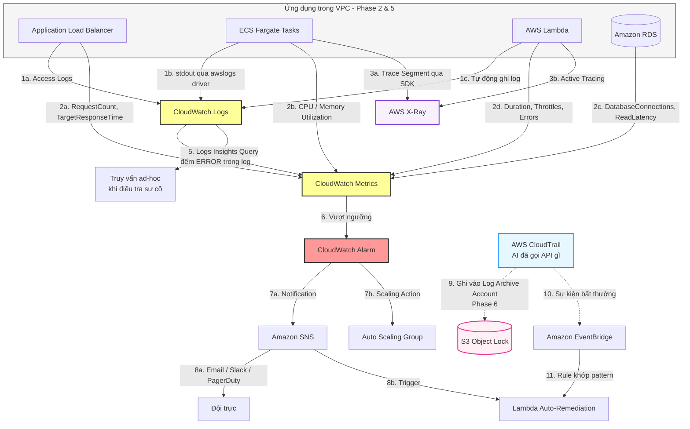
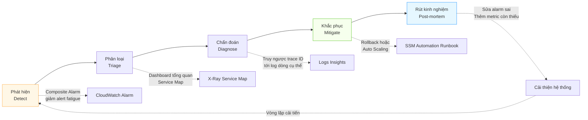

# 📊 Phase 7: Observability & Incident Response (Quan sát Hệ thống & Xử lý Sự cố)

Từ Phase 1 đến Phase 6 ta đã **xây dựng** hạ tầng. Phase này trả lời câu hỏi vận hành: ***"Khi hệ thống chậm hoặc lỗi lúc 3 giờ sáng, làm sao biết nguyên nhân nằm ở đâu trong hàng chục dịch vụ?"***

Các dịch vụ chính: **CloudWatch** (Metrics, Logs, Alarms), **AWS X-Ray** (Distributed Tracing), **CloudTrail** (Audit), **EventBridge** (Event Bus), **SNS** (Notification), và **Systems Manager** (Remediation).

> **Phân biệt cốt lõi — Monitoring vs Observability:**
> - **Monitoring** trả lời câu hỏi bạn **đã biết trước**: "CPU có vượt 80% không?" → cần dashboard và alarm.
> - **Observability** trả lời câu hỏi bạn **chưa từng nghĩ tới**: "Tại sao đúng 12 khách hàng ở Singapore gặp lỗi 504 vào 14h03?" → cần correlation giữa metric, log và trace.
>
> Hệ thống monolith chỉ cần monitoring. Hệ thống microservice (Phase 5) và multi-account (Phase 6) **bắt buộc** phải có observability.

---

## 🏛️ Sơ đồ 1: Ba trụ cột Observability và luồng dữ liệu



---

## 🚨 Sơ đồ 2: Vòng đời một sự cố (Incident Lifecycle)



---

## 🔍 Phân tích chi tiết mối quan hệ giữa các dịch vụ

### 1. CloudWatch Metrics ↔ Logs: Hai kho dữ liệu, một cầu nối

Nhiều người nghĩ Metrics và Logs là hai thế giới tách biệt. Cầu nối giữa chúng là **Metric Filter**:

- **Metric** là số có cấu trúc, rẻ, truy vấn nhanh, giữ được 15 tháng. Nhưng không cho biết *tại sao*.
- **Log** là văn bản tự do, đắt để lưu và truy vấn, nhưng chứa toàn bộ ngữ cảnh.
- **Metric Filter** đọc log stream, đếm số dòng khớp pattern (ví dụ `ERROR` hoặc `OutOfMemoryError`) và **xuất ra một metric mới**. Từ đó có thể đặt Alarm trên nội dung log.

**Ngược lại — Embedded Metric Format (EMF)** cho phép ứng dụng ghi một dòng JSON vào log, CloudWatch tự động trích xuất thành metric. Đây là cách rẻ nhất để tạo custom metric có nhiều dimension: **một lần ghi log = vừa có log chi tiết vừa có metric**, thay vì gọi API `PutMetricData` tốn phí riêng.

> **Chi phí là ràng buộc thực tế:** Custom metric giá ~$0.30/metric/tháng. Mỗi tổ hợp dimension là **một metric riêng biệt** — 10 API endpoint × 5 status code × 3 region = 150 metric = $45/tháng chỉ cho một chỉ số. Đây là lý do việc thiết kế dimension cần cân nhắc, không phải "cứ thêm cho đủ".

### 2. X-Ray — Thứ CloudWatch không làm được

CloudWatch cho biết "Lambda chạy chậm 3 giây". Nó **không** cho biết 3 giây đó tiêu ở đâu: gọi DynamoDB? gọi service khác? chờ cold start?

**X-Ray** giải quyết bằng cách gắn một **trace ID** vào request và truyền nó qua mọi service (context propagation):

- **Segment** = công việc của một service. **Subsegment** = một lời gọi bên trong (query DB, HTTP call).
- **Service Map** dựng tự động sơ đồ phụ thuộc giữa các service kèm latency và error rate từng cạnh — thứ mà không ai duy trì bằng tay được trong kiến trúc microservice.
- **Sampling Rule:** mặc định 1 request/giây + 5% phần còn lại. Trace 100% traffic sẽ rất đắt và không cần thiết — nhưng nên cấu hình sample 100% cho các request lỗi.

**Liên kết quan trọng nhất:** Từ một điểm bất thường trên Service Map → lấy trace ID → tra ngược vào CloudWatch Logs Insights bằng `filter @message like /trace-id/` → tìm ra đúng dòng log của request đó. **Đây là quy trình chẩn đoán mà không có nó thì microservice là hộp đen.**

### 3. CloudTrail vs CloudWatch Logs — Hai câu hỏi hoàn toàn khác nhau

Đây là điểm dễ nhầm nhất trong Phase này:

| | **CloudWatch Logs** | **CloudTrail** |
|---|---|---|
| Trả lời | *Ứng dụng của tôi đã làm gì?* | *AI đã gọi API AWS nào?* |
| Nguồn | stdout/stderr của app, ALB access log | Control plane của AWS |
| Ví dụ nội dung | `ERROR: null pointer at line 42` | `user X đã gọi ec2:TerminateInstances lúc 14:03` |
| Dùng cho | Debug ứng dụng | Audit bảo mật, forensics |

**Data Events là bẫy chi phí lớn nhất:** CloudTrail mặc định chỉ ghi **Management Events** (miễn phí cho trail đầu tiên). **Data Events** (`s3:GetObject`, `lambda:Invoke`) phải bật riêng và tính phí theo số event — bật toàn bộ trên một bucket lưu lượng cao có thể tốn hàng nghìn USD/tháng. Chỉ bật cho bucket chứa dữ liệu nhạy cảm.

**Liên kết với Phase 6:** CloudTrail nên bật ở cấp **Organization**, ghi vào **Log Archive Account** với S3 Object Lock. Kẻ tấn công chiếm được account workload vẫn không xóa được dấu vết — đây là điều kiện tiên quyết để bước "điều tra" trong quy trình xử lý sự cố có ý nghĩa.

### 4. EventBridge — Bộ não phản ứng tự động

CloudWatch Alarm chỉ phản ứng với **ngưỡng số học**. EventBridge phản ứng với **mẫu sự kiện có cấu trúc**:

```json
{
  "source": ["aws.ec2"],
  "detail-type": ["EC2 Instance State-change Notification"],
  "detail": { "state": ["terminated"] }
}
```

**Mối quan hệ với các dịch vụ khác:**

- **EventBridge ← CloudTrail:** Mọi API call trở thành event. Ví dụ: ai đó gọi `iam:CreateUser` (vốn đã bị SCP chặn ở Phase 6, nhưng attempt vẫn được ghi) → EventBridge kích hoạt Lambda cảnh báo đội bảo mật ngay.
- **EventBridge → Systems Manager:** Rule khớp → chạy **SSM Automation Runbook** để tự khắc phục (khởi động lại service, mở rộng EBS volume, cô lập instance).
- **EventBridge ≠ SNS:** SNS là fan-out đơn giản theo topic. EventBridge có **lọc theo nội dung, schema registry, archive & replay**. Với sự cố, khả năng **replay event** để tái hiện lại chuỗi sự kiện là vô giá.

### 5. Alarm Fatigue và Composite Alarm

Vấn đề thực tế nghiêm trọng hơn người ta tưởng: khi một RDS chậm, thường **hàng chục alarm cùng kêu** (ALB latency cao, ECS CPU cao vì retry, Lambda timeout, queue backlog). Đội trực nhận 30 tin nhắn lúc 3 giờ sáng và không biết bắt đầu từ đâu — hoặc tệ hơn, tắt notification.

**Composite Alarm** giải quyết bằng cách gom nhóm theo logic:

```
ALARM("service-degraded") =
    ALARM(alb-5xx-high) AND
    (ALARM(rds-cpu-high) OR ALARM(rds-connections-high))
```

Chỉ **một** thông báo được gửi, kèm nguyên nhân gốc đã được thu hẹp.

**Ba nguyên tắc thiết kế alarm:**

1. **Alarm phải hành động được.** Nếu nhận alarm mà không biết làm gì → đó là dashboard metric, không phải alarm.
2. **Đặt alarm trên triệu chứng người dùng cảm nhận** (error rate, p99 latency), không phải nguyên nhân kỹ thuật (CPU). CPU 95% mà người dùng không bị ảnh hưởng thì không phải sự cố.
3. **Luôn xử lý trạng thái `INSUFFICIENT_DATA`.** Metric ngừng gửi thường có nghĩa là service đã **chết hẳn** — nguy hiểm hơn là vượt ngưỡng. Cấu hình `treat missing data as breaching` cho các metric quan trọng.

> **Dùng p99 thay vì Average.** Average latency 200ms nghe ổn, nhưng nếu p99 là 8 giây thì 1% người dùng đang có trải nghiệm tệ — và trong hệ thống microservice, một request gọi 10 service nội bộ thì xác suất chạm vào p99 lên tới ~10%.

### 6. Container Insights & Lambda Insights — Quan sát Phase 5

Kiến trúc container/serverless ở Phase 5 cần lớp quan sát riêng vì tài nguyên **phù du** (ephemeral) — task chết đi thì log và metric của nó phải tồn tại độc lập:

- **Container Insights** thu thập metric ở cấp cluster/service/task/pod cho ECS và EKS, tự động dựng dashboard theo cấu trúc phân cấp.
- **Lambda Insights** bổ sung metric mà CloudWatch mặc định không có: **cold start duration**, memory thực dùng vs cấp phát, CPU time.
- **Metric quan trọng nhất của Lambda:** `ConcurrentExecutions` so với account limit, và `Throttles`. Throttle có nghĩa là request bị **loại bỏ hoàn toàn** — không phải chậm.
- Với ECS, log driver `awslogs` gửi stdout thẳng vào CloudWatch Logs. Với khối lượng lớn, `awsfirelens` + Fluent Bit rẻ hơn đáng kể và cho phép định tuyến log tới nhiều đích.

### 7. VPC Flow Logs — Quan sát tầng mạng (liên kết Phase 2)

Khi ứng dụng báo "connection timeout", câu hỏi là: **Security Group chặn, NACL chặn, hay route table sai?**

**VPC Flow Logs** ghi lại metadata mọi luồng traffic (không ghi nội dung packet). Cột `action` cho biết `ACCEPT` hay `REJECT`:

- Thấy `REJECT` ở chiều **inbound** → thủ phạm thường là **Security Group** hoặc **NACL inbound**.
- Thấy `ACCEPT` inbound nhưng `REJECT` ở chiều **outbound trả về** → gần như chắc chắn là **NACL** (stateless — quên mở ephemeral port `1024-65535`, đúng như phân tích ở Phase 2).
- Không thấy dòng nào → traffic chưa từng tới VPC, vấn đề nằm ở route table, DNS (Phase 6) hoặc phía client.

> Kết hợp với **Reachability Analyzer** để phân tích tĩnh đường đi mạng mà không cần gửi packet thật — cực hữu ích khi debug kết nối cross-VPC hoặc qua Transit Gateway.

### 8. Quan sát tập trung trong Multi-Account (liên kết Phase 6)

Kiến trúc Phase 6 tạo ra vấn đề mới: **log và metric nằm rải rác trên 50 account**. Ba cơ chế tập trung hóa:

| Cơ chế | Dùng cho | Lưu ý |
|---|---|---|
| **CloudWatch Cross-Account Observability** | Xem metric, log, trace từ nhiều account trong một console | Cấu hình Monitoring Account + Source Account, không cần copy dữ liệu |
| **CloudWatch Logs Subscription Filter** | Stream log real-time sang Kinesis Firehose → S3 tập trung | Dùng khi cần lưu trữ dài hạn hoặc đưa vào SIEM |
| **CloudTrail Organization Trail** | Audit log toàn Organization | Bật một lần ở Management Account, tự áp cho account mới |

> **Nguyên tắc:** Metric và log vận hành → dùng Cross-Account Observability (đội dev tự xem). Audit log → bắt buộc đẩy về Log Archive Account immutable (đội bảo mật kiểm soát). **Không trộn lẫn hai luồng này** — chúng có yêu cầu về quyền truy cập và thời gian lưu trữ hoàn toàn khác nhau.

### 9. Tối ưu chi phí Observability

Observability thường là dòng chi phí lớn thứ 3-4 trong hóa đơn AWS, và gần như luôn bị bỏ qua cho tới khi quá muộn:

- **Log Retention mặc định là "Never Expire"** — đây là bẫy đắt nhất. Đặt retention ngay khi tạo log group (30 ngày cho app log, 1 năm cho audit là điểm cân bằng phổ biến).
- **Logs Insights tính phí theo lượng dữ liệu quét.** Query không giới hạn thời gian trên log group lớn có thể tốn hàng chục USD **cho một lần chạy**. Luôn thu hẹp khoảng thời gian trước.
- **S3 Export + Athena** rẻ hơn nhiều cho phân tích lịch sử. Pattern chuẩn: giữ 30 ngày trong CloudWatch để điều tra nóng, export sang S3 (Glacier sau 90 ngày) cho compliance.
- **CloudWatch Logs Infrequent Access class** giảm ~50% chi phí ingestion cho log hiếm khi truy vấn.
- Tắt Container Insights ở môi trường dev — chi phí tính theo số metric mà cluster sinh ra, tăng nhanh theo số task.

---

## ⚠️ Bẫy thường gặp trong Phase này

| Bẫy | Hậu quả |
|---|---|
| Không đặt log retention | Chi phí lưu trữ tăng vô hạn, không ai để ý cho tới khi review hóa đơn |
| Bật CloudTrail Data Events cho mọi S3 bucket | Hóa đơn tăng vọt hàng nghìn USD/tháng |
| Alarm dựa trên Average latency | Che giấu hoàn toàn trải nghiệm tệ của nhóm người dùng ở p99 |
| Không xử lý `INSUFFICIENT_DATA` | Service chết hẳn nhưng không có alarm nào kêu |
| Quá nhiều alarm không hành động được | Alert fatigue → đội trực bỏ qua cả alarm thật |
| Metric có quá nhiều dimension | Chi phí custom metric tăng theo cấp số nhân |
| Lambda không bật Active Tracing | Không có trace, debug hoàn toàn bằng phỏng đoán |
| Đặt log group ở account workload cho audit log | Kẻ tấn công chiếm account là xóa được dấu vết |
| Dùng CloudWatch Logs làm data lake | Đắt gấp nhiều lần so với S3 + Athena |

---

## 📚 Đọc sâu hơn

| Chủ đề | Tài liệu |
|---|---|
| CloudWatch: Metrics, Logs, Alarms, Dashboard | [Amazon CloudWatch Getting Started](../../AWS_Knowledge/11_Observability/Amazon_CloudWatch_Getting_Started.md) |
| VPC Flow Logs, Reachability Analyzer, troubleshooting mạng | [AWS Network Monitoring and Troubleshooting](../../AWS_Knowledge/03_Networking/AWS_Network_Monitoring_and_Troubleshooting.md) |
| CloudTrail org-wide, Log Archive Account, Security Hub | [Cloud Governance](../../AWS_Knowledge/12_Cloud_Governance/Cloud_Governance.md) |
| Kiến trúc multi-account và Log Archive immutable | [Phase 6: Multi-Account Governance](../06_MultiAccount_Governance_Global_DNS/README.md) |
| Lambda: cold start, concurrency, throttling | [Lambda Foundations](../../AWS_Knowledge/04_Compute_Serverless/Lambda_Foundations.md) |
