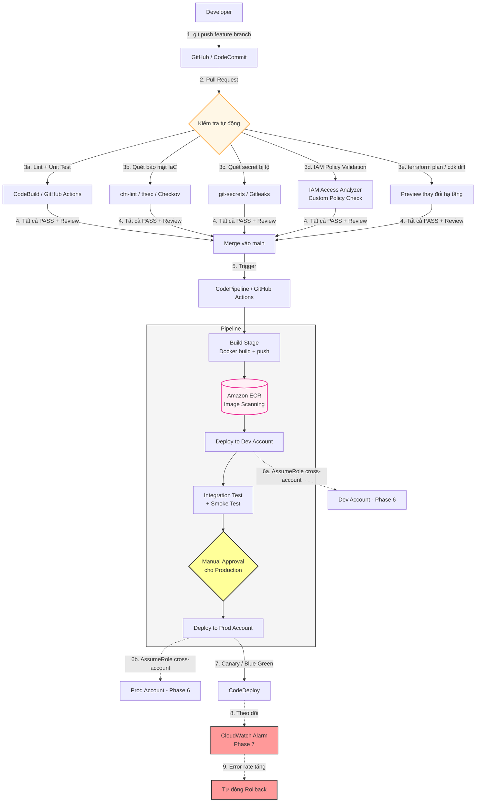
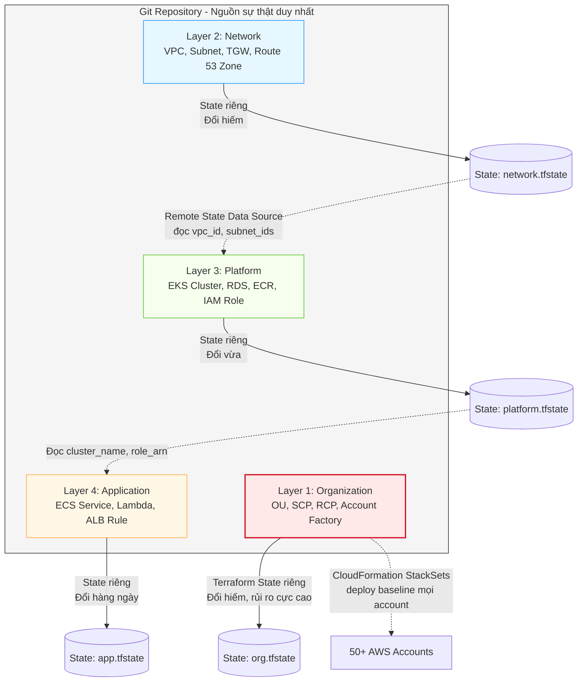

# 🚀 Phase 8: IaC, CI/CD & Deployment Automation (Hạ tầng dưới dạng Mã & Tự động hóa Triển khai)

Phase cuối của lộ trình, và cũng là phase khiến toàn bộ 7 phase trước trở nên **lặp lại được, kiểm toán được và an toàn**.

Câu hỏi cốt lõi: ***"Toàn bộ hạ tầng ở Phase 1-7 — VPC, EC2, ALB, RDS, ECS, SCP, Route 53, Alarm — được tạo ra bằng cách nào? Bấm tay trong Console, hay bằng code trong Git?"***

Các dịch vụ và công cụ chính: **CloudFormation**, **AWS CDK**, **Terraform**, **StackSets**, **CodePipeline / CodeBuild / CodeDeploy**, **GitHub Actions với OIDC**, và **ECR**.

> **Vấn đề của "ClickOps":** Hạ tầng tạo bằng tay không có lịch sử thay đổi, không tái tạo được ở region khác, không rollback được, và tri thức nằm trong đầu một người. Khi người đó nghỉ việc hoặc region đó sập, tổ chức mất khả năng khôi phục. **IaC biến hạ tầng thành tài sản của tổ chức thay vì của cá nhân.**

---

## 🏛️ Sơ đồ 1: Luồng CI/CD hoàn chỉnh từ commit tới production



---

## 🏛️ Sơ đồ 2: Phân tầng IaC trong kiến trúc Multi-Account



---

## 🔍 Phân tích chi tiết mối quan hệ giữa các dịch vụ

### 1. CloudFormation vs CDK vs Terraform — Chọn theo bài toán, không theo sở thích

| Tiêu chí | **CloudFormation** | **AWS CDK** | **Terraform** |
|---|---|---|---|
| Ngôn ngữ | YAML / JSON | TypeScript, Python, Java, Go | HCL |
| Bản chất | Khai báo thuần | Sinh ra CloudFormation template | Khai báo + graph phụ thuộc |
| Quản lý state | AWS quản lý (trong stack) | AWS quản lý | **Bạn tự quản lý** (S3 + DynamoDB lock) |
| Đa cloud | ❌ Chỉ AWS | ❌ Chỉ AWS (CDKTF thì có) | ✅ Có |
| Dịch vụ mới của AWS | Hỗ trợ sớm nhất | Theo sau CloudFormation | Chậm hơn vài tuần/tháng |
| Drift detection | Có sẵn | Có sẵn | `terraform plan` |
| Rollback tự động | ✅ Tích hợp sẵn | ✅ | ❌ Phải apply lại phiên bản cũ |

**Cách chọn thực dụng:**

- **Chỉ dùng AWS + đội quen YAML** → CloudFormation. Đơn giản, rollback tự động, không phải lo state file.
- **Đội mạnh về lập trình, cần abstraction phức tạp** → CDK. Viết một class `SecureBucket` rồi tái sử dụng 50 lần, có type-checking và IDE autocomplete.
- **Đa cloud, hoặc quản lý cả tài nguyên ngoài AWS (Cloudflare, Datadog, GitHub)** → Terraform. Cũng là lựa chọn phổ biến nhất trên thị trường lao động.

> **Điểm khác biệt lớn nhất về vận hành là State file.** CloudFormation giấu state đi — bạn không bao giờ phải nghĩ tới nó. Terraform bắt bạn quản lý state, và **state file bị mất hoặc corrupt là sự cố nghiêm trọng**. Bắt buộc: S3 backend có versioning + DynamoDB table để lock (chống hai người `apply` cùng lúc), và **state file phải được mã hóa** vì nó chứa giá trị nhạy cảm ở dạng thô.

### 2. IaC ↔ Phase 6: StackSets và triển khai xuyên tổ chức

Kiến trúc multi-account ở Phase 6 tạo ra bài toán: làm sao deploy cùng một baseline (Config Recorder, IAM Role, GuardDuty, log forwarding) vào **50 account × 3 region = 150 nơi**?

**CloudFormation StackSets** giải quyết:

- Định nghĩa template **một lần** ở Management Account (hoặc delegated admin account).
- **Service-managed permissions** tích hợp trực tiếp với Organizations — deploy theo **OU**, không phải theo danh sách account ID.
- **Auto-deployment:** account mới được tạo trong OU đó **tự động nhận baseline** — không cần ai nhớ chạy gì.

> **Đây là mối liên kết đẹp nhất giữa Phase 6 và Phase 8:** Organizations định nghĩa *cấu trúc*, StackSets triển khai *nội dung* vào cấu trúc đó, và cả hai đều nằm trong Git.

Với Terraform, tương đương là dùng provider alias + `for_each` qua danh sách account, nhưng **không có cơ chế auto-deploy cho account mới** — phải chạy lại pipeline. Đây là điểm CloudFormation StackSets thắng rõ ràng.

### 3. Phân tầng State — Sai lầm kiến trúc phổ biến nhất

**Anti-pattern:** một Terraform state chứa toàn bộ hạ tầng. Hậu quả:

- `terraform plan` mất 10+ phút vì phải refresh hàng nghìn resource.
- Sửa một ECS task definition mà plan hiển thị diff của VPC → không ai dám apply.
- Một lỗi apply có thể phá hủy tài nguyên ở tầng khác.
- Hai team không thể làm việc song song vì state bị lock.

**Nguyên tắc phân tầng:** tách state theo **tần suất thay đổi và mức độ rủi ro**. Tầng dưới đổi hiếm (VPC, Organization), tầng trên đổi hàng ngày (application). Tầng trên đọc output của tầng dưới qua **remote state data source**, không bao giờ ngược lại.

> **Quy tắc kiểm tra:** Nếu một lần `apply` của team application có khả năng chạm tới VPC hoặc RDS, kiến trúc state của bạn đang sai.

### 4. CI/CD ↔ IAM: OIDC thay thế Access Key (liên kết Phase 6)

Cách làm cũ: tạo IAM User cho CI/CD, lưu access key vào GitHub Secrets. Vấn đề: **credential vĩnh viễn**, không xoay vòng, ai có quyền admin repo là có quyền vào AWS, và key bị lộ thì không ai biết cho tới khi quá muộn.

**Cách làm đúng — OIDC Federation:**

1. Đăng ký GitHub làm **OIDC Identity Provider** trong IAM.
2. Tạo Role với Trust Policy kiểm tra `token.actions.githubusercontent.com:sub`.
3. Pipeline gọi `sts:AssumeRoleWithWebIdentity` → nhận credential tạm **1 giờ**.
4. **Không có secret nào được lưu trữ ở bất kỳ đâu.**

```json
"Condition": {
  "StringEquals": {
    "token.actions.githubusercontent.com:aud": "sts.amazonaws.com",
    "token.actions.githubusercontent.com:sub": "repo:my-org/my-app:environment:production"
  }
}
```

> **Lỗi cấu hình nguy hiểm nhất:** dùng `StringLike` với `repo:my-org/*`. Khi đó **mọi repo trong org** đều deploy được vào production — kể cả repo thử nghiệm hoặc repo có contributor bên ngoài. Luôn khóa tới đúng repo, và tốt nhất là tới đúng `environment` hoặc `ref`.

**Kết hợp Permissions Boundary (Phase 6):** Role của CI/CD thường cần quyền rộng để tạo hạ tầng. Gắn Permissions Boundary để nó không thể tạo ra IAM entity có quyền cao hơn chính nó — chặn con đường leo thang quyền qua pipeline.

### 5. Deployment Strategies — Đánh đổi giữa rủi ro, chi phí và tốc độ

| Chiến lược | Cơ chế | Rủi ro | Chi phí | Rollback |
|---|---|---|---|---|
| **All-at-once** | Thay toàn bộ cùng lúc | Cao | Thấp | Chậm (deploy lại) |
| **Rolling** | Thay từng batch | Trung bình | Thấp | Chậm |
| **Blue-Green** | Dựng môi trường mới song song, chuyển traffic | Thấp | **Gấp đôi trong lúc deploy** | **Tức thì** |
| **Canary** | Chuyển 10% → theo dõi → 100% | Thấp nhất | Trung bình | Nhanh |
| **Linear** | Tăng đều 10% mỗi 10 phút | Thấp | Trung bình | Nhanh |

**Mối liên kết với các Phase trước:**

- **Blue-Green ở tầng DNS** (Phase 6): Route 53 Weighted Routing chuyển traffic dần. Ràng buộc là **TTL** — rollback không nhanh hơn TTL cộng cache của resolver.
- **Blue-Green ở tầng Load Balancer** (Phase 2): ALB Target Group swap — **nhanh hơn nhiều** vì không phụ thuộc DNS cache. Đây là lựa chọn mặc định nên dùng.
- **Canary với Lambda** (Phase 5): Alias + weighted routing giữa hai version, CodeDeploy quản lý việc dịch chuyển.
- **Auto-rollback dựa trên CloudWatch Alarm** (Phase 7): CodeDeploy theo dõi alarm trong `AlarmConfiguration`, error rate tăng → tự rollback mà không cần con người.

> **Điểm mấu chốt:** Auto-rollback chỉ hoạt động nếu alarm ở Phase 7 được thiết kế đúng. Alarm dựa trên Average latency sẽ không phát hiện được deployment lỗi chỉ ảnh hưởng 5% người dùng — và pipeline sẽ vui vẻ đẩy bug ra 100% production.

### 6. Database Migration — Mắt xích yếu nhất của mọi pipeline

Code rollback được trong vài giây. **Schema database thì không.** Đây là nơi phần lớn sự cố deployment nghiêm trọng bắt nguồn.

**Nguyên tắc Expand-Contract (backward compatible migration):**

1. **Expand:** Thêm cột mới (nullable), **không** xóa cột cũ. Deploy migration này trước, độc lập với code.
2. **Migrate:** Deploy code ghi vào **cả hai** cột, đọc từ cột cũ.
3. **Backfill:** Chạy job điền dữ liệu cho cột mới.
4. **Switch:** Deploy code đọc từ cột mới.
5. **Contract:** Sau khi ổn định vài ngày, mới xóa cột cũ.

> Trong suốt quá trình, **phiên bản code cũ và mới đều chạy được** trên cùng schema — điều kiện bắt buộc để rolling deployment và rollback hoạt động. Nếu migration làm gãy code cũ, bạn đã mất khả năng rollback ngay khoảnh khắc migration chạy xong.

### 7. ECR và bảo mật chuỗi cung ứng container (liên kết Phase 5)

Container image là **artifact được deploy**, nên nó phải được kiểm soát chặt như source code:

- **Image Scanning:** ECR Enhanced Scanning (dùng Inspector) quét CVE liên tục, kể cả sau khi image đã được push từ lâu — lỗ hổng mới công bố hôm nay ảnh hưởng image push từ tháng trước.
- **Immutable Tags:** Bật để không ai ghi đè được tag `v1.2.3`. Nếu không, "image đã test" và "image đang chạy production" có thể là hai thứ khác nhau hoàn toàn.
- **Không bao giờ dùng tag `latest` ở production.** Deploy phải trỏ tới **digest** (`sha256:...`) hoặc tag bất biến — đây là điều kiện để tái tạo chính xác một deployment đã xảy ra.
- **Lifecycle Policy:** tự động xóa image cũ. Không có nó, ECR tích lũy hàng nghìn image và trở thành khoản chi phí lưu trữ đáng kể.
- **Pipeline gate:** chặn deploy nếu scan tìm thấy CVE mức `CRITICAL`.

### 8. Quản lý Secrets — Không bao giờ nằm trong IaC

State file của Terraform và template CloudFormation đều **lưu giá trị ở dạng thô**. Đặt password vào đó là rò rỉ, kể cả khi biến được đánh dấu `sensitive` (nó chỉ ẩn khỏi output console, không ẩn khỏi state).

**Pattern đúng:**

- IaC tạo ra **Secret rỗng** trong Secrets Manager (hoặc chỉ tham chiếu tới nó), giá trị thật được nạp ngoài pipeline.
- Với RDS: dùng **`manage_master_user_password`** — RDS tự sinh và tự xoay vòng password trong Secrets Manager, giá trị **không bao giờ đi qua Terraform**.
- Ứng dụng đọc secret lúc **runtime** qua IAM Role (Phase 2), không phải lúc deploy.
- ECS/EKS inject secret qua `secrets` block trong task definition — giá trị không xuất hiện trong biến môi trường của image.

| | **Secrets Manager** | **SSM Parameter Store** |
|---|---|---|
| Rotation tự động | ✅ Tích hợp sẵn với RDS/Redshift | ❌ Phải tự làm |
| Chi phí | ~$0.40/secret/tháng | **Standard miễn phí** |
| Cross-account | ✅ Resource policy | Chỉ Advanced tier |
| Dùng cho | Password, API key cần xoay vòng | Config, endpoint, feature flag |

### 9. Drift Detection — Khi thực tế khác với code

**Drift** xảy ra khi ai đó sửa tài nguyên trực tiếp trong Console. Đây là kẻ thù của IaC: lần `apply` tiếp theo sẽ **âm thầm ghi đè** thay đổi đó — và nếu thay đổi đó là một hotfix lúc 3 giờ sáng, bạn vừa tái tạo lại sự cố.

**Ba lớp phòng thủ:**

1. **Ngăn chặn (Phase 6):** SCP chỉ cho phép `OrganizationIaCRole` thay đổi hạ tầng; người dùng thông thường chỉ có quyền read-only ở production.
2. **Phát hiện:** `terraform plan` chạy định kỳ trong pipeline (nightly) và cảnh báo nếu có diff. CloudFormation có Drift Detection tích hợp. AWS Config phát hiện thay đổi cấu hình theo thời gian thực (Phase 7).
3. **Quy trình break-glass:** Phải có đường thoát hiểm hợp pháp — một role đặc biệt, cần phê duyệt, mọi hành động được CloudTrail ghi lại, và **bắt buộc phản ánh ngược lại vào code trong vòng 24 giờ**.

> Cấm tuyệt đối thay đổi thủ công là không thực tế — sẽ có lúc production cháy và pipeline hỏng. Điều quan trọng là **thay đổi thủ công phải là ngoại lệ có kiểm soát, không phải thói quen**.

---

## ⚠️ Bẫy thường gặp trong Phase này

| Bẫy | Hậu quả |
|---|---|
| Terraform state không có DynamoDB lock | Hai người apply cùng lúc → state corrupt, hạ tầng bất định |
| State file không mã hóa / không versioning | Rò rỉ secret; mất state là mất khả năng quản lý hạ tầng |
| Một state cho toàn bộ hạ tầng | Plan chậm, blast radius lớn, team block lẫn nhau |
| Access key vĩnh viễn trong CI/CD secrets | Credential không xoay vòng, rò rỉ khó phát hiện |
| OIDC trust policy dùng `repo:org/*` | Mọi repo trong org deploy được vào production |
| Dùng tag `latest` ở production | Không biết chính xác code nào đang chạy, không tái tạo được |
| Migration không backward compatible | Mất hoàn toàn khả năng rollback |
| Không có auto-rollback dựa trên alarm | Bug được đẩy ra 100% người dùng trước khi ai đó nhận ra |
| Hardcode secret trong template/state | Rò rỉ qua Git history — xóa file không đủ, phải rotate secret |
| Không có Lifecycle Policy cho ECR | Chi phí lưu trữ image tăng âm thầm |
| Bỏ qua drift detection | Code và thực tế lệch nhau, `apply` tiếp theo gây sự cố bất ngờ |

---

## 🎯 Thứ tự áp dụng khuyến nghị

1. **Đưa hạ tầng hiện có vào code** — dùng `terraform import` hoặc CloudFormation resource import. Bắt đầu từ môi trường dev.
2. **Thiết lập remote state đúng chuẩn** — S3 versioning + encryption + DynamoDB lock, mỗi tầng một state.
3. **Chuyển CI/CD sang OIDC**, xóa toàn bộ access key vĩnh viễn.
4. **Thêm cổng kiểm soát vào PR** — lint, `plan`, quét secret, quét bảo mật IaC.
5. **Áp Blue-Green hoặc Canary** cho service quan trọng nhất, kèm auto-rollback dựa trên alarm Phase 7.
6. **Triển khai StackSets** cho baseline toàn Organization (Phase 6).
7. **Bật drift detection định kỳ** và định nghĩa quy trình break-glass rõ ràng.

> **Nguyên tắc cuối cùng khép lại toàn bộ lộ trình:** Nếu bạn không thể **xóa sạch một môi trường và dựng lại từ Git trong vòng vài giờ**, thì hạ tầng của bạn vẫn chưa thực sự là code — và mọi cam kết về disaster recovery ở các Phase trước chỉ là lý thuyết.

---

## 📚 Đọc sâu hơn

| Chủ đề | Tài liệu |
|---|---|
| ECS, EKS, Fargate, ECR — đối tượng được deploy | [Phase 5: Containers & Serverless](../05_Containers_Serverless/README.md) |
| Multi-account, SCP, OIDC cross-account, StackSets | [Phase 6: Multi-Account Governance](../06_MultiAccount_Governance_Global_DNS/README.md) |
| CloudWatch Alarm làm cơ sở cho auto-rollback | [Phase 7: Observability & Incident Response](../07_Observability_Incident_Response/README.md) |
| IAM Role, Permissions Boundary, Policy Validation | [IAM Deep Dive v2](../../AWS_Knowledge/02_Security_Identity/IAM_DeepDive_v2.md) |
| IaC cho governance: SCP, Config Rules, Tag Policy | [Cloud Governance](../../AWS_Knowledge/12_Cloud_Governance/Cloud_Governance.md) |
| Container service: ECS vs EKS vs Fargate | [Container Service](../../AWS_Knowledge/04_Compute_Serverless/container_service.md) |
