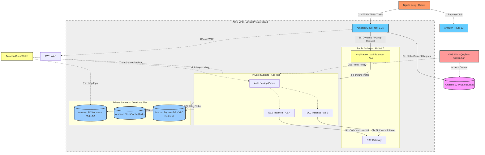

# 🛠️ AWS Deep Dive Infrastructure: Phân tích mối quan hệ giữa các dịch vụ

Chào mừng bạn đến với tài liệu học sâu (Deep Dive) về hạ tầng **Amazon Web Services (AWS)**. Dựa trên lộ trình chuyên nghiệp từ [roadmap.sh/aws](https://roadmap.sh/aws), tài liệu này không chỉ đi qua định nghĩa của từng dịch vụ mà tập trung phân tích **mối quan hệ tương quan, cách các dịch vụ tích hợp, bảo mật, và luồng dữ liệu chạy qua lại giữa chúng**.

---

## 🏛️ Sơ đồ kiến trúc tổng quan (Comprehensive 3-Tier Architecture)

Dưới đây là sơ đồ Mermaid thể hiện cách các dịch vụ AWS cốt lõi kết hợp với nhau trong một hệ thống Web App 3 lớp (3-Tier) an toàn, có khả năng tự động mở rộng và chịu lỗi cao:

---

## 📂 Các giai đoạn phân tích chuyên sâu (Learning Phases)

Để giúp bạn tiếp thu một cách hệ thống và bám sát theo roadmap.sh/aws, kiến thức được chia làm 8 Phase cụ thể:

1. **[Phase 1: Foundations & Core Concepts (Nền tảng & Khái niệm cốt lõi)](./01_Foundations_Core_Concepts/)**
   - Tìm hiểu về các mô hình cloud, hạ tầng toàn cầu, Shared Responsibility Model và 6 trụ cột của Well-Architected Framework.
2. **[Phase 2: Core Compute, Networking & IAM (Hạ tầng Máy chủ, Mạng & Định danh)](./02_Core_Compute_Networking_IAM/)**
   - Phân tích sâu mối liên kết cốt lõi giữa `VPC`, `EC2`, và `IAM` cùng các nguyên tắc bảo mật mạng/máy chủ.
3. **[Phase 3: Storage, Content Delivery & SES (Lưu trữ, CDN & Email)](./03_Storage_ContentDelivery_SES/)**
   - Phân tích sâu luồng phân phối nội dung tĩnh/động kết hợp `S3`, `CloudFront`, `Route 53`, `SES` và giám sát qua `CloudWatch`.
4. **[Phase 4: Databases & Caching (Cơ sở dữ liệu & Bộ nhớ đệm)](./04_Databases_Caching/)**
   - Tìm hiểu cách tối ưu hóa tầng dữ liệu thông qua sự kết hợp của `RDS`, `DynamoDB`, `ElastiCache` và các mẫu thiết kế cache.
5. **[Phase 5: Containers & Serverless (Container & Điện toán Không máy chủ)](./05_Containers_Serverless/)**
   - Phân tích cơ chế hoạt động và tích hợp các dịch vụ hiện đại: `ECR`, `ECS`, `EKS`, `Fargate`, `Lambda`, và `API Gateway`.
6. **[Phase 6: Multi-Account Governance & Global Traffic (Quản trị Đa tài khoản & Điều phối Lưu lượng)](./06_MultiAccount_Governance_Global_DNS/)**
   - Phân tích tầng điều khiển: `AWS Organizations` (SCP/RCP), `IAM` (Policy Evaluation, Permissions Boundary, Identity Center) và `Route 53` (DNS tập trung, Latency Routing) trong kiến trúc multi-account.
7. **[Phase 7: Observability & Incident Response (Quan sát Hệ thống & Xử lý Sự cố)](./07_Observability_Incident_Response/)**
   - Ba trụ cột Metrics/Logs/Traces với `CloudWatch`, `X-Ray`, `CloudTrail`, `EventBridge` — và quy trình chẩn đoán sự cố trong hệ thống phân tán.
8. **[Phase 8: IaC, CI/CD & Deployment Automation (Hạ tầng dưới dạng Mã & Tự động hóa)](./08_IaC_CICD_Automation/)**
   - `CloudFormation`, `CDK`, `Terraform`, `StackSets`, `CodePipeline` và OIDC — biến toàn bộ hạ tầng Phase 1-7 thành code lặp lại được.

---

## 🎯 Cách khai thác tài liệu này hiệu quả

- **Bước 1:** Bắt đầu bằng việc đọc tài liệu tổng quan của từng nhóm để hiểu được **Why (Tại sao cần kết hợp chúng)** và **How (Chúng liên kết như thế nào)**.
- **Bước 2:** Nghiên cứu kỹ các sơ đồ kiến trúc cục bộ (Mermaid) trong mỗi thư mục để ghi nhớ luồng đi của dữ liệu.
- **Bước 3:** Áp dụng các kiến trúc này vào các dự án thực tế nằm trong thư mục [Example](../Example) để thực hành trực quan.
