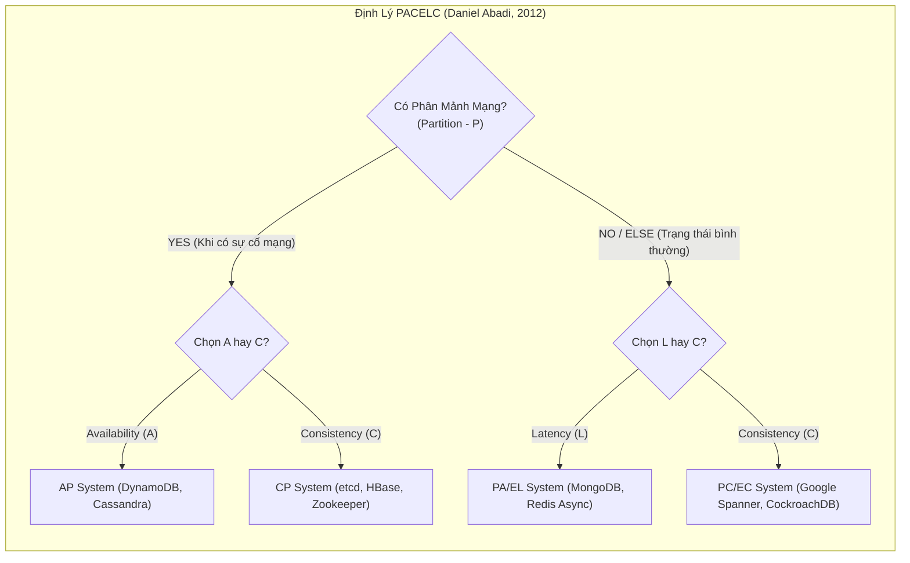
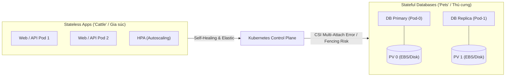
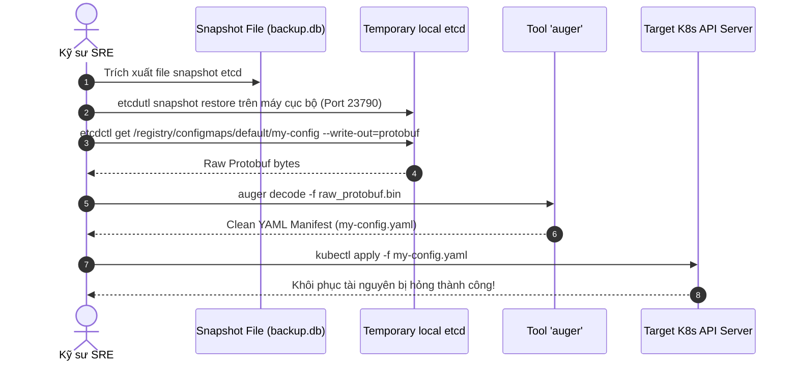
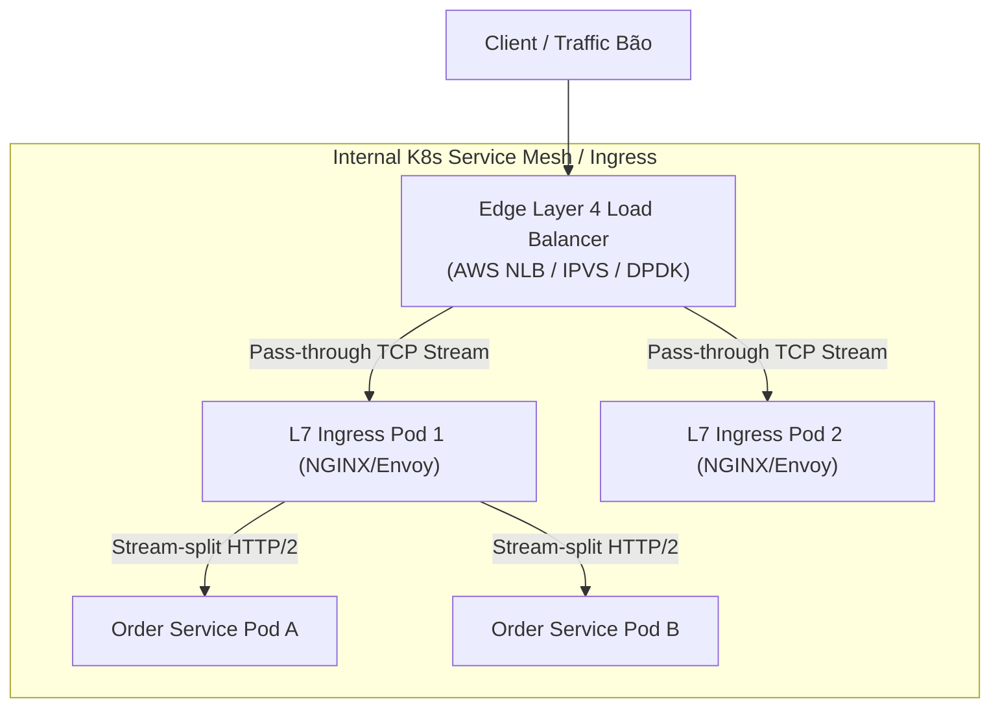

# Báo Cáo Chuyên Sâu: Nền Tảng Kiến Trúc Hệ Thống Phân Tán & SRE Operations

Báo cáo nghiên cứu chuyên sâu này phân tích **5 trụ cột kiến trúc nền tảng** trong thiết kế, triển khai và vận hành hệ thống phân tán quy mô lớn (Large-Scale Distributed Systems) dành cho Kỹ sư Phần mềm và Chuyên gia SRE (Site Reliability Engineering):
1. **Những giới hạn toán học định hình hệ thống phân tán**: Định lý CAP, PACELC và giải pháp Google Spanner / TrueTime.
2. **Mô hình Stateless vs Stateful Microservices trên Kubernetes**: Tư duy Cattle vs Pets, rào cản CSI Multi-Attach Error, Fencing/STONITH và Patroni Operator.
3. **Quorum, Split-Brain & Phục hồi thảm họa etcd**: Toán học số node lẻ (3, 5, 7), thuật toán Raft và kỹ thuật phục hồi phẫu thuật etcd snapshot (`auger` + `etcdctl`).
4. **Phân phối tải & Reverse Proxy (Layer 4 vs Layer 7)**: Giải quyết vấn đề gRPC/HTTP2 multiplexing imbalance và Kiến trúc phân tầng (Tiered Load Balancing).
5. **Tính Idempotency (Lũy đẳng) trong thiết kế API**: Chuẩn Idempotency-Key của Stripe, Redis SETNX race condition vs PostgreSQL ACID Transactional Outbox Pattern.

---

## 📋 Mục lục
1. [Định Lý Giới Hạn Trong Hệ Thống Phân Tán (CAP, PACELC & Google Spanner)](#1-định-lý-giới-hạn-trong-hệ-thống-phân-tán-cap-pacelc--google-spanner)
2. [Mô Hình Stateless & Stateful Microservices Trên Kubernetes](#2-mô-hình-stateless--stateful-microservices-trên-kubernetes)
3. [Quorum, Split-Brain & Phục Hồi Thảm Họa etcd Trong K8s](#3-quorum-split-brain--phục-hồi-thảm-họa-etcd-trong-k8s)
4. [Phân Phối Tải Network: Layer 4 vs. Layer 7 & Kiến Trúc Phân Tầng](#4-phân-phối-tải-network-layer-4-vs-layer-7--kiến-trúc-phân-tầng)
5. [Tính Lũy Đẳng (Idempotency) Trong Thiết Kế API & Giao Dịch Tài Chính](#5-tính-lũy-đẳng-idempotency-trong-thiết-kế-api--giao-dịch-tài-chính)
6. [Tổng Kết & SRE Checklist Vận Hành Hạ Tầng](#6-tổng-kết--sre-checklist-vận-hành-hạ-tầng)

---

## 1. Định Lý Giới Hạn Trong Hệ Thống Phân Tán (CAP, PACELC & Google Spanner)

Một **Hệ thống phân tán (Distributed System)** là một tập hợp các máy tính độc lập về mặt vật lý nhưng giao tiếp và phối hợp với nhau thông qua mạng lưới để dưới góc nhìn của người dùng, toàn bộ hệ thống hoạt động như một thực thể nhất quán duy nhất.



*Figure 1: Sơ đồ phân nhánh quyết định kiến trúc theo định lý PACELC.*

---

### 1.1 Định Lý CAP và Bản Chất Của Sự Đánh Đổi

Được chứng minh toán học bởi Seth Gilbert và Nancy Lynch (2002) từ phỏng đoán của Eric Brewer (2000), **Định lý CAP** khẳng định một hệ thống lưu trữ phân tán chỉ có thể cung cấp tối đa **2 trong 3 sự đảm bảo** tại một thời điểm:

1. **Consistency (C - Tính nhất quán tuyến tính / Linearizability)**: Mọi thao tác đọc đều nhận được kết quả của lần ghi gần nhất hoặc một thông báo lỗi. Tất cả các Client luôn nhìn thấy cùng một dữ liệu tại cùng một thời điểm bất kể họ kết nối tới node nào.
2. **Availability (A - Tính khả dụng 100%)**: Mọi node không bị hỏng (non-failing node) bắt buộc phải trả về phản hồi hợp lệ cho mọi request (dù phản hồi đó có thể chứa dữ liệu cũ), không được phép trả về error hoặc timeout.
3. **Partition Tolerance (P - Khả năng chịu phân mảnh mạng)**: Hệ thống tiếp tục vận hành bình thường bất chấp việc mạng giữa các node bị mất gói tin (packet loss), độ trễ cao hoặc bị đứt đoạn hoàn toàn.

> [!CRITICAL]
> **Thực tế kỹ thuật mạng**: Trong mạng diện rộng (WAN) hoặc giữa các Availability Zones (AZ), sự cố phân mảnh mạng (Network Partition) là **điều chắc chắn sẽ xảy ra** do đứt cáp, hỏng switch hay lỗi định tuyến. Do đó, hệ thống phân tán **bắt buộc phải chọn P**. Sự đánh đổi thực sự của CAP luôn là: **Khi xảy ra Partition, chọn CP (hy sinh Availability để giữ đúng dữ liệu) hay AP (hy sinh Consistency để giữ hệ thống sống)?**

---

### 1.2 PACELC: Mở Rộng Cần Thiết Cho Định Lý CAP

Định lý CAP có điểm yếu là **chỉ mô tả hệ thống khi có sự cố mạng (Partition)**. Tuy nhiên, hệ thống chạy 99.9% thời gian ở trạng thái bình thường. Định lý **PACELC** (Daniel Abadi, 2012) bổ sung góc nhìn hoàn chỉnh:

$$\text{If } \mathbf{P} \text{ (Partition) } \rightarrow \text{Choose } \mathbf{A} \text{ or } \mathbf{C}; \quad \mathbf{E} \text{lse (Normal) } \rightarrow \text{Choose } \mathbf{L} \text{ (Latency) or } \mathbf{C} \text{ (Consistency)}$$

- **Khi mạng bình thường (Else - E)**: Để đạt **Tính nhất quán tuyệt đối (C)**, node tiếp nhận dữ liệu phải gửi bản sao qua mạng tới các node khác và chờ xác nhận trước khi phản hồi Client. Quá trình này bị giới hạn bởi **tốc độ ánh sáng truyền qua cáp quang** (ví dụ: Round-trip time giữa Mỹ và Việt Nam $\sim 180\text{ms}$), gây ra **Độ trễ cao (High Latency - L)**.
- Nếu muốn **Độ trễ thấp (L)**, hệ thống phải phản hồi ngay sau khi ghi tại node cục bộ và nhân bản bất đồng bộ (Async Replication) sang các node khác $\rightarrow$ Chấp nhận **Nhất quán cuối (Eventual Consistency)**.

---

### 1.3 Bứt Phá Giới Hạn: Google Spanner & Hệ Thống TrueTime

Google Spanner được coi là "chén thánh" của ngành cơ sở dữ liệu phân tán khi cung cấp **External Consistency (Linearizability) toàn cầu** mà vẫn duy trì tính sẵn sàng siêu cao.

```
+-------------------------------------------------------------------------+
|                  BẢN CHẤT KỸ THUẬT CỦA GOOGLE SPANNER                   |
+-------------------------------------------------------------------------+
| 1. Bản chất là hệ thống CP (dùng Paxos Consensus).                      |
| 2. Nhờ mạng cáp quang riêng + dự phòng phần cứng khổng lồ, xác suất    |
|    xảy ra Partition < 0.1% -> Hoạt động như một hệ thống CA thực tế.    |
| 3. TrueTime API: Đồng hồ nguyên tử (Atomic Clocks) + GPS Receivers tại |
|    mỗi Data Center -> Cung cấp khoảng mốc thời gian [t_earliest, t_latest]|
| 4. Cho phép MVCC (Multi-Version Concurrency Control) Snapshot Reads     |
|    toàn cầu không cần dùng Lock.                                        |
+-------------------------------------------------------------------------+
```

TrueTime không trả về mốc thời gian tuyệt đối mà trả về khoảng bất định $[t_{\text{earliest}}, t_{\text{latest}}]$ với độ sai lệch cực nhỏ ($\epsilon < 7\text{ms}$). Nhờ đó, Spanner có thể gán timestamp gia tăng đơn điệu cho mọi giao dịch mà không cần giao tiếp mạng giữa các châu lục để xin lock, giải quyết xuất sắc bài toán PACELC.

---

## 2. Mô Hình Stateless & Stateful Microservices Trên Kubernetes

Kubernetes (K8s) đã trở thành chuẩn mực điều phối container. Tuy nhiên, thái độ của kỹ sư SRE đối với các khối công việc (Workloads) bị phân hóa sâu sắc dựa trên thuộc tính lưu trữ dữ liệu.



*Figure 2: So sánh kiến trúc Stateless (Cattle) và Stateful (Pets) trên Kubernetes.*

---

### 2.1 Stateless Microservices: Bầy Cừu (Cattle) Của Hạ Tầng

Ứng dụng Stateless (Web API, Auth Service, Image Processors) không lưu bất kỳ Session state nào trên ổ đĩa cục bộ. Dữ liệu được đẩy ra các bộ lưu trữ bên ngoài (Redis, Database, S3).
- **Tư duy Cattle**: Pod bị xóa hoặc Node sập không gây mất mát dữ liệu. `ReplicaSet` chỉ cần lập lịch tạo Pod mới trên Node khác trong vài giây.
- **Tự động mở rộng (HPA)**: Có thể tăng/giảm từ 5 lên 500 Pods tức thì mà không gặp rào cản gán đĩa (Storage Attachment).

---

### 2.2 Stateful Microservices: 3 Rào Cản Kỹ Thuật Khổng Lồ

Ngược lại, Cơ sở dữ liệu (PostgreSQL, MySQL, Kafka, Cassandra) là những "thú cưng" (Pets) có danh tính mạng cố định và dữ liệu vĩnh viễn trên đĩa. Việc chạy Database trên K8s vướng phải 3 điểm nghẽn nghiêm trọng:

#### 1. Điểm nghẽn CSI và Lỗi Multi-Attach Error:
Giao diện lưu trữ Container (CSI) gồm `Controller` và `Node Plugin`. Khi một Worker Node bị rớt mạng đột ngột:
- Kubelet trên Node lỗi không thể gửi RPC `Unpublish` về cho CSI Node Plugin.
- K8s Master thấy Node offline nên tạo Pod DB mới trên Node khác.
- Tuy nhiên, Cloud Provider (như AWS EBS) nhận thấy đĩa **vẫn đang bị gắn vào Node cũ** $\rightarrow$ Ném lỗi **`Multi-Attach error`**. Pod DB mới mãi mãi bị kẹt ở trạng thái `ContainerCreating`, khiến quá trình tự động khôi phục (Failover) hoàn toàn thất bại.

#### 2. Thách thức Fencing và STONITH (Shoot The Other Node In The Head):
Trong hạ tầng Bare-metal truyền thống, khi Node Master DB có dấu hiệu chập chờn, hệ thống dùng phần cứng IPMI/iLO gửi lệnh **STONITH (Cắt điện trực tiếp Node cũ)** để đảm bảo 100% Node cũ dừng ghi đĩa trước khi bầu Master mới.
Trên Kubernetes, việc ngắt điện một Worker Node chứa hàng chục Pod của dịch vụ khác là không thể. Thiếu STONITH mức phần cứng khiến nguy cơ **2 Pod DB cùng ghi đĩa mạng (Split-Brain Storage)** cực kỳ cao.

#### 3. Sự Phức Tạp Của Database Operator (Điển hình: Patroni cho PostgreSQL):
Để chạy PostgreSQL an toàn trên K8s, SRE phải bọc nó qua **Patroni Operator**:

```mermaid
flowchart TD
    subgraph PatroniArchitecture["Kiến Trúc Patroni Operator trên Kubernetes"]
        Patroni1["Patroni + PostgreSQL (Primary)"]
        Patroni2["Patroni + PostgreSQL (Replica)"]
        DCS[("etcd / Consul<br/>(Distributed Config Store)")]
        
        Patroni1 -- "Keepalive Heartbeat (Leader Lease)" --> DCS
        Patroni2 -- "Watch Lease" --> DCS
        Patroni1 -.-x|Thất bại Lease (Mất mạng)| SelfKill["Self-Terminate (Fencing Mềm)"]
        Patroni2 -- "Bầu Leader Mới" --> Promoted["Promote to Primary"]
    end
```

*Figure 3: Cơ chế Fencing mềm và bầu chọn Leader của Patroni Operator.*

---

## 3. Quorum, Split-Brain & Phục Hồi Thảm Họa etcd Trong K8s

### 3.1 Quorum và Công Thức Toán Học Bầu Cử

**Quorum** là số lượng node tối thiểu phải liên lạc được với nhau để cụm phân tán được phép bầu Leader hoặc chấp nhận lệnh ghi.

$$\text{Quorum } (Q) = \left\lfloor \frac{N}{2} \right\rfloor + 1 \quad \mid \quad \text{Khả năng chịu lỗi } (F) = \left\lfloor \frac{N - 1}{2} \right\rfloor$$

#### Bảng Phân Tích Chi Tiết Số Node Trong Cluster:

| Số Node ($N$) | Quorum ($Q$) | Node Hỏng Tối Đa ($F$) | Đánh Giá Vận Hành |
| :---: | :---: | :---: | :--- |
| **1** | 1 | 0 | Không có dự phòng |
| **2** | 2 | 0 | **Nguy hiểm**: 1 node sập làm sập toàn bộ cụm |
| **3** | 2 | **1** | **Cấu hình tiêu chuẩn tối thiểu** |
| **4** | 3 | **1** | **Kém hiệu quả**: Tốn tài nguyên hơn cụm 3 node nhưng $F$ vẫn bằng 1 |
| **5** | 3 | **2** | **Khuyên dùng cho Production lớn** |
| **6** | 4 | **2** | Kém hiệu quả so với cụm 5 node |
| **7** | 4 | **3** | Chịu lỗi rất cao cho hạ tầng cốt lõi |

> [!WARNING]
> **Nghịch lý của số node CHẴN**: Cụm 4 nodes yêu cầu Quorum = 3. Nếu đứt cáp mạng chia cụm thành 2-2, **cả 2 bên đều không đạt Quorum (2 < 3)** $\rightarrow$ Toàn bộ cụm bị ngắt dịch vụ hoàn toàn. Trong khi đó, cụm 3 nodes bị chia 2-1 thì phân vùng 2 nodes đạt Quorum và tiếp tục chạy bình thường!

---

### 3.2 Kỹ Thuật Phục Hồi Phẫu Thuật (Surgical Recovery) etcd Snapshot

Khi cụm etcd bị hỏng đa số (Lost Quorum), K8s API Server bị liệt hoàn toàn. Thay vì khôi phục đè toàn bộ snapshot (làm đảo ngược thời gian và mất các thay đổi khác), SRE thực hiện **Phục hồi phẫu thuật trích xuất khóa lẻ**:



*Figure 4: Quy trình phẫu thuật trích xuất dữ liệu từ etcd snapshot bằng auger.*

---

## 4. Phân Phối Tải Network: Layer 4 vs. Layer 7 & Kiến Trúc Phân Tầng



*Figure 5: Kiến trúc Phân tầng (Tiered Load Balancing) kết hợp L4 ở mép mạng và L7 bên trong.*

---

### 4.1 Điểm Mù Của Layer 4 Đối Với gRPC & HTTP/2 Multiplexing

- **Layer 4 (Transport Layer)**: Phân phối dựa trên **5-tuple** (Src IP, Src Port, Dst IP, Dst Port, Protocol).
- **Vấn đề gRPC / HTTP/2 Multiplexing**: gRPC duy trì **một kết nối TCP duy nhất kéo dài (Long-lived TCP connection)** và đẩy hàng nghìn request đồng thời qua kết nối đó.
- L4 Load Balancer chỉ nhìn thấy 1 TCP connection nên ném toàn bộ dữ liệu vào **đúng 1 Pod duy nhất**, khiến Pod đó quá tải sập nguồn trong khi các Pod khác hoàn toàn nhàn rỗi!
- **Layer 7 giải quyết triệt để**: Gỡ các HTTP/2 streams bên trong kết nối TCP và rải đều từng request lẻ qua tất cả các Pod backend.

---

### 4.2 Bảng So Sánh Chi Tiết Layer 4 vs. Layer 7

| Đặc Điểm | Layer 4 (Network LB) | Layer 7 (Application LB) |
| :--- | :--- | :--- |
| **Tiêu chí định tuyến** | IP Address, Port, TCP/UDP | Hostname, URL Path, HTTP Headers, Cookies |
| **Kết nối TCP** | TCP Pass-through (1 luồng end-to-end) | Full Proxy (2 kết nối TCP riêng biệt) |
| **SSL/TLS Handling** | SSL Pass-through (Không giải mã) | SSL Termination (Giải mã tập trung) |
| **Xử lý gRPC / HTTP/2** | Kém (Mất cân bằng tải do TCP Multiplexing) | Tối ưu (Chia tách streams và rải đều request) |
| **Hiệu năng & Latency** | Siêu cao ($> 1,000,000\text{ pps}$), Latency $< 1\text{ms}$ | Thấp hơn L4 do tốn CPU giải mã SSL & parse HTTP |
| **Khả năng quan sát** | Kém (Chỉ đo đếm Bytes và TCP Connections) | Xuất sắc (Thống kê HTTP 200/500, Latency từng API) |

---

## 5. Tính Lũy Đẳng (Idempotency) Trong Thiết Kế API & Giao Dịch Tài Chính

### 5.1 Khái Niệm & Bài Toán Retries Trên Mạng Bất Ổn

Một API được gọi là **Idempotent (Lũy đẳng)** nếu thực thi nó 1 lần hay $N$ lần liên tiếp với cùng dữ liệu đầu vào đều mang lại trạng thái hệ thống giống hệt nhau: $f(x) = f(f(x))$.

```
[Client] --- POST /api/v1/payments ($100) ---> [Backend DB: Trừ $100 thành công]
   |                                                    |
   +x-- NETWORK DROPPED (Client Timeout) <--------------+
   |
[Client Retries POST /api/v1/payments ($100)]
   |
   +---> Lần 1: Không Idempotent -> Trừ thêm $100 (Khách bị mất $200!)
   +---> Lần 2: Có Idempotent     -> Trả về kết quả cũ (Khách chỉ mất $100)
```

---

### 5.2 Stripe Idempotency Pattern: 3 Thành Tố Cốt Lõi

1. **Header `Idempotency-Key` & Response Cache**: Client đính kèm UUIDv4. Backend xử lý xong sẽ cache HTTP Status & Response Body trong Deduplication Store.
2. **Fingerprint Check (Kiểm tra dấu vân tay)**: Ghi lại Hash của Payload. Nếu Client dùng cùng `Idempotency-Key` nhưng đổi số tiền từ `$100` thành `$500`, API từ chối ngay với lỗi `HTTP 422 Unprocessable Entity`.
3. **In-Progress Lock**: Nếu request 2 đến trong khi request 1 vẫn đang xử lý, API trả về `HTTP 409 Conflict` để tránh hai luồng chạy song song.

---

### 5.3 Redis SETNX Race Condition vs. PostgreSQL ACID Transactional Outbox

```mermaid
flowchart TD
    subgraph RedisRisky["Cách tiếp cận Redis SETNX (Có rủi ro desync)"]
        R1["1. SETNX idempotency:key 'IN_PROGRESS'"] --> R2["2. Trừ tiền DB thành công"]
        R2 --> R3["3. App bị OOMKilled trước khi lưu Cache!"]
        R3 --> R4["Lần Retry sau: Redis mất Lock nhưng DB đã trừ tiền -> Trừ tiền lần 2!"]
    end

    subgraph PGAcid["Cách tiếp cận PostgreSQL ACID Transaction (Brandur Leach)"]
        P1["BEGIN TRANSACTION;"] --> P2["INSERT INTO idempotency_keys (key, status) VALUES (...);"]
        P2 --> P3["UPDATE accounts SET balance = balance - 100 WHERE id = 123;"]
        P3 --> P4["COMMIT TRANSACTION;"]
        P4 --> P5["100% Nguyên tử (All-or-Nothing) - Không bao giờ desync!"]
    end
```



*Figure 6: So sánh tính nguyên tử giữa Redis Cache Lock và PostgreSQL ACID Transaction.*

> [!TIP]
> **Khuyên dùng từ Brandur Leach (Stripe Engineer)**: Đối với giao dịch tài chính quan trọng, **bắt buộc phải lưu bảng `idempotency_keys` trực tiếp trong cùng PostgreSQL Database với dữ liệu nghiệp vụ** và thực thi trong cùng 1 ACID Transaction (`BEGIN ... COMMIT`). Điều này loại bỏ hoàn toàn nguy cơ rớt mạng giữa Cache và DB.

---

## 6. Tổng Kết & SRE Checklist Vận Hành Hạ Tầng

| Trụ Cột | Quy Tắc Vàng Vận Hành (SRE Golden Rules) |
| :--- | :--- |
| **Distributed CAP/PACELC** | Chấp nhận ranh giới vật lý. Dùng Eventual Consistency cho hệ thống đọc quy mô lớn; dùng Strong Consistency (Spanner/etcd) cho metadata cốt lõi. |
| **Stateless & Stateful K8s** | Đặt 100% App/Web lên K8s Deployment. Giữ DB quan trọng trên Cloud Managed Services (RDS/Aurora) hoặc bọc bằng Operator chuyên dụng (Patroni) có Fencing mềm. |
| **Quorum & etcd** | Triển khai **3 hoặc 5 nodes LẺ** cho etcd. Thực hiện sao lưu snapshot etcd định kỳ và nắm vững kỹ thuật phẫu thuật snapshot bằng `auger`. |
| **Load Balancing** | Phân tầng hạ tầng: L4 LB ở viền ngoài đón bão kết nối TCP $\rightarrow$ L7 Ingress Proxy ở bên trong gỡ gRPC/HTTP2 multiplexing và điều hướng theo URL. |
| **API Idempotency** | Bắt buộc đính kèm `Idempotency-Key` cho mọi `POST` API thanh toán. Gom việc kiểm tra Idempotency và ghi DB vào cùng **1 ACID Transaction**. |

---
*Tài liệu tham khảo chuyên sâu: Martin Kleppmann (Designing Data-Intensive Applications), Seth Gilbert & Nancy Lynch (CAP Proof), Daniel Abadi (PACELC Theorem), Brandur Leach (Stripe Engineering Idempotency).*
