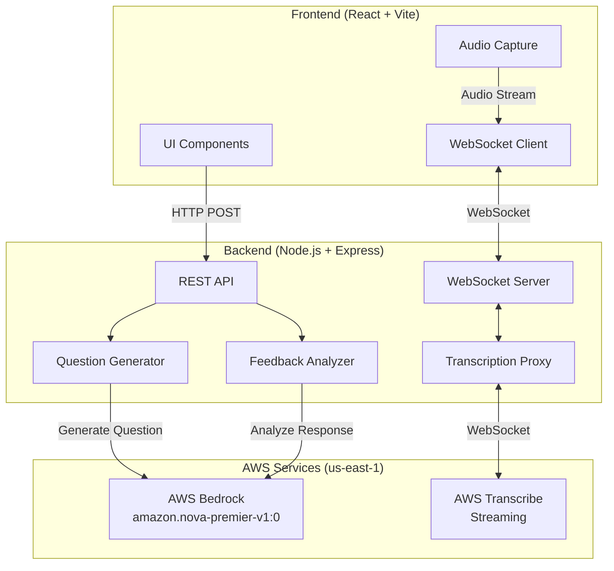

# Design Document: Interview Coach

## Overview

The Interview Coach is a lightweight, single-user web application that helps college students practice behavioral interview questions using AI-powered question generation and feedback. The system consists of a React frontend and Node.js backend that integrate with AWS Bedrock for AI capabilities and AWS Transcribe for real-time speech-to-text conversion.

### Key Design Principles

- **Ephemeral Sessions**: No data persistence; all sessions exist only in memory during runtime
- **Real-Time Feedback**: WebSocket-based streaming for immediate transcription display
- **Minimalist UX**: Black and white interface focused on core practice workflow
- **Single-User**: No authentication or multi-user support required

### Core Workflow

1. User clicks "Generate Question" → Backend calls AWS Bedrock → Question displayed
2. User clicks "Start Practice Session" → Frontend captures audio → Streams to backend via WebSocket
3. Backend forwards audio to AWS Transcribe → Receives transcription → Streams back to frontend
4. User clicks "Stop Session" → Frontend sends transcription to backend
5. Backend analyzes response with AWS Bedrock → Returns STAR format feedback → Displayed to user

## Architecture

### System Architecture



### Component Responsibilities

**Frontend Components:**
- **UI Layer**: Renders question display, buttons, transcription area, timer, and feedback panel
- **Audio Capture**: Accesses browser microphone API and captures audio in PCM format
- **WebSocket Client**: Manages bidirectional streaming connection for audio upload and transcription download
- **State Management**: Tracks session state (idle, recording, analyzing), timer, and UI visibility

**Backend Components:**
- **REST API**: Handles HTTP endpoints for question generation and feedback analysis
- **WebSocket Server**: Manages real-time connections for transcription streaming
- **Question Generator**: Constructs prompts and calls AWS Bedrock to generate behavioral questions
- **Feedback Analyzer**: Constructs prompts and calls AWS Bedrock to analyze responses against STAR format
- **Transcription Proxy**: Bridges WebSocket connections between frontend and AWS Transcribe streaming API

### Technology Stack

**Frontend:**
- React 18+ with functional components and hooks
- Vite for build tooling and dev server
- Native WebSocket API for streaming
- MediaRecorder or AudioContext API for microphone access

**Backend:**
- Node.js 18+ with Express framework
- `ws` library for WebSocket server
- AWS SDK v3 for Bedrock and Transcribe clients
- Environment variables for AWS credentials (AWS_ACCESS_KEY_ID, AWS_SECRET_ACCESS_KEY, AWS_REGION)

**AWS Services:**
- AWS Bedrock with `amazon.nova-premier-v1:0` model for text generation
- AWS Transcribe Streaming for real-time speech-to-text
- Region: `us-east-1`

## Components and Interfaces

### Frontend Components

#### QuestionDisplay Component
```typescript
interface QuestionDisplayProps {
  question: string | null;
  onGenerate: () => Promise<void>;
  isGenerating: boolean;
}
```
Displays the current behavioral question and provides a "Generate Question" button. Shows loading state during generation.

#### PracticeSession Component
```typescript
interface PracticeSessionProps {
  question: string;
  onSessionComplete: (transcription: string) => void;
}
```
Manages the practice session lifecycle including:
- Start/Stop buttons with conditional rendering
- Audio capture and streaming
- WebSocket connection management
- Live transcription display
- Session timer display

#### FeedbackPanel Component
```typescript
interface FeedbackPanelProps {
  feedback: FeedbackResult | null;
  isAnalyzing: boolean;
}
```
Displays STAR format analysis results including strengths, areas for improvement, and actionable tips.

### Backend API Endpoints

#### POST /api/questions/generate
Generates a new behavioral interview question.

**Request:**
```json
{}
```

**Response:**
```json
{
  "question": "Tell me about a time when you had to work with a difficult team member."
}
```

**Error Response:**
```json
{
  "error": "Failed to generate question"
}
```

#### POST /api/feedback/analyze
Analyzes a transcribed response against STAR format.

**Request:**
```json
{
  "question": "Tell me about a time when you had to work with a difficult team member.",
  "transcription": "In my software engineering class..."
}
```

**Response:**
```json
{
  "starAnalysis": {
    "situation": {
      "present": true,
      "content": "Software engineering class group project"
    },
    "task": {
      "present": true,
      "content": "Complete project with unresponsive team member"
    },
    "action": {
      "present": true,
      "content": "Scheduled one-on-one meeting, established communication protocol"
    },
    "result": {
      "present": false,
      "content": null
    }
  },
  "strengths": ["Clear situation setup", "Specific actions taken"],
  "improvements": ["Missing result/outcome", "Could quantify impact"],
  "tips": [
    "Always conclude with measurable results",
    "Use specific metrics when possible",
    "Connect outcome back to team success"
  ]
}
```

**Error Response:**
```json
{
  "error": "Failed to analyze response"
}
```

#### WebSocket /ws/transcribe
Bidirectional streaming endpoint for real-time transcription.

**Client → Server Messages:**
```json
{
  "type": "start",
  "config": {
    "sampleRate": 16000,
    "languageCode": "en-US"
  }
}
```

```json
{
  "type": "audio",
  "data": "<base64-encoded-audio-chunk>"
}
```

```json
{
  "type": "stop"
}
```

**Server → Client Messages:**
```json
{
  "type": "transcription",
  "text": "partial transcription text",
  "isFinal": false
}
```

```json
{
  "type": "transcription",
  "text": "final transcription text",
  "isFinal": true
}
```

```json
{
  "type": "error",
  "message": "Transcription service error"
}
```

### AWS Service Integration

#### AWS Bedrock Integration

**Question Generation Prompt Template:**
```
You are an interview coach helping college students practice behavioral interviews.
Generate a single behavioral interview question appropriate for entry-level candidates.

The question should:
- Focus on one of these categories: leadership, teamwork, conflict resolution, problem-solving, failure/learning, or time management
- Be open-ended and encourage STAR format responses
- Be realistic for college students with limited work experience

Generate only the question text, no additional commentary.
```

**Feedback Analysis Prompt Template:**
```
You are an encouraging interview coach analyzing a student's response to a behavioral interview question.

Question: {question}

Response: {transcription}

Analyze this response using the STAR format (Situation, Task, Action, Result).

For each component:
1. Identify if it is present or absent
2. If present, extract the relevant content

Then provide:
- 2-3 specific strengths (what they did well)
- 2-3 areas for improvement (what's missing or weak)
- 2-3 actionable tips for improvement

Use an encouraging, constructive tone. Be specific and helpful.

Return your analysis in JSON format matching this structure:
{
  "starAnalysis": {
    "situation": {"present": boolean, "content": string or null},
    "task": {"present": boolean, "content": string or null},
    "action": {"present": boolean, "content": string or null},
    "result": {"present": boolean, "content": string or null}
  },
  "strengths": [string],
  "improvements": [string],
  "tips": [string]
}
```

**Bedrock API Configuration:**
- Model ID: `amazon.nova-premier-v1:0`
- Region: `us-east-1`
- Max tokens: 1000 for questions, 2000 for feedback
- Temperature: 0.7 for variety in questions, 0.3 for consistent feedback analysis

#### AWS Transcribe Integration

**Streaming Configuration:**
- Language Code: `en-US`
- Sample Rate: 16000 Hz
- Encoding: PCM
- Media Format: PCM
- Enable partial results for real-time display
- Vocabulary filtering: None (not required for this use case)

**Connection Flow:**
1. Backend establishes WebSocket connection to AWS Transcribe Streaming API
2. Backend sends audio stream configuration
3. Backend forwards audio chunks from frontend
4. Backend receives transcription events (partial and final)
5. Backend forwards transcription text to frontend
6. Backend closes connection when session ends

## Data Models

### Frontend State Models

```typescript
// Application state
interface AppState {
  currentQuestion: string | null;
  isGenerating: boolean;
  sessionState: 'idle' | 'recording' | 'analyzing';
  transcription: string;
  feedback: FeedbackResult | null;
  error: string | null;
}

// Session state
interface SessionState {
  isActive: boolean;
  startTime: number | null;
  elapsedSeconds: number;
  audioChunks: Blob[];
}

// Feedback result
interface FeedbackResult {
  starAnalysis: {
    situation: ComponentAnalysis;
    task: ComponentAnalysis;
    action: ComponentAnalysis;
    result: ComponentAnalysis;
  };
  strengths: string[];
  improvements: string[];
  tips: string[];
}

interface ComponentAnalysis {
  present: boolean;
  content: string | null;
}
```

### Backend Data Models

```typescript
// Question generation request/response
interface GenerateQuestionRequest {}

interface GenerateQuestionResponse {
  question: string;
}

// Feedback analysis request/response
interface AnalyzeFeedbackRequest {
  question: string;
  transcription: string;
}

interface AnalyzeFeedbackResponse {
  starAnalysis: {
    situation: ComponentAnalysis;
    task: ComponentAnalysis;
    action: ComponentAnalysis;
    result: ComponentAnalysis;
  };
  strengths: string[];
  improvements: string[];
  tips: string[];
}

// WebSocket message types
type TranscribeClientMessage = 
  | { type: 'start'; config: { sampleRate: number; languageCode: string } }
  | { type: 'audio'; data: string }
  | { type: 'stop' };

type TranscribeServerMessage =
  | { type: 'transcription'; text: string; isFinal: boolean }
  | { type: 'error'; message: string };
```

### AWS Service Models

**Bedrock Request:**
```typescript
interface BedrockInvokeRequest {
  modelId: string;
  contentType: string;
  accept: string;
  body: string; // JSON stringified
}

interface BedrockRequestBody {
  messages: Array<{
    role: 'user' | 'assistant';
    content: string;
  }>;
  max_tokens: number;
  temperature: number;
}
```

**Transcribe Streaming:**
- Uses AWS SDK's TranscribeStreamingClient
- Audio events encoded as event stream
- Transcription results received as event stream
- No explicit data model (handled by SDK)


## Correctness Properties

*A property is a characteristic or behavior that should hold true across all valid executions of a system—essentially, a formal statement about what the system should do. Properties serve as the bridge between human-readable specifications and machine-verifiable correctness guarantees.*

### Property Reflection

After analyzing all acceptance criteria, I identified several areas of redundancy:

- **STAR Component Content Properties (4.3-4.6)**: All four criteria test the same pattern—when a component is marked present, it must have associated content. These can be combined into a single comprehensive property.
- **Session State Properties (2.2, 2.3, 2.4)**: Multiple properties test different aspects of active session state. While related, each tests a distinct behavior and should remain separate.
- **WebSocket Properties (3.2, 3.3, 7.6)**: Properties 3.2 and 3.3 test unidirectional flows, while 7.6 tests bidirectional communication. Property 7.6 subsumes 3.2 and 3.3.
- **Analysis Structure Properties (4.2, 4.7)**: Property 4.7 is redundant with 4.2—both test that analysis results indicate presence/absence of all STAR components.
- **Session Ending Properties (2.6, 3.5, 8.5)**: These test different aspects of session cleanup (audio capture, WebSocket, microphone) and should remain separate as they verify distinct resources.

### Property 1: Question Generation Returns Valid Question

*For any* question generation request, the system should return a non-empty string containing a behavioral interview question.

**Validates: Requirements 1.1, 1.4, 7.4**

### Property 2: Generated Questions Belong to Valid Categories

*For any* generated question, it should be classifiable into one of the six categories: leadership, teamwork, conflict resolution, problem-solving, failure/learning, or time management.

**Validates: Requirements 1.2**

### Property 3: Session Start Transitions to Active State

*For any* start session request, the system should transition from idle state to recording state, enable the stop button, disable the start button, and initialize the session timer.

**Validates: Requirements 2.1, 2.4**

### Property 4: Active Session Captures Audio

*For any* active practice session, the system should have an active microphone stream and be collecting audio data.

**Validates: Requirements 2.2, 8.3**

### Property 5: Session Timer Updates During Active Session

*For any* active practice session, the displayed elapsed time should increase monotonically from the session start time.

**Validates: Requirements 2.3**

### Property 6: Session Stop Transitions to Idle State

*For any* stop session request during an active session, the system should transition to idle state and enable the start button.

**Validates: Requirements 2.5**

### Property 7: Session End Releases Audio Resources

*For any* session ending, the system should stop the microphone stream, release all audio tracks, and stop capturing audio data.

**Validates: Requirements 2.6, 8.5**

### Property 8: Session Start Establishes WebSocket Connection

*For any* session start, the system should establish a WebSocket connection to the transcription service and send a start message with audio configuration.

**Validates: Requirements 3.1, 8.1**

### Property 9: Active Session Maintains Bidirectional WebSocket Communication

*For any* active practice session, the system should send audio data to the transcription service via WebSocket and receive transcription data back via the same WebSocket connection.

**Validates: Requirements 3.2, 3.3, 7.6**

### Property 10: Transcription Display Updates with Received Data

*For any* transcription data received from the WebSocket, the live transcription display area should be updated to include the new text.

**Validates: Requirements 3.4**

### Property 11: Session End Closes WebSocket Connection

*For any* session ending, the system should close the WebSocket connection to the transcription service.

**Validates: Requirements 3.5**

### Property 12: Transcription Persists After Session End

*For any* completed practice session, the full transcription text should remain accessible in the application state after the session ends.

**Validates: Requirements 3.6**

### Property 13: Session End Triggers Feedback Analysis

*For any* session ending with a non-empty transcription, the system should invoke the feedback analyzer with the question and transcription.

**Validates: Requirements 4.1**

### Property 14: Feedback Analysis Returns STAR Component Indicators

*For any* feedback analysis result, it should contain a boolean presence indicator for each of the four STAR components: Situation, Task, Action, and Result.

**Validates: Requirements 4.2, 4.7**

### Property 15: Present STAR Components Have Associated Content

*For any* STAR component marked as present in the analysis result, the component should have non-null, non-empty content text.

**Validates: Requirements 4.3, 4.4, 4.5, 4.6**

### Property 16: Feedback Display Shows Analysis Results

*For any* completed feedback analysis, the feedback panel should display the analysis results including STAR component information.

**Validates: Requirements 5.1**

### Property 17: Feedback Contains Required Sections

*For any* feedback result, it should contain three sections: strengths (array of strings), improvements (array of strings), and tips (array of strings).

**Validates: Requirements 5.2, 5.3**

### Property 18: Feedback Tips Count Within Range

*For any* feedback result, the tips array should contain between 2 and 3 elements (inclusive).

**Validates: Requirements 5.4**

### Property 19: Inactive Session Hides Stop Button

*For any* application state where no practice session is active, the stop session button should not be visible in the UI.

**Validates: Requirements 6.4**

### Property 20: Active Session Hides Start Button

*For any* application state where a practice session is active, the start practice session button should not be visible in the UI.

**Validates: Requirements 6.5**

### Property 21: Feedback Analysis Request Returns Feedback

*For any* feedback analysis request with a valid question and transcription, the REST API should return a feedback result containing STAR analysis, strengths, improvements, and tips.

**Validates: Requirements 7.5**

### Property 22: Microphone Permission Denial Prevents Session Start

*For any* session start attempt where microphone permission is denied, the system should display an error message and remain in idle state without starting the session.

**Validates: Requirements 8.2**

### Property 23: Audio Capture Format Matches Transcribe Requirements

*For any* captured audio during an active session, the audio format should be PCM with a sample rate of 16000 Hz, compatible with AWS Transcribe streaming requirements.

**Validates: Requirements 8.4**

## Error Handling

### Frontend Error Handling

**Microphone Access Errors:**
- Display user-friendly error message when permission is denied
- Prevent session from starting if microphone is unavailable
- Show error if microphone is already in use by another application

**WebSocket Connection Errors:**
- Display error message if WebSocket connection fails to establish
- Handle unexpected WebSocket disconnections during active sessions
- Show error if transcription service is unavailable

**API Request Errors:**
- Display error message if question generation fails
- Display error message if feedback analysis fails
- Show loading states during API requests

**Audio Capture Errors:**
- Handle errors from MediaRecorder or AudioContext APIs
- Display error if audio format is not supported by browser

### Backend Error Handling

**AWS Bedrock Errors:**
- Log errors when Bedrock API calls fail
- Return 500 status with generic error message to frontend
- Handle rate limiting and throttling from Bedrock service

**AWS Transcribe Errors:**
- Log errors when Transcribe connection fails
- Send error message to frontend via WebSocket
- Handle connection timeouts and service unavailability

**WebSocket Errors:**
- Log errors when WebSocket connections fail
- Clean up resources when connections are terminated unexpectedly
- Handle malformed messages from clients

**Request Validation Errors:**
- Return 400 status for missing or invalid request parameters
- Validate transcription length before analysis (reject if empty)
- Validate question exists before analysis

### Error Response Format

All REST API errors follow this format:
```json
{
  "error": "Human-readable error message"
}
```

WebSocket errors follow this format:
```json
{
  "type": "error",
  "message": "Human-readable error message"
}
```

## Testing Strategy

### Dual Testing Approach

This feature requires both unit tests and property-based tests to ensure comprehensive coverage:

- **Unit tests**: Verify specific examples, edge cases, and error conditions
- **Property tests**: Verify universal properties across all inputs through randomization

### Unit Testing Focus

Unit tests should focus on:

**Specific Examples:**
- Question generation returns a valid question for a single request
- Feedback analysis correctly identifies STAR components in a sample response
- WebSocket connection establishes successfully for a single session

**Edge Cases:**
- Empty transcription handling
- Microphone permission denial
- WebSocket connection failures
- API timeout scenarios

**Error Conditions:**
- AWS service unavailability
- Malformed API responses
- Invalid audio formats
- Network disconnections

**Integration Points:**
- REST API endpoints respond with correct status codes
- WebSocket messages are properly formatted
- Frontend state updates correctly after API calls

### Property-Based Testing Focus

Property tests should focus on universal behaviors that hold across all inputs. Each property test must:
- Run a minimum of 100 iterations (due to randomization)
- Reference its corresponding design document property
- Use the tag format: **Feature: interview-coach, Property {number}: {property_text}**

**Property Test Examples:**

**Property 1 Test:**
```javascript
// Feature: interview-coach, Property 1: Question Generation Returns Valid Question
// For any question generation request, the system should return a non-empty string
test('question generation returns valid question', async () => {
  for (let i = 0; i < 100; i++) {
    const response = await generateQuestion();
    expect(response.question).toBeTruthy();
    expect(typeof response.question).toBe('string');
    expect(response.question.length).toBeGreaterThan(0);
  }
});
```

**Property 14 Test:**
```javascript
// Feature: interview-coach, Property 14: Feedback Analysis Returns STAR Component Indicators
// For any feedback analysis result, it should contain boolean indicators for all STAR components
test('feedback analysis returns STAR component indicators', async () => {
  for (let i = 0; i < 100; i++) {
    const question = generateRandomQuestion();
    const transcription = generateRandomTranscription();
    const feedback = await analyzeFeedback(question, transcription);
    
    expect(feedback.starAnalysis).toBeDefined();
    expect(typeof feedback.starAnalysis.situation.present).toBe('boolean');
    expect(typeof feedback.starAnalysis.task.present).toBe('boolean');
    expect(typeof feedback.starAnalysis.action.present).toBe('boolean');
    expect(typeof feedback.starAnalysis.result.present).toBe('boolean');
  }
});
```

**Property 18 Test:**
```javascript
// Feature: interview-coach, Property 18: Feedback Tips Count Within Range
// For any feedback result, the tips array should contain between 2 and 3 elements
test('feedback tips count within range', async () => {
  for (let i = 0; i < 100; i++) {
    const question = generateRandomQuestion();
    const transcription = generateRandomTranscription();
    const feedback = await analyzeFeedback(question, transcription);
    
    expect(feedback.tips.length).toBeGreaterThanOrEqual(2);
    expect(feedback.tips.length).toBeLessThanOrEqual(3);
  }
});
```

### Property-Based Testing Library

For JavaScript/TypeScript, use **fast-check** as the property-based testing library:
- Integrates with Jest or other test frameworks
- Provides generators for common data types
- Supports custom generators for domain-specific data
- Configurable iteration counts and shrinking strategies

### Testing Balance

- Avoid writing too many unit tests for scenarios that property tests already cover
- Use unit tests for specific examples that demonstrate correct behavior
- Use property tests to verify universal properties across randomized inputs
- Together, unit and property tests provide comprehensive coverage: unit tests catch concrete bugs, property tests verify general correctness

### Test Coverage Goals

**Frontend:**
- Component rendering and state management
- WebSocket client message handling
- Audio capture initialization and cleanup
- UI state transitions (idle → recording → analyzing)
- Error message display

**Backend:**
- REST API endpoint responses
- WebSocket server message routing
- AWS Bedrock integration (question generation and feedback analysis)
- AWS Transcribe streaming integration
- Error handling and validation

**Integration:**
- End-to-end question generation flow
- End-to-end practice session with transcription
- End-to-end feedback analysis flow
- WebSocket bidirectional communication
- Error propagation from backend to frontend
