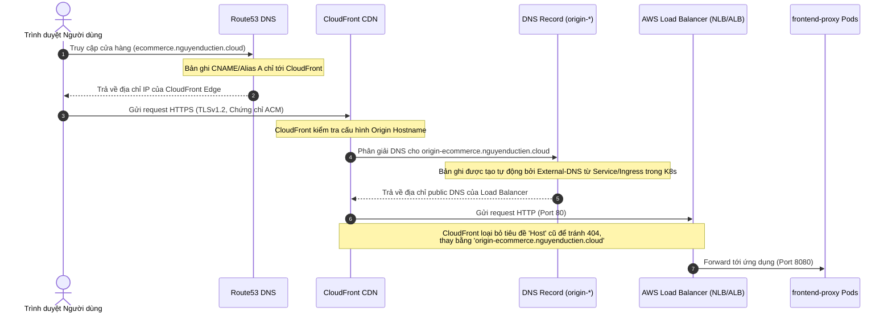
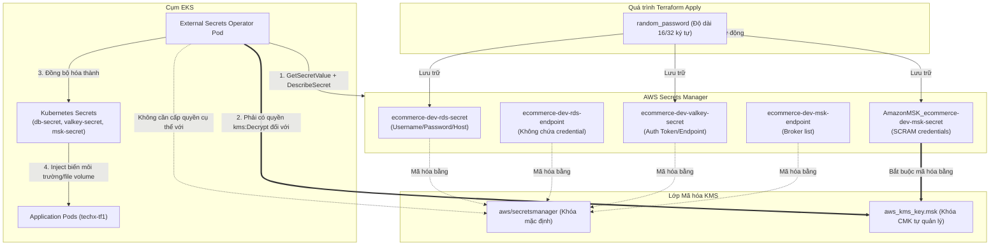
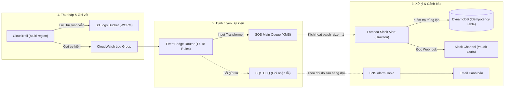
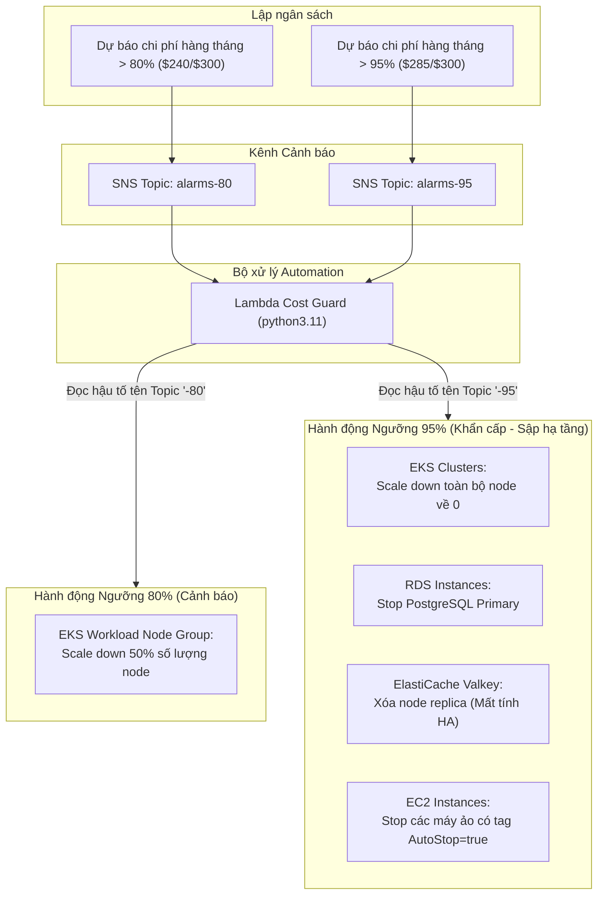

# Tài liệu Kiến trúc Hệ thống AWS (AWS Architecture Documentation)

Tài liệu này tổng hợp toàn bộ kiến trúc hạ tầng AWS hiện tại của dự án `capstone-phase-3` dựa trên phân tích mã nguồn Terraform trong thư mục `.temps/architecture_aws`. Tài liệu mô tả chi tiết các thành phần (components), mối quan hệ (relationships), luồng dữ liệu (data flows) và các điểm lưu ý kỹ thuật quan trọng giữa hai tài khoản AWS (`Sandbox/Prod` và `Develop`).

---

## 1. Bản đồ Hạ tầng Tổng quan (Overall Infrastructure Map)

Hạ tầng được triển khai trên 2 tài khoản AWS trong vùng `us-east-1` (ngoại trừ AI Guardrails ở `us-east-2`):
*   **Tài khoản Develop (`458580846647`)**: Chứa cụm EKS phát triển, các dịch vụ dữ liệu và MSK Connect (Debezium CDC).
*   **Tài khoản Sandbox / Prod (`804372444787`)**: Chứa cụm EKS Sandbox, ECR registry dùng chung, và hệ thống giám sát cảnh báo (Audit & Governance).

Dưới đây là sơ đồ Mermaid mô tả các lớp hạ tầng và mối quan hệ giữa các thành phần:

```mermaid
flowchart TB
    subgraph EDGE["Lớp Biên (Edge Layer)"]
        R53["Route53 Hosted Zone"]
        CF["CloudFront CDN"]
        ACM["Chứng chỉ ACM"]
    end

    subgraph NET["Lớp Mạng (Network Layer - VPC 10.0.0.0/16)"]
        PUB["Public Subnets (3 AZs)"]
        APP["Private App Subnets"]
        DATA["Private Data Subnets"]
        MQ["Private MQ Subnets"]
        VPE["S3 Gateway Endpoint"]
    end

    subgraph COMPUTE["Cụm Tính toán (Compute Layer)"]
        EKS["EKS Cluster (v1.36)"]
        NG["Managed Node Group (Workload)"]
        OPS["Observability Node (Dedicated)"]
        KARP["Karpenter (Autoscaler)"]
    end

    subgraph DATA_SVC["Dịch vụ Dữ liệu (Data Services Layer)"]
        RDS["RDS PostgreSQL (Multi-AZ + Replica)"]
        VALKEY["ElastiCache Valkey (Cache)"]
        MSK["MSK Kafka (Message Queue)"]
        SM["Secrets Manager + KMS"]
    end

    subgraph GOV["Bảo mật & Giám sát (Security & Governance)"]
        CT["CloudTrail + S3 WORM"]
        AD["Audit Detection (EventBridge + SQS + Lambda + Slack)"]
        KY["Kyverno IRSA (Cosign signature check)"]
    end

    subgraph COST_REG["Chi phí & Registry (Cost & Registry)"]
        ECR["ECR Registry (Immutable)"]
        CG["Cost Guard Automation (Budgets + Lambda Scale-down)"]
        BUD["AWS Budgets"]
    end

    %% Mối quan hệ và luồng lưu lượng
    R53 --> CF
    ACM -.-> CF
    CF -->|HTTP :80| PUB
    PUB -->|NAT Gateway| APP
    APP --> EKS
    EKS --> NG
    EKS --> OPS
    EKS --> KARP
    APP --> DATA
    APP --> MQ
    DATA --> RDS
    DATA --> VALKEY
    MQ --> MSK
    SM -.->|External Secrets Operator| EKS
    ECR -.->|Image Pull (Cross-Account)| EKS
    KY -.->|Verify Signatures| ECR
    EKS -.->|Logs| CT
    CT --> AD
    CG -.->|Scale down / Stop| EKS
    CG -.->|Stop Instance| RDS
    BUD --> CG
    VPE -.->|S3 Egress| APP
```

---

## 2. Chi tiết các Thành phần Hạ tầng (Infrastructure Components)

### 2.1. Lớp Mạng & Biên (Networking & Edge)

Hạ tầng mạng sử dụng mô hình 1 VPC riêng cho mỗi môi trường (`VPC CIDR: 10.0.0.0/16`), được chia thành 4 phân vùng mạng (Subnet tiers) trải rộng trên 3 Availability Zones (AZs) tại `us-east-1`:

1.  **Public Subnets (`pub-1`, `pub-2`, `pub-3`)**:
    *   Sử dụng chung 1 bảng định tuyến (`public-rt`) chỉ ra Internet Gateway (IGW).
    *   Tự động cấp IP Public (`map_public_ip_on_launch = true`).
    *   Được tag `kubernetes.io/role/elb = 1` để AWS Load Balancer Controller tự động phát hiện và đặt Load Balancer Public.
2.  **Private-App Subnets (`app-1`, `app-2`, `app-3`)**:
    *   Đi ra ngoài qua NAT Gateway (môi trường Sandbox dùng chung 1 NAT Gateway đặt ở `us-east-1a`).
    *   Được tag `kubernetes.io/role/internal-elb = 1` cho Load Balancer nội bộ.
    *   Được tag `karpenter.sh/discovery = <project>-<env>-eks` để Karpenter xác định subnet chạy các node tính toán tự động.
3.  **Private-Data Subnets (`data-1`, `data-2`)**:
    *   Bảng định tuyến cô lập hoàn toàn (`isolated-rt`), **không** cấu hình NAT/IGW. Đảm bảo RDS và Valkey không thể kết nối Internet hoặc bị tấn công từ bên ngoài.
4.  **Private-MQ Subnets (`mq-1`, `mq-2`)**:
    *   Dùng chung bảng định tuyến với Private-App để đi ra NAT Gateway (dành cho MSK Kafka).
5.  **Cổng S3 Gateway Endpoint (`com.amazonaws.us-east-1.s3`)**:
    *   Được liên kết với bảng định tuyến Private để traffic tới S3 đi qua mạng nội bộ AWS, không phát sinh chi phí NAT Gateway.

### 2.2. Cụm Tính toán (Compute - EKS Platform)

Cụm EKS chạy Kubernetes phiên bản `1.36`, quản lý các node tính toán qua 3 cơ chế:

*   **Workload Node Group (Primary)**: Nhóm Node được quản lý bởi AWS, chạy các máy ảo `t3.large`. Cấu hình tự động scale từ `2` đến `6` node (Sandbox) hoặc khóa cứng `3` node để chạy tải kiểm thử (Develop).
*   **Dedicated Observability Node (Ops Node)**: Nhóm Node cố định gồm đúng 1 instance máy ảo (Sandbox: `t3.large`, Develop: `t3.medium`).
    *   Node này bị áp nhãn `workload-tier=observability` và taint `dedicated=observability:NoSchedule` để chỉ chạy các ứng dụng giám sát (Prometheus, Grafana, Jaeger, OpenSearch).
    *   Node được ghim vào đúng một subnet (`app-2`) để đảm bảo các ổ đĩa EBS (gắn với dữ liệu giám sát vốn bị giới hạn theo AZ) luôn gắn được vào node khi khởi động lại.
*   **Karpenter (Autoscaler)**: Tự động cấp thêm node ảo khi các Node Group chính bị quá tải. Karpenter sử dụng máy ảo On-Demand, các dòng `c`/`m`/`t`, giới hạn tối đa 8 vCPU.
*   **Identity Plumber (IRSA & Pod Identity)**:
    *   **Pod Identity**: Các Service bên trong EKS module như EBS CSI driver, AWS Load Balancer Controller, Karpenter, và Bedrock Access Role sử dụng cơ chế EKS Pod Identity mới thông qua Service Principal `pods.eks.amazonaws.com`.
    *   **IRSA (IAM Roles for Service Accounts)**: Các module bên ngoài EKS module (như `external-dns`, `external-secrets`, `kyverno`) sử dụng cơ chế OIDC Federated Trust truyền thống.

### 2.3. Lớp Dữ liệu (Data Layer)

*   **RDS PostgreSQL**: Postgres v17.10 chạy trên máy ảo nhỏ `db.t4g.micro`.
    *   **Multi-AZ**: Có 1 bản standby đồng bộ ở AZ thứ hai để tự động failover.
    *   **Read Replica**: 1 bản sao đọc độc lập phục vụ lưu lượng truy vấn đọc.
    *   **RDS Proxy**: Bọc trước RDS để gom cụm kết nối (connection pooling).
    *   **Logical Replication**: Luôn được kích hoạt (`enable_logical_replication = true`) để hỗ trợ CDC (Change Data Capture) ở Develop.
*   **ElastiCache Valkey**: Valkey v7.2 chạy trên `cache.t4g.micro` với 2 node (1 Primary, 1 Replica), bật mã hóa dữ liệu tại chỗ và trên đường truyền.
*   **MSK Kafka**: Kafka v3.9.x chạy trên broker `kafka.t3.small` trong phân vùng MQ. Sử dụng mã hóa SASL/SCRAM.

---

## 3. Các Luồng Quan hệ & Dữ liệu Chính (Key Relationships & Data Flows)

### 3.1. Luồng Request của Người dùng (North-South Traffic Flow)

Sơ đồ tuần tự dưới đây mô tả cách một request từ trình duyệt người dùng đi qua Edge Layer và đi vào ứng dụng trong cụm EKS:



**Lưu ý thiết kế:**
*   CloudFront đóng vai trò là điểm kết thúc SSL (TLS Termination) và lớp bảo mật biên, không lưu cache (`TTL = 0`) vì đây là luồng API động.
*   Lưu lượng đi từ CloudFront đến Load Balancer chạy trên internet công cộng qua giao thức HTTP không mã hóa (`origin_protocol_policy = "http-only"` trên port 80).

---

### 3.2. Luồng Quản lý Secrets (Secrets Synchronization Flow)

Các thông tin nhạy cảm (mật khẩu database, token valkey, scram user kafka) được tạo tự động bởi Terraform và phân phối vào EKS bằng External Secrets Operator (ESO):



**Cảnh báo vận hành:** 
Hệ thống sử dụng khóa CMK tự quản lý đối với Secret của MSK. Nếu IAM Role của ESO (`external-secrets-irsa`) bị thiếu quyền `kms:Decrypt` trên khóa `KMS_MSK`, việc đồng bộ `msk-secret` vào Kubernetes sẽ thất bại ngay lập tức với lỗi `AccessDeniedException`. Các RDS/Valkey secret dùng khóa mặc định của AWS nên không bị ảnh hưởng.

---

### 3.3. Luồng Thu thập & Phát hiện Sự cố Bảo mật (Audit & Detection Flow - MANDATE-11)

Môi trường Sandbox sở hữu hệ thống thu thập dấu vết và phát hiện các hành vi bất thường tự động:



**Các nhóm Rule giám sát nổi bật trong EventBridge:**
1.  `audit_collection_tampering`: Phát hiện tắt CloudTrail hoặc thay đổi cấu hình.
2.  `root_activity`: Phát hiện **bất kỳ** hành động nào thực hiện bởi tài khoản `Root`.
3.  `destructive_crown_jewel`: Phát hiện xóa các tài nguyên quan trọng như EKS, RDS, VPC, MSK.
4.  `iam_privilege_escalation`: Phát hiện hành vi leo thang đặc quyền (ví dụ: gán policy admin).

---

### 3.4. Luồng Change Data Capture (CDC) & Truyền Phát dữ liệu (Develop Only)

Tại môi trường Develop, dữ liệu thay đổi từ PostgreSQL được đồng bộ thời gian thực sang Kafka bằng Debezium:

```mermaid
flowchart LR
    subgraph RDS_Tier["Hạ tầng Cơ sở dữ liệu"]
        App["Checkout Service"] -->|1. INSERT INTO checkout.outbox| DB["RDS PostgreSQL (Primary)"]
        DB -->|2. Logical Replication (pgoutput)| CDC["Publication (dbz_publication)"]
    end

    subgraph MSK_Connect["Bộ chuyển đổi MSK Connect"]
        Debezium["Debezium PostgresConnector<br/>(1 MCU x 1 Worker)"]
    end

    subgraph Kafka_Tier["MSK Kafka Cluster"]
        Topic["Topic: domain.checkout.orders<br/>(1 partition, RF = 2)"]
    end

    subgraph Consumers["Các Dịch vụ Tiêu thụ"]
        C1["Payment Service"]
        C2["Shipping Service"]
    end

    %% Luồng dữ liệu
    CDC -->|3. Đọc dữ liệu nhị phân| Debezium
    Debezium -->|4. RegexRouter biến đổi chủ đề| Topic
    Topic -->|5. SASL_SSL / SCRAM-SHA-512| C1 & C2
```

**Vấn đề rủi ro cao:**
Mật khẩu database được nhúng trực tiếp dạng bản rõ (plaintext) từ Terraform state vào cấu hình connector của Debezium. Đồng thời, do RDS cấu hình tự động xoay vòng mật khẩu (password rotation) mỗi 30 ngày, trong khi cấu hình Debezium trỏ đến mật khẩu tĩnh khởi tạo ban đầu, connector sẽ bị mất kết nối tới database ngay sau khi mật khẩu RDS xoay vòng lần đầu tiên.

---

### 3.5. Cơ chế Kiểm soát Chi phí (Cost Guard Automation Flow)

Cost Guard tự động hóa các hành động thu nhỏ quy mô hạ tầng khi chi phí dự báo vượt ngưỡng:



**Rủi ro xung đột lịch biểu (Race Condition):**
Tại Sandbox, có một lịch biểu tự động chạy hàng ngày (`primary-schedule.tf`):
*   `11:40 ICT (ICT = UTC+7)`: Tự động scale cụm node lên 3 node.
*   `13:40 ICT`: Tự động scale cụm node về 2 node.

Nếu Cost Guard kích hoạt ngưỡng 95% (tắt toàn bộ node về 0), thì đến **11:40 ngày tiếp theo**, lịch biểu này sẽ ghi đè lên cấu hình Auto Scaling Group và **tự động khởi động lại cụm lên 3 node**, khiến lưu lượng chi phí tiếp tục phát sinh ngoài tầm kiểm soát của hệ thống cảnh báo.

---

## 4. Bảng So sánh Môi trường & Thiết lập Trạng thái (Sandbox vs Develop)

| Tiêu chí | Môi trường Sandbox (`dev`) | Môi trường Develop (`dev`) | Ý nghĩa thiết kế / Rủi ro |
| :--- | :--- | :--- | :--- |
| **AWS Account** | `804372444787` (Môi trường chính) | `458580846647` (Cô lập DEV) | Sandbox thực chất là môi trường có tải giống Production hơn. |
| **Mã nguồn ECR** | ✅ Sở hữu ECR Registry chính | ❌ Không cấu hình (Kéo ảnh từ Sandbox) | Dùng chung registry giúp kiểm soát chất lượng ảnh Docker duy nhất. |
| **Kyverno IRSA** | ✅ Có cấu hình kiểm tra chữ ký ảnh | ❌ Không cấu hình | Develop hiện chưa bắt buộc kiểm tra tính hợp lệ chữ ký ảnh Docker. |
| **Audit Detection** | ✅ Đầy đủ pipeline Slack Alert | ❌ Chỉ bật CloudTrail ghi log (Không alert) | Tiết kiệm chi phí vận hành Lambda/DynamoDB ở cụm Develop. |
| **MSK Connect (CDC)** | ❌ Không cấu hình | ✅ Kích hoạt Debezium Connector | Chỉ chạy CDC để test tích hợp luồng dữ liệu phát triển. |
| **ASG Node Schedules** | ✅ Bật tự động Scale node hàng ngày | ❌ Khóa cứng 3 node (Phục vụ Load Test) | Cụm Develop cần giữ tĩnh số node để số liệu test tải chính xác. |
| **State Backend** | Khai báo cứng trong file `.tf` | Cấu hình động qua biến môi trường CI | Develop dùng cấu hình động để tránh rủi ro ghi đè nhầm lên state Sandbox. |
| **allowed_account_ids** | ❌ Không thiết lập | ✅ Cấu hình chặt chẽ chỉ cho phép ID của Develop | Develop tự bảo vệ chống việc vô tình chạy nhầm lệnh Terraform. |

---

## 5. Tổng kết Các Điểm Cần Khắc phục ngay (Action Items)

1.  **Sửa lỗi vòng đời ngân sách (Budgets Expiry)**: Các chu kỳ ngân sách trong `cost_guard.auto.tfvars` hiện cấu hình kết thúc vào **2026-07-31**. Sau ngày này, toàn bộ hệ thống Cost Guard và cảnh báo chi phí sẽ ngưng hoạt động. Cần chuyển đổi sang ngân sách tháng lặp lại vô hạn (`MONTHLY`).
2.  **Khắc phục xung đột Lịch biểu Node và Cost Guard**: Cần vô hiệu hóa hoặc đồng bộ lịch biểu scale-up hằng ngày của cụm Sandbox khi hệ thống đang trong trạng thái khóa khẩn cấp do quá ngân sách.
3.  **Khắc phục lỗi ghi đè mật khẩu Debezium (CDC)**: Thay đổi cách cấu hình Debezium Connector sang sử dụng Secrets Manager Config Provider thay vì truyền mật khẩu Postgres dạng văn bản rõ từ Terraform.
4.  **Bật Object Lock cho lưu trữ log**: Bật tính năng Object Lock ở chế độ `COMPLIANCE` (thay vì `GOVERNANCE` hoặc tắt hoàn toàn) để bảo vệ nhật ký hệ thống khỏi nguy cơ bị xóa/sửa bởi hacker chiếm đoạt quyền admin.
5.  **Bổ sung bảo vệ tài khoản Sandbox**: Bổ sung cấu hình `allowed_account_ids = ["804372444787"]` vào provider của môi trường Sandbox tương tự như Develop để tăng độ an toàn.
