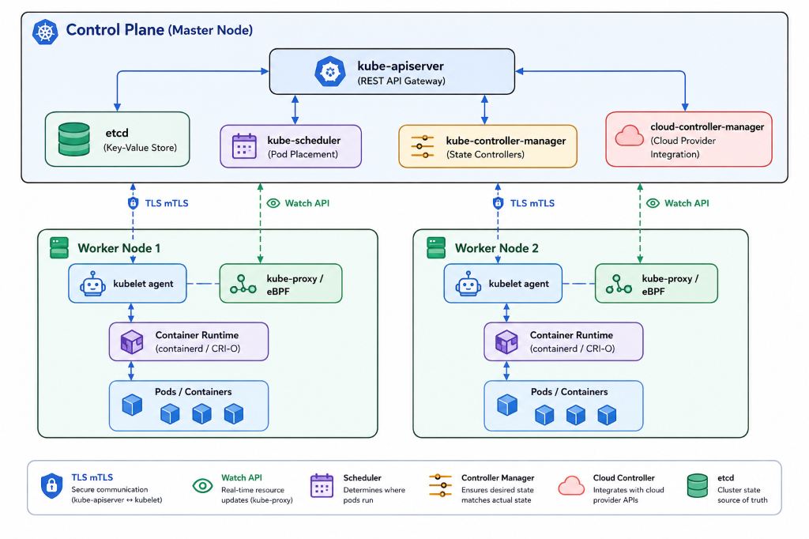
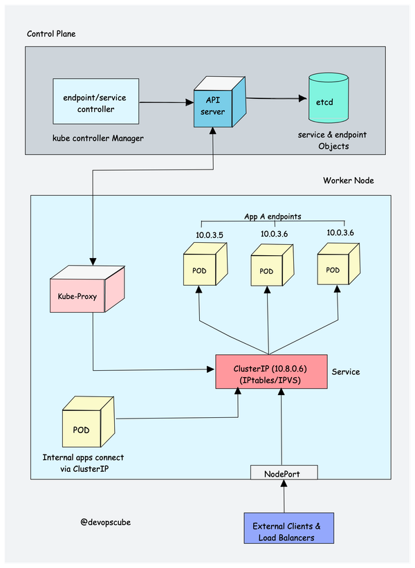
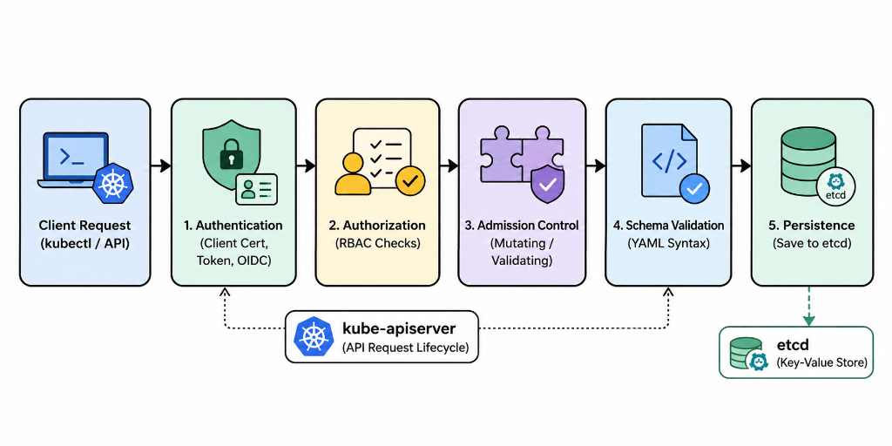
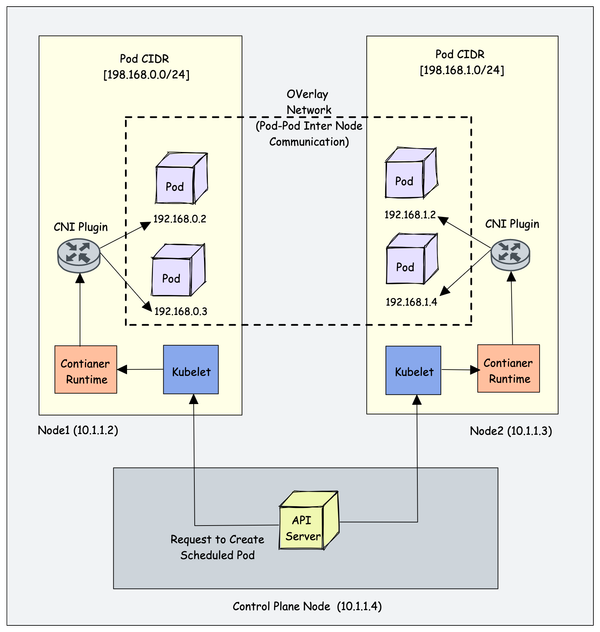
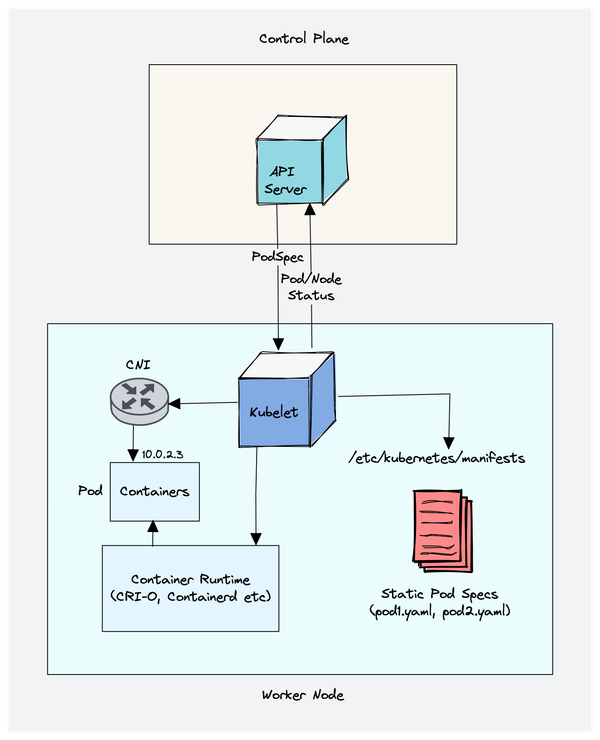
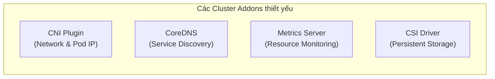
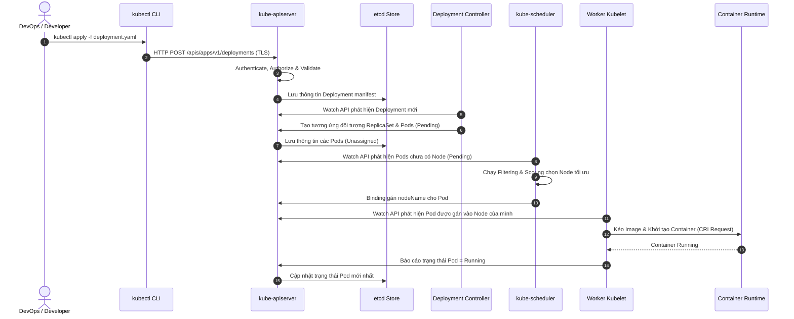

# Kubernetes Architecture Deep Dive — Comprehensive Guide & Hands-on (DevOpsCube)

---

## Table of Contents
1. [High-Level Architecture Overview](#1-high-level-architecture-overview)
2. [Control Plane Components (Master Node)](#2-control-plane-components-master-node)
3. [Worker Node Components](#3-worker-node-components)
4. [Cluster Addons](#4-cluster-addons)
5. [Deployment Workflow](#5-deployment-workflow)
6. [Modern K8s Architecture Evolution](#6-modern-k8s-architecture-evolution)
7. [Troubleshooting & FAQs](#7-troubleshooting--faqs)

---

## 1. High-Level Architecture Overview

Kubernetes (K8s) là hệ thống quản lý và điều phối container (Container Orchestration System) phân tán. Kiến trúc của Kubernetes được chia thành 2 nhóm thành phần chính:

1. **Control Plane (Master Node)**: "Bộ não" điều khiển toàn bộ cluster, chịu trách nhiệm ra quyết định, lập lịch, duy trì trạng thái mong muốn (Desired State) và phản ứng với các sự kiện.
2. **Worker Nodes**: Các máy chủ vật lý hoặc máy ảo trực tiếp chạy các container ứng dụng (Pods) được giao việc từ Control Plane.

*Figure 1: Kiến trúc tổng quan Kubernetes Cluster.*

---

## 2. Control Plane Components (Master Node)

Control Plane chịu trách nhiệm quản lý tổng thể cluster, nhận diện các yêu cầu từ người dùng (`kubectl`), theo dõi tài nguyên và tự động điều phối hệ thống.

*Figure 2: Các thành phần Control Plane.*

### 2.1 kube-apiserver (Central REST API Gateway)
- **Chức năng**: Là thành phần duy nhất tiếp nhận request trực tiếp từ bên ngoài (`kubectl`, Dashboard) và từ các agent trong cluster.
- **Đặc điểm kiến trúc**:
  - **Stateless**: API Server không lưu trạng thái cục bộ mà lưu toàn bộ vào `etcd`.
  - **Horizontal Scaling**: Có thể mở rộng hàng ngang (chạy nhiều instance đằng sau Load Balancer) để tăng khả năng chịu tải.
- **Quy trình xử lý Request tại API Server**:

*Figure 3: Quy trình xử lý Request tại API Server.*

  1. **Authentication (Xác thực)**: Kiểm tra danh tính người gọi (Client Certificate, Bearer Token, OIDC).
  2. **Authorization (Phân quyền)**: Kiểm tra quyền hạn hành động dựa trên **RBAC** (Role-Based Access Control).
  3. **Admission Control (Kiểm soát đầu vào)**: Chạy các plugin kiểm tra hoặc biến đổi request (ví dụ: `MutatingAdmissionWebhook`, `ValidatingAdmissionWebhook`, `ResourceQuota`).
  4. **Schema Validation**: Kiểm tra cú pháp và tính hợp lệ của file manifest YAML.
  5. **Persistence**: Ghi kết quả lưu trữ vào `etcd`.

### 2.2 etcd (Cluster State Store)
- **Chức năng**: Là cơ sở dữ liệu phân tán dạng Key-Value bảo mật cao, đóng vai trò là **Source of Truth** duy nhất cho toàn bộ cấu hình, bí mật (Secrets) và trạng thái hiện tại của Kubernetes Cluster.
- **Đặc điểm kỹ thuật**:
  - Sử dụng thuật toán đồng thuận **Raft Consensus Protocol** để đảm bảo tính nhất quán dữ liệu giữa các node etcd.
  - Cung cấp tính năng **Watch API**: Cho phép API Server đăng ký nhận thông báo ngay khi có dữ liệu thay đổi mà không cần poll định kỳ.
- **Khuyến nghị vận hành (Production Best Practices)**:
  - Cần chạy etcd trên số lẻ node (3, 5 hoặc 7 nodes) để đảm bảo bầu cử Leader khi có node gặp sự cố.
  - Bắt buộc phải thực hiện sao lưu (Backup snapshot) etcd định kỳ vì nếu mất etcd, toàn bộ trạng thái cluster sẽ bị xóa sạch.

### 2.3 kube-scheduler (Pod Scheduler)
- **Chức năng**: Theo dõi các Pod mới được tạo ở trạng thái `Pending` (chưa được gán `nodeName`) và chọn ra Worker Node tối ưu nhất để chạy Pod đó.
- **Quy trình 2 bước lập lịch (Scheduling Cycle)**:
  1. **Filtering (Predicates)**: Lọc ra danh sách các Node đủ điều kiện chạy Pod (kiểm tra tài nguyên CPU/RAM khả dụng, taints/tolerations, node selector, storage capacity).
  2. **Scoring (Priorities)**: Chấm điểm các Node đã qua bước lọc dựa trên các tiêu chí (mức độ phân bổ đều tải, affinity/anti-affinity rules, độ ưu tiên). Node có điểm cao nhất sẽ được chọn.
- **Kết quả**: Scheduler gửi bản ghi "Binding" về API Server để cập nhật trường `nodeName` cho Pod. (Lưu ý: Scheduler chỉ *chọn node*, việc *khởi chạy container* do `kubelet` trên node đó thực hiện).

### 2.4 kube-controller-manager (Desired State Controller)
- **Chức năng**: Chạy các tiến trình điều khiển (Controllers) liên tục trong một vòng lặp không hồi kết (**Reconciliation Loop**) để so sánh giữa **Trạng thái thực tế (Current State)** và **Trạng thái mong muốn (Desired State)**, sau đó đưa ra hành động điều chỉnh.
- **Các Controller cốt lõi**:
  - **Node Controller**: Giám sát sức khỏe Worker Nodes (gửi heartbeat định kỳ).
  - **ReplicaSet Controller**: Duy trì chính xác số lượng Pod replicas đã khai báo.
  - **Endpoints Controller**: Tạo và cập nhật danh sách Endpoints gắn với Service.
  - **ServiceAccount & Token Controllers**: Khởi tạo tài khoản dịch vụ và API Access Tokens cho Namespace mới.

### 2.5 cloud-controller-manager (Cloud Infrastructure Integration)
- **Chức năng**: Cho phép Kubernetes kết nối với các API của nhà cung cấp dịch vụ đám mây (AWS, GCP, Azure).
- **Nhiệm vụ chính**:
  - **Node Controller**: Kiểm tra xem máy chủ ảo trên Cloud có bị xóa hay không khi node không phản hồi.
  - **Route Controller**: Cấu hình bảng tuyến (routing tables) trên hạ tầng Cloud VPC.
  - **Service Controller**: Tự động khởi tạo Cloud Load Balancer (ví dụ: AWS NLB/ALB) khi tạo Service kiểu `Type: LoadBalancer`.

---

## 3. Worker Node Components

Worker Node là nơi trực tiếp thực thi các ứng dụng containerized dưới sự điều khiển của Control Plane.

*Figure 4: Các thành phần Worker Node.*

### 3.1 kubelet (Central Node Agent)
- **Chức năng**: Là một agent chạy trực tiếp trên hệ điều hành của từng Worker Node (không chạy trong container). Kubelet chịu trách nhiệm quản lý toàn bộ vòng đời của Pod trên Node đó.

*Figure 5: Luồng xử lý của Kubelet.*

- **Quy trình hoạt động của Kubelet**:
  1. Đăng ký Node với API Server.
  2. Theo dõi các PodSpec được phân công chạy trên Node của mình qua API Server Watch.
  3. Gọi **Container Runtime (qua CRI)** để pull image, tạo volume, khởi chạy/dừng container.
  4. Thực hiện các liveness/readiness/startup probes để kiểm tra sức khỏe ứng dụng.
  5. Báo cáo trạng thái Node và Pod (`NodeStatus`) định kỳ về API Server.

### 3.2 kube-proxy (Network & Service Routing)
- **Chức năng**: Chạy trên mỗi node để quản lý các quy tắc mạng (Network Rules), cho phép giao tiếp giữa các Pod nội bộ và điều hướng traffic từ bên ngoài qua các đối tượng Service (ClusterIP, NodePort).
- **Các chế độ hoạt động của Kube-proxy**:
  - **IPTables Mode (Mặc định)**: Kube-proxy tạo các quy tắc `iptables` trên node để điều hướng ngẫu nhiên traffic đến các backend Pods. Nhược điểm: Hiệu năng giảm khi cluster có hàng ngàn Service.
  - **IPVS Mode**: Sử dụng Linux IPVS (IP Virtual Server) để load balancing. Hiệu năng cao hơn hẳn IPTables ở quy mô lớn.
  - **NFTables Mode**: Chế độ mới thay thế iptables nhằm khắc phục giới hạn hiệu năng.
  - **eBPF-based (Thay thế Kube-proxy - ví dụ: Cilium)**: Sử dụng chương trình eBPF chạy trực tiếp trong Linux kernel. Tốc độ xử lý packet cực nhanh, bypass hoàn toàn iptables/kube-proxy.

> [!NOTE]
> Nhiều CNI hiện đại như **Cilium** triển khai cơ chế load balancing bằng eBPF hoàn toàn độc lập mà không cần bật `kube-proxy`.

### 3.3 Container Runtime
- **Chức năng**: Là phần mềm chịu trách nhiệm quản lý và chạy các container trên host system (kéo image từ Registry, cấp phát tài nguyên, cách ly tiến trình).
- **Chuẩn giao tiếp cốt lõi**:
  - **CRI (Container Runtime Interface)**: Chuẩn API gúp Kubernetes kết nối linh hoạt với bất kỳ container runtime nào mà không cần sửa code core K8s.
  - **OCI (Open Container Initiative)**: Chuẩn công nghiệp cho định dạng Container Image và Runtime Spec.
- **Các Container Runtime phổ biến**:
  - **containred**: Runtime nhẹ, ổn định do CNCF quản lý (được dùng mặc định trong hầu hết k8s distro hiện nay).
  - **CRI-O**: Runtime thiết kế dành riêng cho Kubernetes.

---

## 4. Cluster Addons

Bên cạnh các thành phần core, một cluster sản xuất (Production Cluster) cần các addon sau để hoạt động hoàn chỉnh:

*Figure 6: Các Cluster Addons thiết yếu.*

### 4.1 CNI Plugin (Container Network Interface)
- **Chức năng**: Cấp phát IP duy nhất cho từng Pod và quản lý kết nối mạng giữa các Pod trên cùng node hoặc khác node (Overlay Network).
- **Các CNI phổ biến**:
  - **Calico**: Hỗ trợ Network Policies bảo mật cao.
  - **Flannel**: Đơn giản, nhẹ, dễ cài đặt.
  - **Cilium**: Tối ưu hiệu năng cao bằng eBPF, hỗ trợ quan sát (observability) nâng cao.
  - **AWS VPC CNI / Azure CNI**: Gắn trực tiếp IP VPC/VNet vào Pod.

### 4.2 CoreDNS (Internal DNS Server)
- Cho phép các Pod tìm kiếm và kết nối với nhau qua tên miền Service nội bộ (ví dụ: `my-service.my-namespace.svc.cluster.local`) thay vì nhớ IP động.

### 4.3 Metrics Server (Resource Metrics)
- Thu thập dữ liệu sử dụng CPU/RAM của Node và Pod từ Kubelet (`cadvisor`), cung cấp dữ liệu cho bộ tự động co giãn **HPA (Horizontal Pod Autoscaler)** và **VPA**.

---

## 5. Deployment Workflow

Điều gì xảy ra khi bạn thực thi lệnh: `kubectl apply -f deployment.yaml`?

*Figure 7: Luồng triển khai Deployment.*

---

## 6. Modern K8s Architecture Evolution

1. **In-place Pod Vertical Scaling**: Cho phép điều chỉnh CPU/RAM Request & Limit của Pod đang chạy mà **không cần restart Pod/Container**.
2. **eBPF-powered Networking & Security**: Sử dụng eBPF (Cilium, Falco) thay thế các quy tắc iptables truyền thống, giúp tăng tốc chuyển mạch gói tin ở Linux Kernel level.
3. **GPU-centric Scheduling & AI/MLOps**: Tối ưu hóa kiến trúc điều phối tài nguyên phần cứng chuyên dụng (NVIDIA GPUs, TPUs, RDMA networks) phục vụ cho công nghệ Generative AI và MLOps.

---

## 7. Troubleshooting & FAQs

### Architecture Review Questions

> [!IMPORTANT]
> **Q1: Điều gì xảy ra nếu `etcd` bị sập hoàn toàn?**
> - **Trả lời**: Các ứng dụng và Pods hiện tại trên Worker Nodes vẫn tiếp tục chạy bình thường. Tuy nhiên, bạn **không thể** tạo mới, chỉnh sửa, xóa đối tượng hay tự động khôi phục (self-heal) Pods khi có lỗi xảy ra do Control Plane mất cơ sở dữ liệu lưu trạng thái.

> [!TIP]
> **Q2: `kube-proxy` có bắt buộc phải chạy trên tất cả các cluster không?**
> - **Trả lời**: Không bắt buộc. Trong các cluster hiện đại sử dụng CNI dựa trên eBPF như **Cilium**, tính năng load balancing được xử lý ở cấp kernel mà không cần khởi chạy `kube-proxy`.

> [!NOTE]
> **Q3: Giao tiếp giữa Control Plane và Worker Nodes có an toàn không?**
> - **Trả lời**: Hoàn toàn an toàn. Tất cả lưu lượng giao tiếp trong Kubernetes đều được mã hóa bằng chứng chỉ số PKI/TLS mã hóa 2 chiều (**mTLS - mutual TLS**).

---

## References

- DevOpsCube Article: [Kubernetes Architecture Explained (With Illustrated Diagrams)](https://devopscube.com/kubernetes-architecture-explained/)
- Kubernetes Official Documentation: [Kubernetes Components](https://kubernetes.io/docs/concepts/overview/components/)
