# ☸️ Kubernetes Pod Deep Dive — Hướng dẫn chi tiết & Thực hành (DevOpsCube)

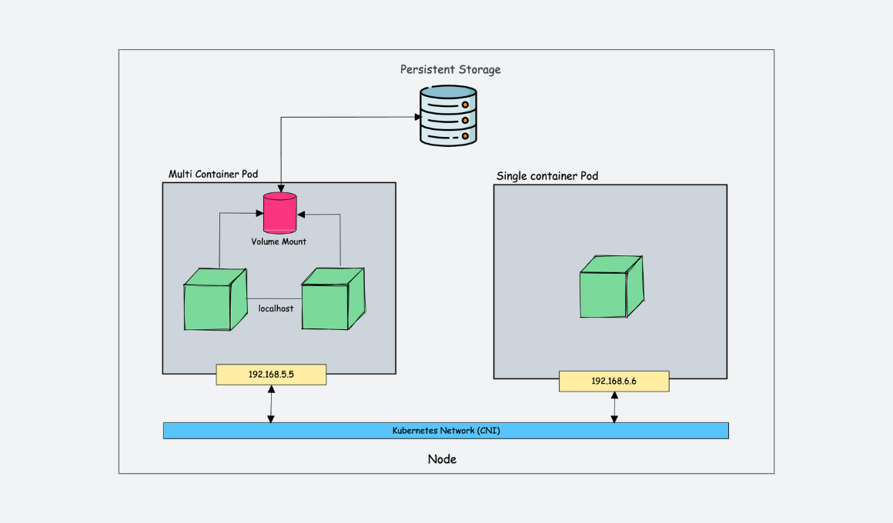

> **Tài liệu tham khảo gốc:** [DevOpsCube - What is Kubernetes Pod? Explained With Practical Examples](https://devopscube.com/kubernetes-pod/)

---

## 📋 Mục lục
1. [Khái niệm Kubernetes Pod là gì?](#1-khái-niệm-kubernetes-pod-là-gì)
2. [Chia sẻ tài nguyên giữa các Container trong Pod](#2-chia-sẻ-tài-nguyên-giữa-các-container-trong-pod)
3. [Giải phẫu cấu trúc Pod (Pod Anatomy) & Manifest YAML](#3-giải-phẫu-cấu-trúc-pod-pod-anatomy--manifest-yaml)
4. [Các phương pháp khởi tạo Pod (Imperative vs Declarative)](#4-các-phương-pháp-khởi-tạo-pod-imperative-vs-declarative)
5. [Truy cập ứng dụng trong Pod (Port Forwarding & Pod Shell)](#5-truy-cập-ứng-dụng-trong-pod-port-forwarding--pod-shell)
6. [Mô hình Multi-container Pod (Sidecar, Init, Ephemeral Containers)](#6-mô-hình-multi-container-pod-sidecar-init-ephemeral-containers)
7. [Vòng đời và các trạng thái của Pod (Pod Lifecycle & Phases)](#7-vòng-đời-và-các-trạng-thái-của-pod-pod-lifecycle--phases)
8. [Cấu hình Pod YAML nâng cao (Pod Features & Specification)](#8-cấu-hình-pod-yaml-nâng-cao-pod-features--specification)
9. [Các đối tượng liên quan tới Pod (Pod-Associated Objects)](#9-các-đối-tượng-liên-quan-tới-pod-pod-associated-objects)
10. [Hướng dẫn Troubleshooting & Chẩn đoán lỗi Pod](#10-hướng-dẫn-troubleshooting--chẩn-đoán-lỗi-pod)

---

## 1. Khái niệm Kubernetes Pod là gì?

Pod là **đơn vị triển khai nhỏ nhất và cơ bản nhất** trong hệ sinh thái Kubernetes:
* **Trình đại diện:** Đại diện cho một thể hiện (instance) của tiến trình ứng dụng đang chạy trong cluster.
* **Containers vs Pods:** Container là môi trường đóng gói đơn lẻ (thường chạy 1 process). Pod đóng vai trò như một "chiếc hộp" (wrapper) chứa một hoặc nhiều container gắn kết chặt chẽ (tightly coupled).
* **Địa chỉ IP duy nhất:** Thay vì mỗi container nhận một IP riêng, **cả Pod nhận một IP duy nhất**. Các container bên trong kết nối với nhau thông qua `localhost` trên các cổng (port) khác nhau.
* **Tính chất Ephemeral:** Pod có tính tạm thời, có thể bị xóa, tái tạo hoặc di dời (reschedule) bất cứ lúc nào.

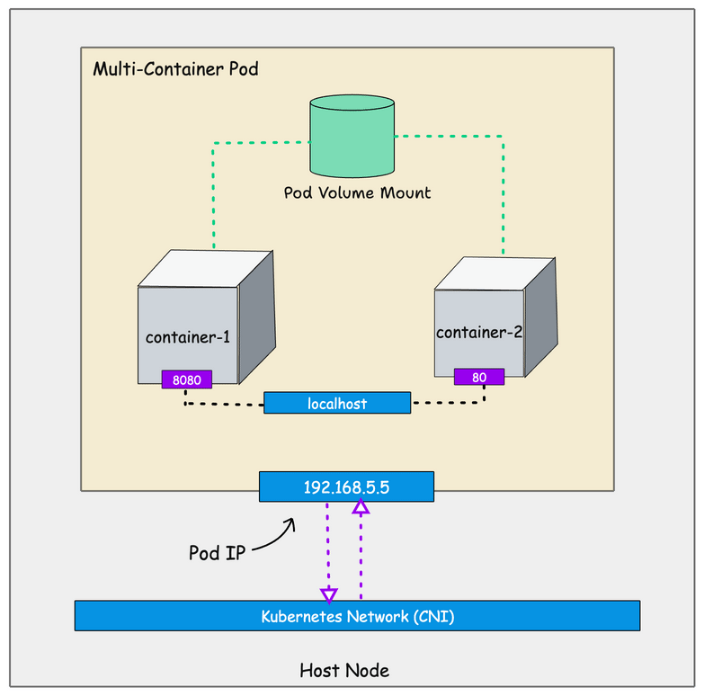

---

## 2. Chia sẻ tài nguyên giữa các Container trong Pod

### 🔄 Các tài nguyên ĐƯỢC chia sẻ:
1. **Network Namespace:** Tất cả container dùng chung IP và port space, giao tiếp qua `localhost`.
2. **IPC Namespace:** Chia sẻ bộ nhớ giao tiếp liên tiến trình (System V IPC / POSIX message queues).
3. **UTS Namespace:** Dùng chung hostname.
4. **Shared Volumes:** Các container có thể mount chung Volume để đọc/ghi dữ liệu lẫn nhau.

### 🔒 Các tài nguyên KHÔNG chia sẻ mặc định:
1. **PID Namespace:** Mặc định bị cô lập giữa các container (có thể bật chia sẻ qua `shareProcessNamespace: true`).
2. **Mount Namespace:** Mỗi container có hệ thống tệp riêng (filesystem isolation).

---

## 3. Giải phẫu cấu trúc Pod (Pod Anatomy) & Manifest YAML

Một Pod manifest chuẩn luôn chứa 4 phần bắt buộc:

```yaml
apiVersion: v1
kind: Pod
metadata:
  name: web-server-pod
  labels:
    app: web-server
    environment: production
  annotations:
    description: "This pod runs the web server"
spec:
  containers:
  - name: web-server
    image: nginx:1.14.2
    ports:
    - containerPort: 80
```

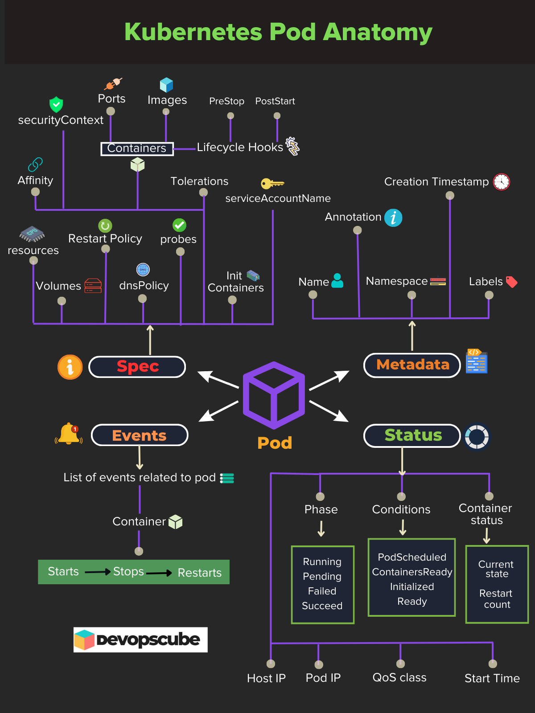
_*Hình: Chi tiết cấu trúc giải phẫu của một Kubernetes Pod (Pod Anatomy)*_

---

## 4. Các phương pháp khởi tạo Pod (Imperative vs Declarative)

### Cách 1: Sử dụng Lệnh Kubectl (Imperative Command)
Phù hợp cho việc học tập, kiểm thử hoặc chẩn đoán nhanh:

```bash
kubectl run web-server-pod \
  --image=nginx:1.14.2 \
  --restart=Never \
  --port=80 \
  --labels=app=web-server,environment=production \
  --annotations description="This pod runs the web server"
```

Kiểm tra trạng thái các Pod:
```bash
kubectl get pods -o wide
```
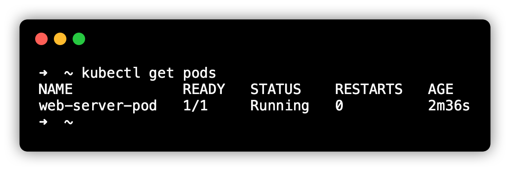

Xem chi tiết Pod (Describe):
```bash
kubectl describe pod web-server-pod
```
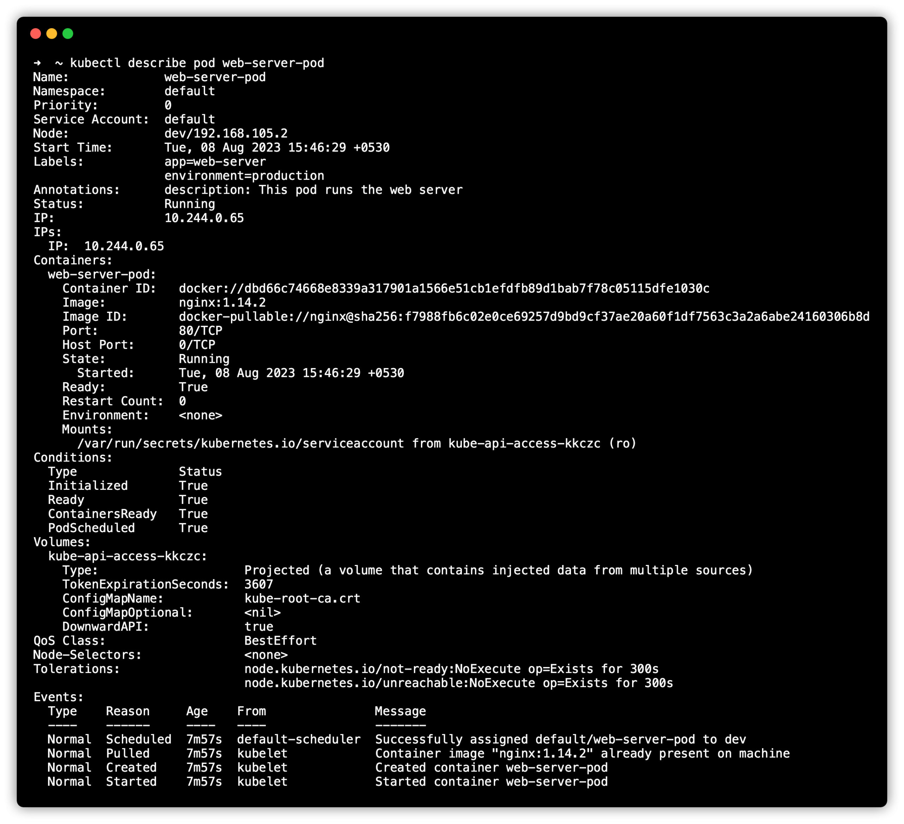
_*Hình: Xem thông tin chi tiết của Pod bao gồm IP, QoS Class, Events và Container Details*_

### Cách 2: Sử dụng File YAML Declarative (Thực tế Production)
Tạo file `nginx.yaml` và triển khai qua lệnh:
```bash
kubectl apply -f nginx.yaml
```

Mẹo tạo nhanh file YAML mẫu qua `--dry-run`:
```bash
kubectl run web-server-pod --image=nginx:1.14.2 --dry-run=client -o yaml > nginx.yaml
```

---

## 5. Truy cập ứng dụng trong Pod (Port Forwarding & Pod Shell)

### Port Forwarding (Kết nối từ Máy cục bộ)
Để truy cập ứng dụng Nginx đang chạy trong Pod từ máy tính local:

```bash
kubectl port-forward pod/web-server-pod 8080:80
```
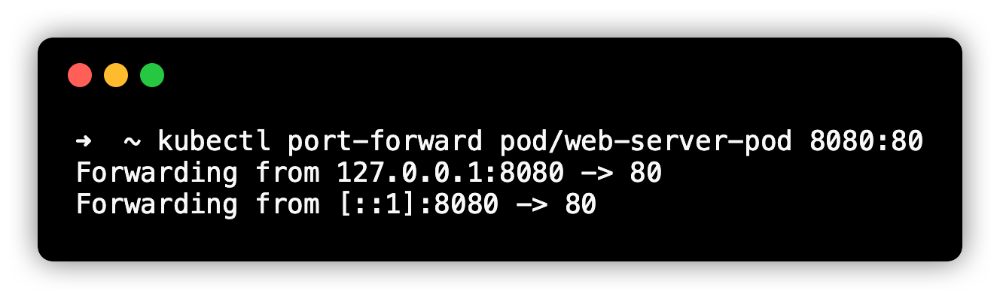

Mở trình duyệt truy cập `http://localhost:8080`:
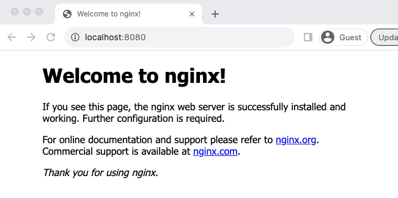

### Access Shell bên trong Pod (Exec Terminal)
Khi cần debug hoặc kiểm tra log/network bên trong Pod:

```bash
kubectl exec -it web-server-pod -- /bin/sh
```
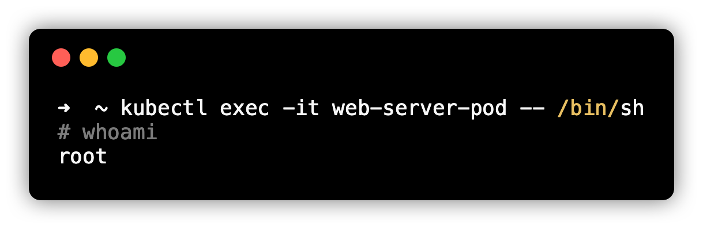

---

## 6. Mô hình Multi-container Pod (Sidecar, Init, Ephemeral Containers)

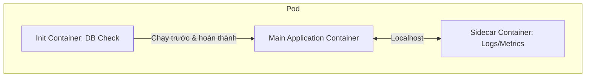

* **Sidecar Pattern:** Container hỗ trợ chạy song song (ví dụ: Fluentd thu thập logs, Envoy proxy).
* **Init Containers:** Chạy trước và hoàn thành trước khi container chính khởi động.
* **Ephemeral Containers:** Container tạm thời phục vụ debug trên Pod đang chạy mà không cần khởi động lại Pod.

---

## 7. Vòng đời và các trạng thái của Pod (Pod Lifecycle & Phases)

Một Pod sẽ đi qua các giai đoạn (Phases):

| Trạng thái | Ý nghĩa |
| :--- | :--- |
| **Pending** | API tiếp nhận Pod nhưng chưa được Scheduler gán Node hoặc đang kéo image (`Pulling`). |
| **Running** | Pod đã gán Node, tất cả container đã được tạo và ít nhất một container đang chạy. |
| **Succeeded** | Tất cả container chạy xong thành công (exit code 0). Thường thấy ở `Job` / `CronJob`. |
| **Failed** | Tất cả container đã dừng nhưng có ít nhất 1 container bị lỗi (exit code != 0). |
| **Unknown** | Không thể giao tiếp với Node quản lý Pod (lỗi mạng hoặc Node sập). |

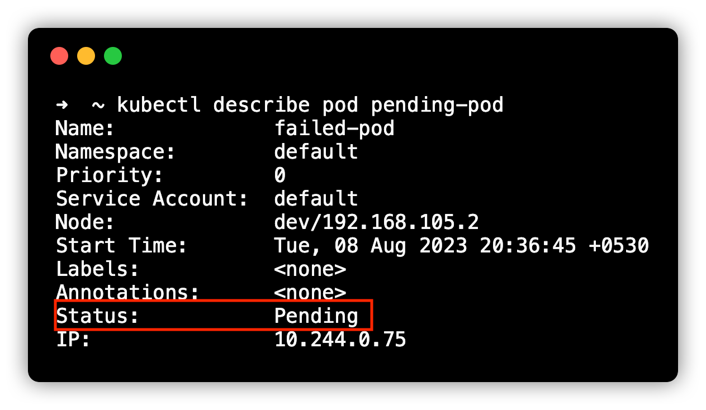
_*Hình: Xem thông tin trạng thái Pod Lifecycle qua lệnh describe*_

---

## 8. Cấu hình Pod YAML nâng cao (Pod Features & Specification)

Một Pod manifest đầy đủ các tính năng nâng cao (Resource Limits, Probes, Volumes, Affinity, SecurityContext):

```yaml
apiVersion: v1
kind: Pod
metadata:
  name: advanced-pod
  namespace: default
  labels:
    app: my-app
    tier: frontend
spec:
  # 1. Khởi tạo Init Container
  initContainers:
  - name: init-myservice
    image: busybox:1.28
    command: ['sh', '-c', "until nslookup myservice.$(cat /var/run/secrets/kubernetes.io/serviceaccount/namespace).svc.cluster.local; do echo waiting for myservice; sleep 2; done"]

  # 2. Main Containers
  containers:
  - name: app-container
    image: nginx:1.25
    ports:
    - containerPort: 80

    # Tài nguyên CPU & Memory
    resources:
      requests:
        memory: "64Mi"
        cpu: "250m"
      limits:
        memory: "128Mi"
        cpu: "500m"

    # Health Checks (Probes)
    livenessProbe:
      httpGet:
        path: /healthz
        port: 80
      initialDelaySeconds: 3
      periodSeconds: 3
    readinessProbe:
      httpGet:
        path: /
        port: 80
      initialDelaySeconds: 5
      periodSeconds: 10

    # Volume Mounts
    volumeMounts:
    - name: cache-volume
      mountPath: /cache

  # 3. Shared Volumes
  volumes:
  - name: cache-volume
    emptyDir: {}

  # 4. Scheduling & Restart Policy
  restartPolicy: Always
  nodeSelector:
    disktype: ssd
```

---

## 9. Các đối tượng liên quan tới Pod (Pod-Associated Objects)

Trong thực tế production, chúng ta **không tạo và quản lý trực tiếp các Pod đơn lẻ** vì Pod có tính tạm thời (ephemeral) và không thể tự khôi phục/mở rộng scale. Chúng ta sử dụng các Controllers:

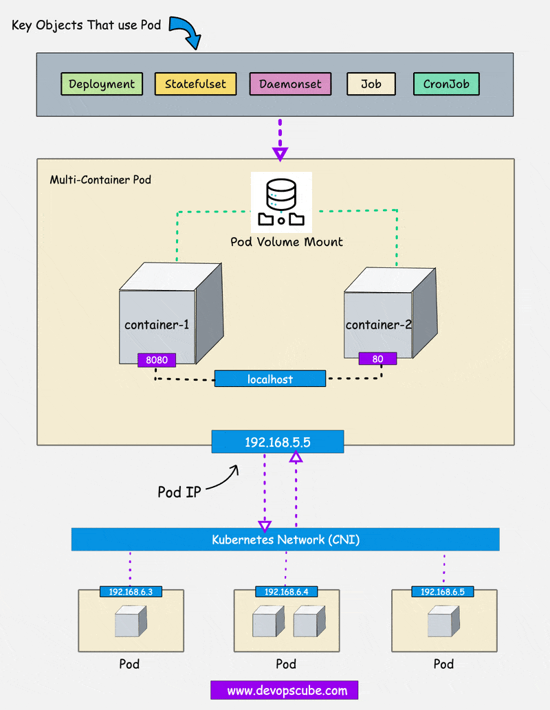
_*Hình: Tổng quan các Kubernetes Objects quản lý Pod (ReplicaSet, Deployment, StatefulSet, DaemonSet, Job, CronJob)*_

1. **ReplicaSet:** Đảm bảo luôn duy trì đủ số lượng Pod chỉ định.
2. **Deployment:** Quản lý ReplicaSet, hỗ trợ Rolling Update và Rollback không gây gián đoạn.
3. **StatefulSet:** Dùng cho ứng dụng có trạng thái (Database, Redis) với định danh mạng và lưu trữ cố định.
4. **DaemonSet:** Đảm bảo chạy 1 bản sao Pod trên **mọi Node** trong Cluster (ví dụ: Log collector, Monitoring agent).
5. **Job & CronJob:** Chạy tác vụ ngắn hạn (batch job), hoàn tất và tự dừng.

---

## 10. Hướng dẫn Troubleshooting & Chẩn đoán lỗi Pod

### Quy trình lệnh chẩn đoán nhanh
* **Kiểm tra danh sách Pod:** `kubectl get pods -o wide`
* **Xem thông tin sự kiện lỗi:** `kubectl describe pod <pod-name>` *(Xem phần Events cuối cùng)*
* **Xem logs ứng dụng:** `kubectl logs <pod-name> -c <container-name>`
* **Vào terminal chẩn đoán:** `kubectl exec -it <pod-name> -- /bin/sh`

### Nguyên nhân các lỗi thường gặp
1. **ImagePullBackOff / ErrImagePull:** Lỗi tên Image, tag không đúng hoặc thiếu `imagePullSecrets` từ Registry riêng.
2. **CrashLoopBackOff:** Container khởi chạy bị sập liên tục (exit status khác 0), do sai code, thiếu biến môi trường hoặc sai lệnh `command`.
3. **Pending:** Node không đủ CPU/RAM (Insufficient resources), hoặc thiếu Tolerations với Taints của Node.
