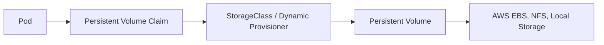

# 06. Storage (Quản lý lưu trữ dữ liệu)

Mặc định, dữ liệu bên trong container là tạm thời (ephemeral) và sẽ mất đi khi container restart hoặc Pod bị xóa. Để lưu trữ dữ liệu bền vững, Kubernetes cung cấp cơ chế quản lý Storage linh hoạt.

---

## 📌 Các thành phần lưu trữ cốt lõi

### 1. Volumes (Tạm thời hoặc Gắn trực tiếp)
*   **emptyDir:** Thư mục trống tạo ra khi Pod khởi động trên một Node. Dữ liệu mất đi khi Pod bị xóa. Thường dùng làm cache hoặc chia sẻ dữ liệu giữa các container trong cùng một Pod.
*   **hostPath:** Mount trực tiếp thư mục từ máy host (Node) vào Pod. Phụ thuộc vào Node cụ thể, không an toàn nếu Pod bị reschedule sang Node khác.

### 2. Persistent Volumes (PV)
*   Tài nguyên lưu trữ thực tế trong cluster (do Admin tạo thủ công hoặc hệ thống tự động sinh ra).
*   Độc lập với vòng đời của Pod.
*   Kết nối với các hệ thống lưu trữ vật lý như: Local Disk, NFS, AWS EBS, Google Persistent Disk, v.v.

### 3. Persistent Volume Claims (PVC)
*   Yêu cầu của người dùng về dung lượng và chế độ truy cập (Access Mode) đối với Storage.
*   Kube-controller-manager sẽ tự động tìm kiếm PV phù hợp để "bind" (gắn kết) với PVC.
*   **Các Access Modes chính:**
    *   `ReadWriteOnce` (RWO): Chỉ mount được cho 1 Node (đọc/ghi).
    *   `ReadOnlyMany` (ROM): Mount cho nhiều Node (chỉ đọc).
    *   `ReadWriteMany` (RWX): Mount cho nhiều Node (đọc/ghi, ví dụ: NFS).

### 4. StorageClasses & Dynamic Provisioning
*   Tránh việc Admin phải tạo PV thủ công.
*   Định nghĩa loại Storage và driver cung cấp (Provisioner). Khi có PVC gửi tới, StorageClass sẽ tự động tạo PV tương ứng trên Cloud (ví dụ: tự tạo AWS EBS Volume).

### 5. CSI (Container Storage Interface)
*   Chuẩn hóa giao diện kết nối giữa Kubernetes và các hãng cung cấp giải pháp lưu trữ bên ngoài (AWS EBS CSI Driver, Ceph CSI, v.v.).

---

## 🎯 Bài tập thực hành
1.  [ ] Tạo một `PersistentVolume` dạng `hostPath` dung lượng 1Gi.
2.  [ ] Tạo một `PersistentVolumeClaim` yêu cầu 1Gi và liên kết thành công (Bound) với PV vừa tạo.
3.  [ ] Viết một Deployment (ví dụ: Pod chạy ứng dụng ghi logs liên tục) mount PVC này vào thư mục `/var/log/myapp`.
4.  [ ] Xóa Pod đó đi và kiểm tra xem logs có còn tồn tại trên thư mục hostPath của Node hay không.
