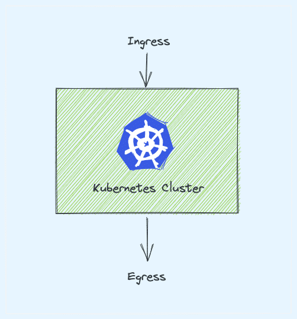
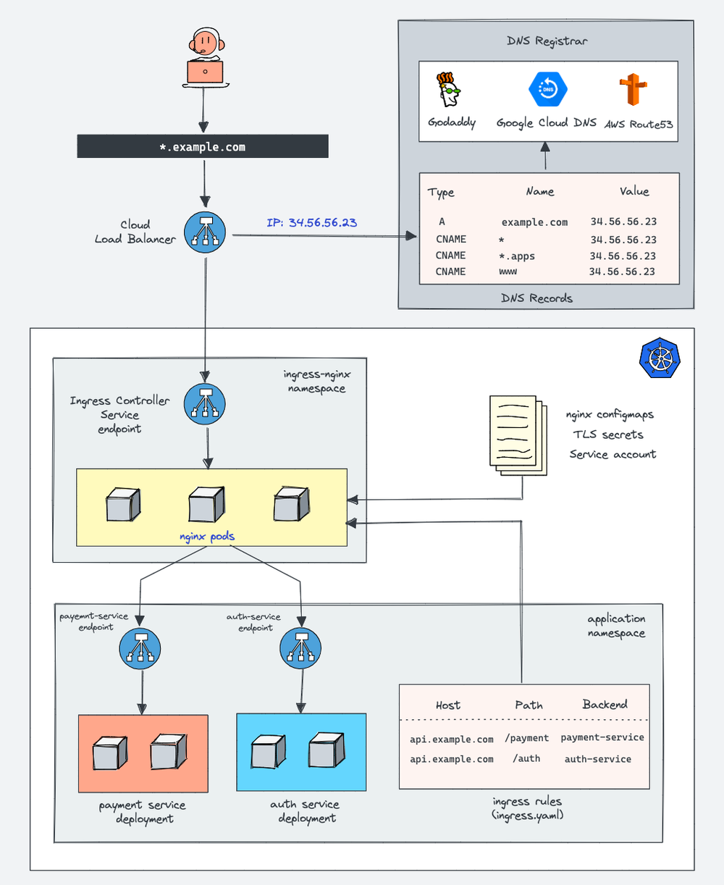
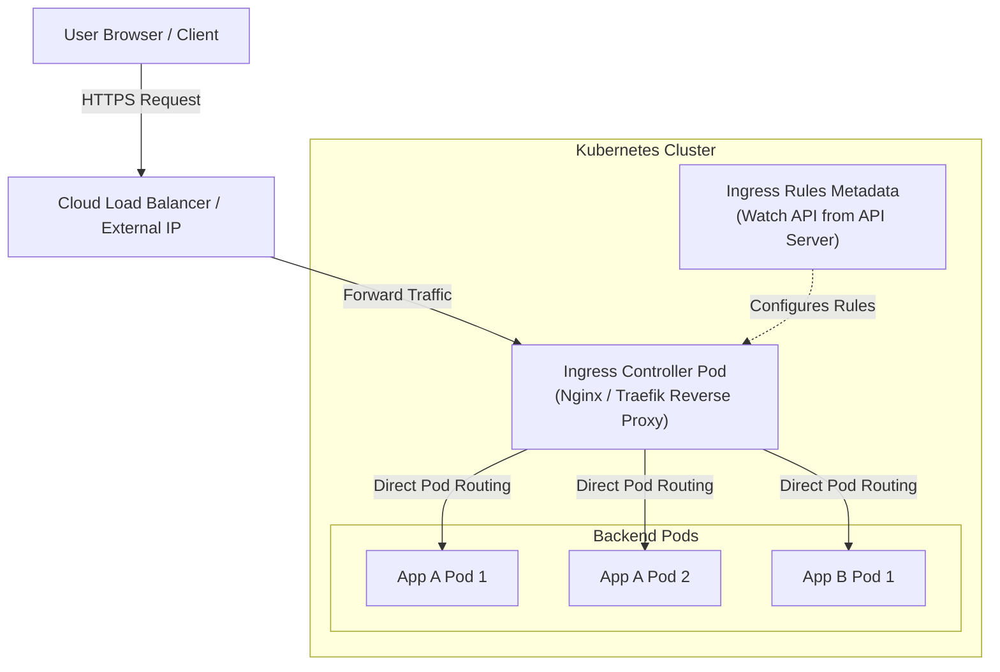
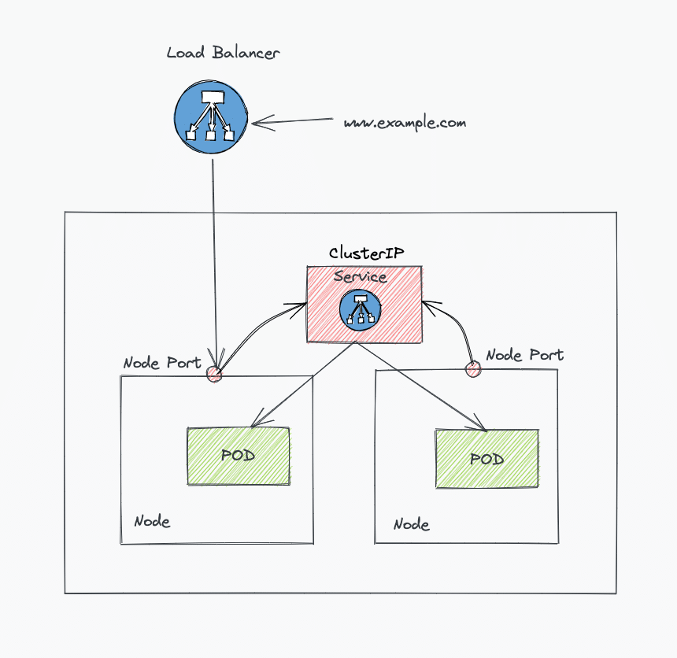
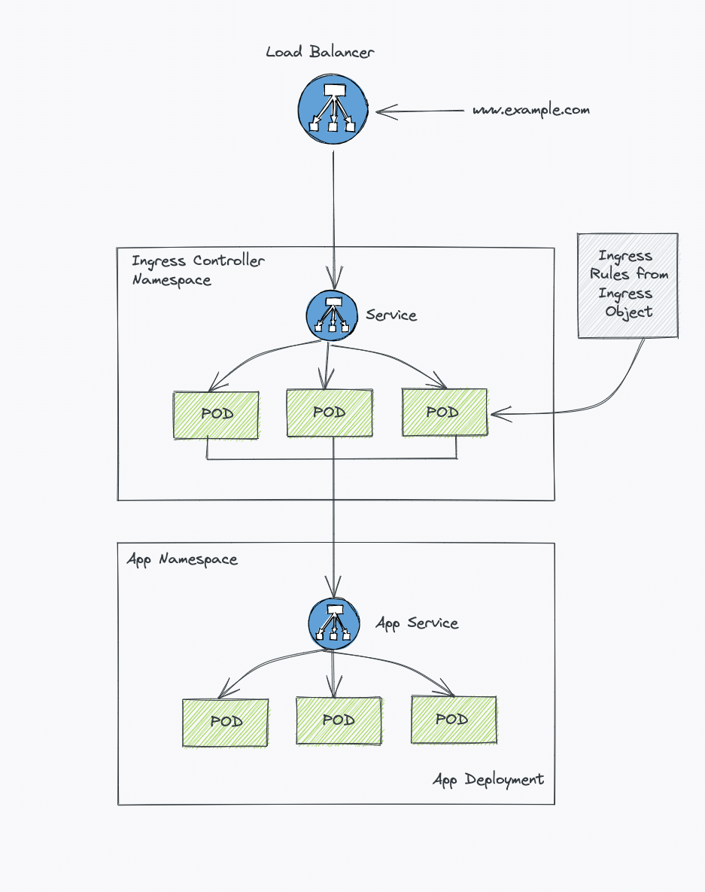
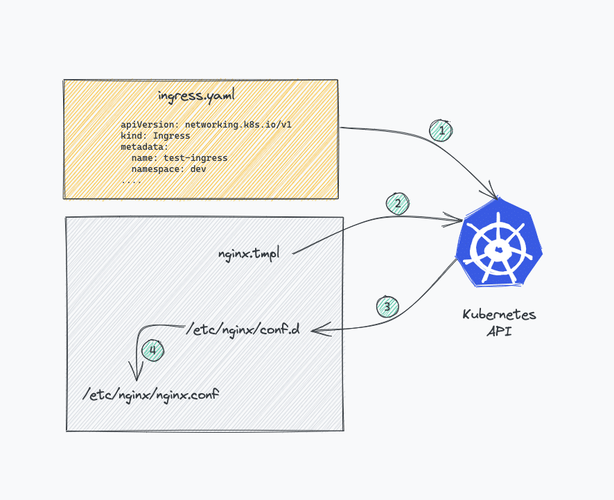
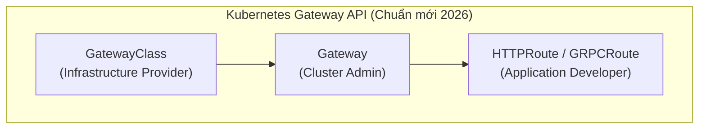

# 🌐 Kubernetes Ingress Deep Dive — Hướng dẫn Chi tiết & Thực hành (DevOpsCube)


> **Tài liệu tham khảo gốc:** [DevOpsCube - Kubernetes Ingress Tutorial for Beginners (With Examples)](https://devopscube.com/kubernetes-ingress-tutorial/)

---

## 📋 Mục lục
1. [Khái niệm Kubernetes Ingress là gì?](#1-khái-niệm-kubernetes-ingress-là-gì)
2. [So sánh: NodePort vs LoadBalancer vs Ingress](#2-so-sánh-nodeport-vs-loadbalancer-vs-ingress)
3. [Kiến trúc & Nguyên lý hoạt động của Ingress](#3-kiến-trúc--nguyên-lý-hoạt-động-của-ingress)
4. [Các kiểu Routing trong Ingress (Routing Strategies)](#4-các-kiểu-routing-trong-ingress-routing-strategies)
5. [Cấu hình TLS/SSL Termination (HTTPS Ingress)](#5-cấu-hình-tlsssl-termination-https-ingress)
6. [Hướng dẫn Thực hành với Nginx Ingress Controller](#6-hướng-dẫn-thực-hành-với-nginx-ingress-controller)
7. [Sự tiến hóa: Ingress API vs Gateway API](#7-sự-tiến-hóa-ingress-api-vs-gateway-api)
8. [Hướng dẫn Troubleshooting & Câu hỏi ôn tập (FAQs)](#8-hướng-dẫn-troubleshooting--câu-hỏi-ôn-tập-faqs)

---

## 1. Khái niệm Kubernetes Ingress là gì?

Trong Kubernetes, **Ingress** là một đối tượng API (API Resource) định nghĩa các quy tắc (rules) cho phép truy cập lưu lượng truy cập HTTP/HTTPS từ bên ngoài vào các dịch vụ (Services) bên trong Cluster.

- **Mục đích chính**: Đóng vai trò là cổng vào duy nhất (Single Point of Entry) giúp quản lý routing, load balancing, SSL/TLS Termination và Virtual Hosting mà không cần tạo riêng lẻ từng Load Balancer tốn kém cho mỗi Service.
- **Lưu ý cốt lõi**: Đối tượng Ingress YAML chỉ là **bản khai báo quy tắc (Rules Metadata)**. Để Ingress hoạt động, cluster bắt buộc phải có một **Ingress Controller** (ví dụ: Nginx Ingress Controller, Traefik, HAProxy, AWS ALB Ingress Controller) chạy thực tế để lắng nghe và thực thi các quy tắc đó.

---

## 2. So sánh: NodePort vs LoadBalancer vs Ingress



*Mô tả hình ảnh:* So sánh kiến trúc truy cập từ bên ngoài vào Kubernetes qua 3 phương thức NodePort, LoadBalancer và Ingress.

| Tiêu chí | Service Type: NodePort | Service Type: LoadBalancer | Kubernetes Ingress |
| :--- | :--- | :--- | :--- |
| **Cơ chế** | Mở một Cổng tĩnh (Port 30000-32767) trên tất cả các Worker Node. | Tự động xin một Cloud Load Balancer (NLB/ALB) cho từng Service. | Chạy 1 Reverse Proxy đằng sau 1 Cloud Load Balancer chung cho cả Cluster. |
| **Tầng OSI** | L4 (TCP/UDP) | L4 (TCP/UDP) | **L7 (HTTP/HTTPS)** |
| **Routing** | Không hỗ trợ routing theo URL Path hay Domain. | Không hỗ trợ (Mỗi LB chỉ trỏ tới 1 Service). | **Hỗ trợ Routing theo Domain, Path, Header, TLS**. |
| **Chi phí** | Rất rẻ (dùng IP Node). | **Rất đắt** (Mỗi microservice tốn 1 Cloud LB riêng). | **Tối ưu chi phí nhất** (Nhiều Service chia sẻ 1 Cloud LB). |
| **Quản lý SSL** | Phải tự quản lý SSL tại App/Node level. | SSL Terminate tại Cloud LB. | **SSL Terminate tập trung tại Ingress Controller**. |
| **Trường hợp dùng** | Thử nghiệm, môi trường Dev/Staging nội bộ. | Các service phi-HTTP (gRPC, Database connection, MQTT). | **Tất cả các ứng dụng Web/REST API Production**. |

---

## 3. Kiến trúc & Nguyên lý hoạt động of Ingress



*Mô tả hình ảnh Ingress Architecture:* Luồng dữ liệu HTTP request đi từ Client -> Ingress Controller Pod -> Endpoints của Pods đại diện cho Service (Bypass qua Service ClusterIP để tối ưu latency).

### 3.1 Hai thành phần của hệ thống Ingress

1. **Ingress Resource (Manifest YAML)**:
   - File cấu hình do Developer/DevOps khai báo định nghĩa các routing rules (Domain name, URL paths, TLS certs, Backend service names).
2. **Ingress Controller (Reverse Proxy Software)**:
   - Một ứng dụng (thường chạy dưới dạng Deployment/DaemonSet) liên tục theo dõi (Watch API) các Ingress Resource mới từ API Server.
   - Khi có thay đổi, Ingress Controller tự động cập nhật lại file cấu hình của Reverse Proxy (ví dụ: `nginx.conf`) và reload mà không làm gián đoạn kết nối.



*Mô tả sơ đồ:* Ingress Controller nhận diện địa chỉ Endpoints của Pods và chuyển tiếp kết nối trực tiếp đến Pod (Point-to-Point Routing) giúp tối ưu hiệu năng chuyển mạch.

---

## 4. Các kiểu Routing trong Ingress (Routing Strategies)



*Mô tả hình ảnh Routing Types:* Hai phương thức routing chính là Path-based Routing (Routing theo URL Path) và Host-based Routing (Name-based Virtual Hosting).

### 4.1 Path-Based Routing (Routing theo URL Path)
Chỉ sử dụng **1 Domain duy nhất**, định hướng truy cập tới các microservices khác nhau dựa trên đường dẫn URL:
- `example.com/analytics` -> Trỏ tới Service `analytics-service`
- `example.com/orders` -> Trỏ tới Service `orders-service`

```yaml
apiVersion: networking.k8s.io/v1
kind: Ingress
metadata:
  name: path-based-ingress
  namespace: default
  annotations:
    nginx.ingress.kubernetes.io/rewrite-target: /
spec:
  ingressClassName: nginx
  rules:
  - host: example.com
    http:
      paths:
      - path: /analytics
        pathType: Prefix
        backend:
          service:
            name: analytics-service
            port:
              number: 80
      - path: /orders
        pathType: Prefix
        backend:
          service:
            name: orders-service
            port:
              number: 80
```

### 4.2 Host-Based Routing (Name-Based Virtual Hosting)
Sử dụng **nhiều Subdomain/Domain khác nhau** trỏ về cùng một địa chỉ IP Ingress:
- `api.example.com` -> Trỏ tới Service `api-backend-service`
- `dashboard.example.com` -> Trỏ tới Service `web-dashboard-service`

```yaml
apiVersion: networking.k8s.io/v1
kind: Ingress
metadata:
  name: host-based-ingress
  namespace: default
spec:
  ingressClassName: nginx
  rules:
  - host: api.example.com
    http:
      paths:
      - path: /
        pathType: Prefix
        backend:
          service:
            name: api-backend-service
            port:
              number: 8080
  - host: dashboard.example.com
    http:
      paths:
      - path: /
        pathType: Prefix
        backend:
          service:
            name: web-dashboard-service
            port:
              number: 80
```

### 4.3 Default Backend (Xử lý lỗi 404)
Nếu request gửi lên không khớp với bất kỳ Host hay Path nào trong bảng quy tắc, Ingress Controller sẽ chuyển request đó tới **Default Backend Service** để hiển thị trang lỗi 404 Not Found chuẩn hóa.

---

## 5. Cấu hình TLS/SSL Termination (HTTPS Ingress)



*Mô tả hình ảnh TLS Termination:* Quá trình bắt tay SSL/TLS và giải mã dữ liệu mã hóa xảy ra ngay tại Ingress Controller. Luồng dữ liệu giữa Ingress Controller và các Pods phía sau là luồng HTTP nội bộ an toàn.

### 5.1 Lợi ích của SSL Termination tại Ingress
1. **Quản lý chứng chỉ tập trung**: Chỉ cần upload và gia hạn chứng chỉ TLS/SSL (`tls.crt`, `tls.key`) tại một nơi duy nhất trên Ingress.
2. **Giảm tải CPU cho Pods**: Các ứng dụng backend không cần tốn tài nguyên xử lý mã hóa/giải mã SSL/TLS handshake.

### 5.2 Các bước cấu hình HTTPS Ingress

#### Bước 1: Tạo Kubernetes Secret chứa SSL Certificate

```bash
kubectl create secret tls example-tls-secret \
  --cert=path/to/tls.crt \
  --key=path/to/tls.key \
  --namespace=default
```

#### Bước 2: Khai báo khối `spec.tls` trong Ingress Manifest

```yaml
apiVersion: networking.k8s.io/v1
kind: Ingress
metadata:
  name: secure-tls-ingress
  namespace: default
  annotations:
    nginx.ingress.kubernetes.io/ssl-redirect: "true"
spec:
  ingressClassName: nginx
  tls:
  - hosts:
    - secure.example.com
    secretName: example-tls-secret
  rules:
  - host: secure.example.com
    http:
      paths:
      - path: /
        pathType: Prefix
        backend:
          service:
            name: secure-app-service
            port:
              number: 443
```

---

## 6. Hướng dẫn Thực hành với Nginx Ingress Controller



*Mô tả hình ảnh Nginx Ingress:* Sơ đồ triển khai thực tế Nginx Ingress Controller nhận lưu lượng từ Cloud Load Balancer và điều hướng vào ứng dụng.

### 6.1 Cài đặt Nginx Ingress Controller bằng Helm

```bash
# Thêm Helm Repository của ingress-nginx
helm repo add ingress-nginx https://kubernetes.github.io/ingress-nginx
helm repo update

# Cài đặt ingress-nginx controller vào namespace ingress-nginx
helm install ingress-nginx ingress-nginx/ingress-nginx \
  --create-namespace \
  --namespace ingress-nginx
```

### 6.2 Các Annotations quan trọng của Nginx Ingress

- `nginx.ingress.kubernetes.io/rewrite-target`: Viết lại URL path trước khi gửi tới backend pod.
- `nginx.ingress.kubernetes.io/ssl-redirect`: Tự động chuyển hướng HTTP (port 80) sang HTTPS (port 443).
- `nginx.ingress.kubernetes.io/proxy-body-size`: Tăng giới hạn dung lượng file upload (ví dụ: `50m`).
- `nginx.ingress.kubernetes.io/cors-allow-origin`: Cấu hình CORS cho API.

---

## 7. Sự tiến hóa: Ingress API vs Gateway API

Từ phiên bản Kubernetes 1.26+, cộng đồng CNCF đã phát triển **Kubernetes Gateway API** để khắc phục các hạn chế của Ingress API v1 cũ:



| Tiêu chí | Ingress API (v1) | Gateway API (v1.x - Hiện đại) |
| :--- | :--- | :--- |
| **Thiết kế vai trò** | Đơn khối (Phù hợp với 1 người làm từ A-Z). | **Phân quyền rõ ràng (Role-oriented)**: Infrastructure Provider, Cluster Admin, App Developer. |
| **Khả năng mở rộng** | Phụ thuộc nặng vào Vendor Annotations (`nginx.ingress...`). | **Chuẩn hóa native API** (Hỗ trợ Header matching, Weight Traffic Splitting, Mirroring). |
| **Giao thức hỗ trợ** | Chủ yếu HTTP/HTTPS. | **Hỗ trợ đa dạng**: HTTP, HTTPS, gRPC, TCP, UDP, TLS passthrough. |

---

## 8. Hướng dẫn Troubleshooting & Câu hỏi ôn tập (FAQs)

### Các lỗi phổ biến và cách khắc phục

> [!WARNING]
> **Lỗi 1: 404 Not Found (Default Backend)**
> - **Nguyên nhân**: Request gửi lên không khớp với bất kỳ `host` hoặc `path` nào được định nghĩa trong Ingress YAML, hoặc do `ingressClassName` bị sai/thiếu.
> - **Cách fix**: Kiểm tra lệnh `kubectl get ingress` và đối chiếu tên Host/Path với URL bạn đang gọi. Đảm bảo Nginx Controller đang lắng nghe đúng `ingressClassName`.

> [!CAUTION]
> **Lỗi 2: 502 Bad Gateway / 503 Service Unavailable**
> - **Nguyên nhân**: Ingress Controller không thể kết nối tới Pods đằng sau Backend Service (Pods bị CrashLoopBackOff, sai `service.port` hoặc ứng dụng không phản hồi healthcheck).
> - **Cách fix**: Kiểm tra danh sách Endpoints: `kubectl get endpoints <service-name>`. Đảm bảo các Pods đang ở trạng thái `Running` và `Ready`.

> [!TIP]
> **Lỗi 3: Certificate Warning / SSL Error**
> - **Nguyên nhân**: Tên miền trong request không trùng với SAN (Subject Alternative Name) trong SSL Certificate, hoặc Secret chứa cert bị thiếu/nằm sai Namespace.
> - **Cách fix**: Kiểm tra Secret TLS nằm đúng Namespace của Ingress Resource và certificate hỗ trợ đúng hostname khai báo trong `spec.tls`.

---

## 📚 Tài liệu tham khảo

- DevOpsCube Article: [Kubernetes Ingress Tutorial for Beginners (With Examples)](https://devopscube.com/kubernetes-ingress-tutorial/)
- Kubernetes Official Documentation: [Ingress Controllers](https://kubernetes.io/docs/concepts/services-networking/ingress-controllers/)
- Nginx Ingress Documentation: [Ingress-Nginx Controller User Guide](https://kubernetes.github.io/ingress-nginx/)
