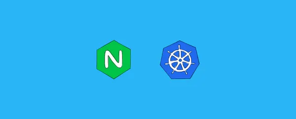
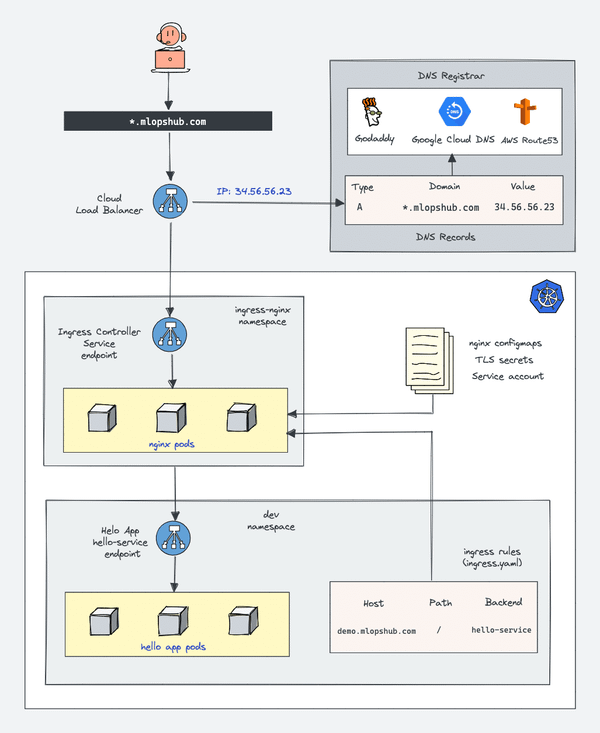
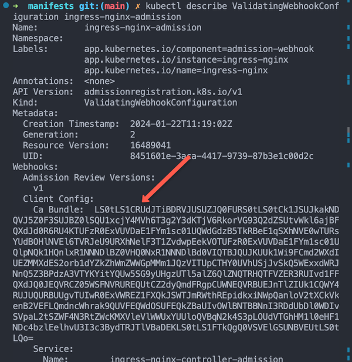
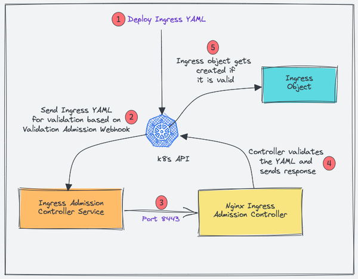
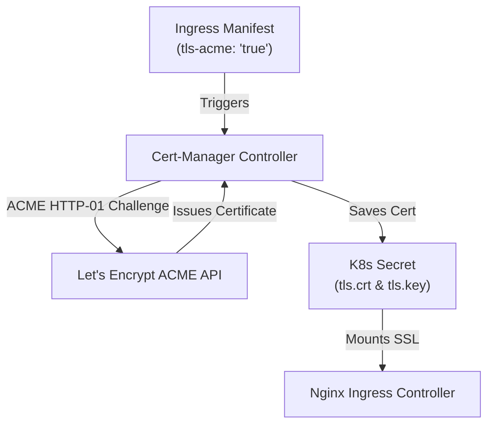

# 🛠️ Nginx Ingress Controller Setup Guide — Hướng dẫn Cài đặt & Triển khai Chi tiết (DevOpsCube)



> **Tài liệu tham khảo gốc:** [DevOpsCube - How to Setup NGINX Ingress Controller on Kubernetes](https://devopscube.com/setup-ingress-kubernetes-nginx-controller/)

---

## 📋 Mục lục
1. [Tổng quan Kiến trúc Nginx Ingress Controller](#1-tổng-quan-kiến-trúc-nginx-ingress-controller)
2. [Các phương thức triển khai Nginx Ingress Controller (Deployment Modes)](#2-các-phương-thức-triển-khai-nginx-ingress-controller-deployment-modes)
3. [Hướng dẫn Cài đặt chi tiết từng bước bằng Manifest YAML (Step-by-Step)](#3-hướng-dẫn-cài-đặt-chi-tiết-từng-bước-bằng-manifest-yaml-step-by-step)
4. [Triển khai Ứng dụng Demo & Kiểm tra Routing Rules](#4-triển-khai-ứng-dụng-demo--kiểm-tra-routing-rules)
5. [Cấu hình HTTPS / SSL tự động với Cert-Manager & Let's Encrypt](#5-cấu-hình-https--ssl-tự-động-với-cert-manager--lets-encrypt)
6. [Hướng dẫn Troubleshooting & Chẩn đoán Sự cố](#6-hướng-dẫn-troubleshooting--chẩn-đoán-sự-cố)

---

## 1. Tổng quan Kiến trúc Nginx Ingress Controller



*Mô tả hình ảnh Kiến trúc Nginx Ingress:* Nginx Ingress Controller bao gồm một tiến trình Go (Controller Daemon) liên tục đồng bộ trạng thái từ API Server và tự động render lại file `nginx.conf` của trình Reverse Proxy Nginx đằng sau.

### 1.1 Hai thành phần bên trong Nginx Ingress Controller Pod

1. **Ingress Controller Daemon (Go Binary)**:
   - Đóng vai trò là một Kubernetes Controller.
   - Liên tục kết nối với `kube-apiserver` qua cơ chế Watch API để nhận biết khi nào có đối tượng `Ingress`, `Service` hoặc `Endpoints` được tạo mới hay thay đổi.
2. **Nginx Reverse Proxy Executable**:
   - Tiến trình Nginx thực tế xử lý gói tin HTTP/HTTPS.
   - Khi Controller Daemon phát hiện sự thay đổi cấu hình Ingress, nó sẽ tự động cập nhật file `/etc/nginx/nginx.conf` và gửi tín hiệu Reload Nginx mà không ngắt các kết nối (Zero-Downtime Reload).

---

## 2. Các phương thức triển khai Nginx Ingress Controller (Deployment Modes)



*Mô tả hình ảnh Deployment Modes:* Ba phương thức triển khai Nginx Ingress Controller phổ biến bao gồm Service LoadBalancer, Service NodePort và HostNetwork.

### 2.1 Mode 1: Service Type LoadBalancer (Khuyên dùng cho Managed K8s: AWS EKS, GCP GKE, Azure AKS)
- **Cơ chế**: Triển khai Nginx Controller đằng sau một Kubernetes Service dạng `type: LoadBalancer`.
- **Hoạt động**: Nhà cung cấp đám mây (AWS/GCP/Azure) sẽ tự động tạo một Cloud Load Balancer (NLB/ALB) với IP Public tĩnh duy nhất trỏ tới các Nginx Ingress Pods.
- **Ưu điểm**: Độ sẵn sàng cao (HA), tích hợp sẵn tính năng tự động mở rộng và phòng chống DDoS của Cloud.

### 2.2 Mode 2: Service Type NodePort (Dành cho On-Premise, Bare-Metal, Minikube/Kind)
- **Cơ chế**: Mở một cổng tĩnh (ví dụ: NodePort `30080` cho HTTP và `30443` cho HTTPS) trên tất cả các Worker Nodes.
- **Hoạt động**: Sử dụng một thiết bị Load Balancer bên ngoài (HAProxy, F5) hoặc DNS Round-Robin trỏ trực tiếp tới IP của các Worker Nodes ở cổng NodePort đó.

### 2.3 Mode 3: HostNetwork Mode (Hiệu năng cao nhất)
- **Cơ chế**: Cho phép Nginx Controller Pod bind trực tiếp vào giao diện mạng của Host Node (Worker Node) và chiếm dụng cổng `80` và `443` thật của Node đó (`hostNetwork: true`).
- **Ưu điểm**: Loại bỏ hoàn toàn overhead chuyển mạch NAT của Kube-proxy, cho tốc độ xử lý gói tin (Throughput) tối đa.

---

## 3. Hướng dẫn Cài đặt chi tiết từng bước bằng Manifest YAML (Step-by-Step)

### Bước 1: Tạo Namespace dành riêng cho Ingress Controller

```yaml
# 01-namespace.yaml
apiVersion: v1
kind: Namespace
metadata:
  name: ingress-nginx
  labels:
    app.kubernetes.io/name: ingress-nginx
```

### Bước 2: Tạo ServiceAccounts & Cấu hình RBAC Security

Nginx Controller cần quyền truy cập API Server để đọc thông tin Ingress, Service, Secret và Endpoints trên toàn bộ Cluster.

```yaml
# 02-rbac.yaml
apiVersion: v1
kind: ServiceAccount
metadata:
  name: ingress-nginx
  namespace: ingress-nginx
---
apiVersion: rbac.authorization.k8s.io/v1
kind: ClusterRole
metadata:
  name: ingress-nginx
rules:
  - apiGroups: [""]
    resources: ["configmaps", "endpoints", "nodes", "pods", "secrets", "namespaces", "services"]
    verbs: ["get", "list", "watch"]
  - apiGroups: ["networking.k8s.io"]
    resources: ["ingresses", "ingressclasses"]
    verbs: ["get", "list", "watch"]
  - apiGroups: ["networking.k8s.io"]
    resources: ["ingresses/status"]
    verbs: ["update"]
---
apiVersion: rbac.authorization.k8s.io/v1
kind: ClusterRoleBinding
metadata:
  name: ingress-nginx
roleRef:
  apiGroup: rbac.authorization.k8s.io
  kind: ClusterRole
  name: ingress-nginx
subjects:
  - kind: ServiceAccount
    name: ingress-nginx
    namespace: ingress-nginx
```

### Bước 3: Khởi tạo ConfigMap tùy chỉnh Nginx Options

```yaml
# 03-configmap.yaml
apiVersion: v1
kind: ConfigMap
metadata:
  name: ingress-nginx-controller
  namespace: ingress-nginx
data:
  proxy-connect-timeout: "15"
  proxy-read-timeout: "600"
  proxy-send-timeout: "600"
  client-max-body-size: "50m"
  use-gzip: "true"
```

### Bước 4: Khai báo đối tượng IngressClass

```yaml
# 04-ingress-class.yaml
apiVersion: networking.k8s.io/v1
kind: IngressClass
metadata:
  name: nginx
  annotations:
    ingressclass.kubernetes.io/is-default-class: "true"
spec:
  controller: k8s.io/ingress-nginx
```

### Bước 5: Triển khai Nginx Ingress Controller Deployment

```yaml
# 05-deployment.yaml
apiVersion: apps/v1
kind: Deployment
metadata:
  name: ingress-nginx-controller
  namespace: ingress-nginx
spec:
  replicas: 2
  selector:
    matchLabels:
      app.kubernetes.io/name: ingress-nginx
  template:
    metadata:
      labels:
        app.kubernetes.io/name: ingress-nginx
    spec:
      serviceAccountName: ingress-nginx
      containers:
        - name: controller
          image: registry.k8s.io/ingress-nginx/controller:v1.9.4
          args:
            - /nginx-ingress-controller
            - --election-id=ingress-nginx-leader
            - --controller-class=k8s.io/ingress-nginx
            - --configmap=$(POD_NAMESPACE)/ingress-nginx-controller
          ports:
            - name: http
              containerPort: 80
            - name: https
              containerPort: 443
          env:
            - name: POD_NAME
              valueFrom:
                fieldRef:
                  fieldPath: metadata.name
            - name: POD_NAMESPACE
              valueFrom:
                fieldRef:
                  fieldPath: metadata.namespace
```

### Bước 6: Khởi tạo Service type LoadBalancer (Ingress Entry Point)

```yaml
# 06-service.yaml
apiVersion: v1
kind: Service
metadata:
  name: ingress-nginx-controller
  namespace: ingress-nginx
spec:
  type: LoadBalancer
  selector:
    app.kubernetes.io/name: ingress-nginx
  ports:
    - name: http
      port: 80
      targetPort: http
    - name: https
      port: 443
      targetPort: https
```

---

## 4. Triển khai Ứng dụng Demo & Kiểm tra Routing Rules



*Mô tả hình ảnh Request Flow:* Dữ liệu từ Client gửi tới Ingress Controller, Nginx Controller đối chiếu luật và chuyển thẳng tới Pod của Demo App v1 hoặc Demo App v2.

### 4.1 Tạo 2 ứng dụng Demo (App-Apple & App-Banana)

```yaml
# demo-apps.yaml
apiVersion: apps/v1
kind: Deployment
metadata:
  name: apple-app
spec:
  replicas: 2
  selector:
    matchLabels:
      app: apple
  template:
    metadata:
      labels:
        app: apple
    spec:
      containers:
      - name: apple-app
        image: hashicorp/http-echo
        args: ["-text=🍎 Welcome to Apple App!"]
        ports:
        - containerPort: 5678
---
apiVersion: v1
kind: Service
metadata:
  name: apple-service
spec:
  ports:
  - port: 80
    targetPort: 5678
  selector:
    app: apple
---
apiVersion: apps/v1
kind: Deployment
metadata:
  name: banana-app
spec:
  replicas: 2
  selector:
    matchLabels:
      app: banana
  template:
    metadata:
      labels:
        app: banana
    spec:
      containers:
      - name: banana-app
        image: hashicorp/http-echo
        args: ["-text=🍌 Welcome to Banana App!"]
        ports:
        - containerPort: 5678
---
apiVersion: v1
kind: Service
metadata:
  name: banana-service
spec:
  ports:
  - port: 80
    targetPort: 5678
  selector:
    app: banana
```

### 4.2 Cấu hình Ingress Routing Rules

```yaml
# demo-ingress.yaml
apiVersion: networking.k8s.io/v1
kind: Ingress
metadata:
  name: fruit-ingress
  annotations:
    nginx.ingress.kubernetes.io/rewrite-target: /
spec:
  ingressClassName: nginx
  rules:
  - host: fruits.devopscube.local
    http:
      paths:
      - path: /apple
        pathType: Prefix
        backend:
          service:
            name: apple-service
            port:
              number: 80
      - path: /banana
        pathType: Prefix
        backend:
          service:
            name: banana-service
            port:
              number: 80
```

### 4.3 Kiểm tra kết quả truy cập (Verification)

Thêm địa chỉ IP Ingress External vào file `/etc/hosts` (hoặc `C:\Windows\System32\drivers\etc\hosts` trên Windows):

```text
192.168.1.100  fruits.devopscube.local
```

Thực thi câu lệnh `curl` kiểm tra:

```bash
# Kiểm tra Apple App
curl http://fruits.devopscube.local/apple
# Kết quả: 🍎 Welcome to Apple App!

# Kiểm tra Banana App
curl http://fruits.devopscube.local/banana
# Kết quả: 🍌 Welcome to Banana App!
```

---

## 5. Cấu hình HTTPS / SSL tự động với Cert-Manager & Let's Encrypt

Để tự động cấp phát và gia hạn chứng chỉ SSL/TLS miễn phí từ Let's Encrypt cho Nginx Ingress:



### Khai báo Issuer Let's Encrypt

```yaml
apiVersion: cert-manager.io/v1
kind: ClusterIssuer
metadata:
  name: letsencrypt-prod
spec:
  acme:
    server: https://acme-v02.api.letsencrypt.org/directory
    email: admin@devopscube.com
    privateKeySecretRef:
      name: letsencrypt-prod-account-key
    solvers:
    - http01:
        ingress:
          class: nginx
```

---

## 6. Hướng dẫn Troubleshooting & Chẩn đoán Sự cố

### 1. Xem nhật ký hoạt động (Logs) của Nginx Controller

```bash
kubectl logs -n ingress-nginx deployment/ingress-nginx-controller -f
```

### 2. Kiểm tra file cấu hình `/etc/nginx/nginx.conf` tạo tự động bên trong Pod

```bash
# Lấy tên Pod Nginx Controller
POD_NAME=$(kubectl get pods -n ingress-nginx -l app.kubernetes.io/name=ingress-nginx -o jsonpath='{.items[0].metadata.name}')

# Truy vấn nội dung file cấu hình Nginx
kubectl exec -it $POD_NAME -n ingress-nginx -- cat /etc/nginx/nginx.conf | grep -A 20 "fruits.devopscube.local"
```

### 3. Kiểm tra danh sách Endpoints động (Ingress Bypass Service IP)

```bash
kubectl get endpoints -n default
```

---

## 📚 Tài liệu tham khảo

- DevOpsCube Tutorial: [How to Setup NGINX Ingress Controller on Kubernetes](https://devopscube.com/setup-ingress-kubernetes-nginx-controller/)
- Nginx Ingress Controller Official Docs: [Installation Guide with Manifests](https://kubernetes.github.io/ingress-nginx/deploy/)
