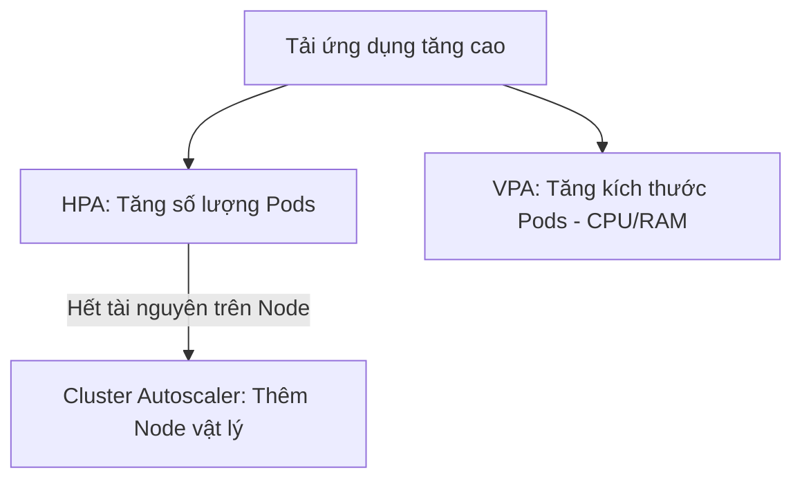

# 09. Autoscaling (Tự động co giãn tài nguyên)

Kubernetes hỗ trợ tự động mở rộng hoặc thu nhỏ quy mô hệ thống dựa trên nhu cầu sử dụng thực tế (tải CPU, RAM, hoặc số lượng requests gửi tới).

---

## 📌 Các cơ chế co giãn chính

Kubernetes cung cấp 3 giải pháp co giãn tự động bổ trợ cho nhau:



### 1. HPA (Horizontal Pod Autoscaler)
*   **Mô tả:** Tự động tăng hoặc giảm số lượng Pods (replicas) của một Deployment.
*   **Hoạt động:** Định kỳ kiểm tra lượng sử dụng tài nguyên (thông qua Metrics Server) và so sánh với ngưỡng cấu hình (ví dụ: Tự động scale khi CPU > 80%).
*   *Cú pháp lệnh nhanh:*
    ```bash
    kubectl autoscale deployment web-app --cpu-percent=80 --min=2 --max=10
    ```

### 2. VPA (Vertical Pod Autoscaler)
*   **Mô tả:** Tự động điều chỉnh cấu hình CPU/RAM yêu cầu (`requests` và `limits`) của các container trong Pod.
*   **Hoạt động:** Theo dõi hành vi tiêu thụ tài nguyên của Pod theo thời gian và đề xuất mức tài nguyên tối ưu, hoặc tự động restart Pod để cập nhật mức cấu hình mới.
*   *Lưu ý:* VPA và HPA chạy dựa trên CPU/RAM thường không nên dùng chung cho cùng một Deployment (vì sẽ gây xung đột quyết định).

### 3. Cluster Autoscaler
*   **Mô tả:** Tự động thêm hoặc bớt các Node vật lý (hoặc máy ảo EC2, VM) vào cluster.
*   **Hoạt động:** 
    *   *Scale-out:* Khi có Pod ở trạng thái `Pending` do không có Node nào đủ CPU/RAM trống để chạy.
    *   *Scale-in:* Khi một Node bị bỏ trống hoặc chạy quá ít tải trong thời gian dài, các Pod trên đó sẽ được di dời sang Node khác và xóa Node đó đi để tiết kiệm chi phí.

---

## 🎯 Bài tập thực hành
1.  [ ] Deploy một ứng dụng chạy PHP hoặc Node.js và cấu hình HPA cho nó (ngưỡng CPU 50%).
2.  [ ] Chạy một Pod thực hiện tấn công tải (load generator) gửi hàng ngàn request liên tục tới ứng dụng web trên.
3.  [ ] Giám sát trạng thái co giãn bằng lệnh `kubectl get hpa -w` để xem số lượng Pod tự động tăng lên từ 1 lên nhiều Pod.
4.  [ ] Tắt load generator và quan sát quá trình thu nhỏ (scale-down) của hệ thống sau thời gian hạ tải (cooling-down period).
